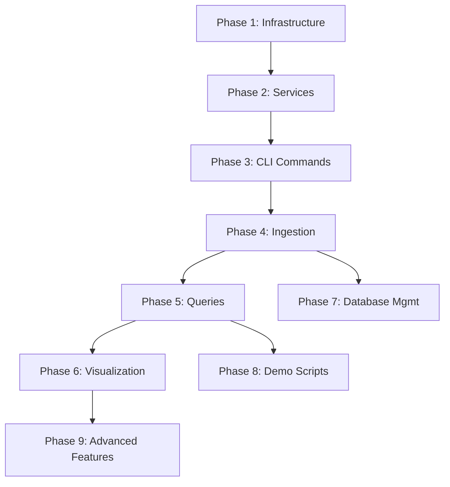

# CLI Demo Execution Plan - Complete Testing Strategy

This document provides a comprehensive plan for systematically testing the Code Story CLI demo functionality as described in [`docs/demos/cli_demo.md`](docs/demos/cli_demo.md).

## 📋 Planning Documents Created

1. **[`CLI_DEMO_TEST_PLAN.md`](CLI_DEMO_TEST_PLAN.md)** - High-level test plan with dependency analysis
2. **[`CLI_DEMO_TASK_BREAKDOWN.md`](CLI_DEMO_TASK_BREAKDOWN.md)** - Detailed commands and expected results
3. **[`test_cli_demo_phase1.sh`](test_cli_demo_phase1.sh)** - Executable test script for Phase 1

## 🎯 Executive Summary

The CLI demo testing is organized into **9 phases** with **strict dependency ordering** to ensure systematic validation:

### Critical Path Dependencies



**Key Insight**: All ingestion issues must be resolved before any visualization or query functionality can be tested.

## 🚀 Quick Start - Begin Testing

### Step 1: Run Phase 1 Infrastructure Test
```bash
# Execute the automated Phase 1 test
./test_cli_demo_phase1.sh
```

This script will:
- ✅ Verify Docker installation and status
- ✅ Check project structure and required files
- ✅ Validate Python and CLI availability
- ✅ Create and configure `.env` file
- ✅ Provide clear pass/fail results with next steps

### Step 2: Based on Phase 1 Results

**If Phase 1 PASSES:**
```bash
# Proceed to manual Phase 2 testing
docker compose up -d neo4j redis
# Then follow CLI_DEMO_TASK_BREAKDOWN.md Phase 2 steps
```

**If Phase 1 FAILS:**
- Review the specific failure messages
- Fix infrastructure issues (Docker, Python, missing files)
- Re-run Phase 1 until it passes

## 📊 Testing Phases Overview

| Phase | Focus Area | Dependencies | Priority | Estimated Time |
|-------|------------|--------------|----------|----------------|
| 1 | Infrastructure Setup | None | Critical | 5-10 min |
| 2 | Service Infrastructure | Phase 1 | Critical | 10-15 min |
| 3 | CLI Basic Commands | Phase 2 | High | 5-10 min |
| 4 | Ingestion Pipeline | Phase 3 | High | 15-30 min |
| 5 | Query Features | Phase 4 | High | 10-15 min |
| 6 | Visualization | Phase 5 | Medium | 10-15 min |
| 7 | Database Management | Phase 5 | Medium | 5-10 min |
| 8 | End-to-End Scripts | All Previous | Medium | 20-40 min |
| 9 | Advanced Features | All Previous | Low | 15-30 min |

## 🔍 Issue Categories & Resolution Strategy

### Critical Issues (Stop Testing Until Fixed)
- **Docker not running**: Service infrastructure cannot start
- **Missing configuration files**: Application cannot initialize
- **CLI installation failures**: Cannot test any functionality
- **Database connection failures**: Core functionality unavailable

### High Priority Issues (Fix Before Demo)
- **Celery worker unhealthy**: Ingestion will fail
- **Service startup failures**: API endpoints unavailable
- **Authentication problems**: Limited functionality access
- **Progress tracking failures**: Poor user experience

### Medium Priority Issues (Fix Before Production)
- **Visualization generation failures**: Limited analytical capability
- **Query performance issues**: Poor user experience
- **Database management failures**: Operational limitations

### Low Priority Issues (Enhancement/Polish)
- **Error message quality**: User experience improvements
- **Command shortcuts**: Convenience features
- **Documentation accuracy**: Alignment with actual behavior

## 🛠️ Resolution Workflow

### For Each Failed Test:

1. **Identify Root Cause**
   - Check the specific error message
   - Review dependency chain
   - Validate prerequisites

2. **Apply Targeted Fix**
   - Use troubleshooting commands from [`CLI_DEMO_TASK_BREAKDOWN.md`](CLI_DEMO_TASK_BREAKDOWN.md)
   - Focus on the specific component that failed
   - Verify fix with minimal reproduction case

3. **Validate Fix**
   - Re-run the specific failed test
   - Ensure dependent tests still pass
   - Document the resolution

4. **Continue Testing**
   - Proceed to next phase only after current phase passes
   - Maintain strict dependency ordering

## 📝 Detailed Task Lists

### Phase 1: Infrastructure Setup ✅ (Automated)
- [x] **Automated Script Created**: [`test_cli_demo_phase1.sh`](test_cli_demo_phase1.sh)
- [x] **Tests**: Docker, project structure, Python, CLI, configuration
- [x] **Output**: Pass/fail with specific remediation steps

### Phase 2: Service Infrastructure (Manual)
**Tasks from [`CLI_DEMO_TASK_BREAKDOWN.md`](CLI_DEMO_TASK_BREAKDOWN.md):**
- [ ] Start Docker containers (Neo4j, Redis)
- [ ] Verify container health
- [ ] Test database connectivity
- [ ] Build and start service containers
- [ ] Validate service endpoints

### Phase 3: CLI Basic Commands (Manual)
- [ ] Verify CLI installation
- [ ] Test help system
- [ ] Test service management commands
- [ ] Test configuration commands

### Phase 4: Ingestion Pipeline (Manual)
- [ ] Create sample project
- [ ] Verify Celery worker health
- [ ] Test repository ingestion
- [ ] Test job management commands

### Phase 5: Query Features (Manual)
- [ ] Test Cypher queries
- [ ] Test natural language queries
- [ ] Verify query shortcuts

### Phase 6: Visualization Features (Manual)
- [ ] Test visualization generation
- [ ] Test direct API access
- [ ] Validate output files

### Phase 7: Database Management (Manual)
- [ ] Test database commands
- [ ] Test clear operations
- [ ] Verify data persistence

### Phase 8: End-to-End Scripts (Manual)
- [ ] Run sample project demo script
- [ ] Run CodeStory codebase demo script
- [ ] Validate complete workflows

### Phase 9: Advanced Features (Manual)
- [ ] Test error handling scenarios
- [ ] Verify authentication behavior
- [ ] Test performance edge cases

## 🎯 Success Criteria

### Minimum Viable Demo (Must Pass)
- [ ] All infrastructure components start successfully
- [ ] CLI commands execute without errors
- [ ] Sample project ingests completely
- [ ] Basic queries return expected results
- [ ] Visualization generates successfully

### Full Demo Success (Should Pass)
- [ ] All demo scripts run to completion
- [ ] Advanced queries work correctly
- [ ] Database management functions properly
- [ ] Error handling is graceful
- [ ] Documentation matches actual behavior

### Production Ready (Nice to Have)
- [ ] Performance meets expectations
- [ ] Edge cases handled gracefully
- [ ] All shortcuts and aliases work
- [ ] Comprehensive error messages
- [ ] Complete feature coverage

## 📈 Progress Tracking

Use this checklist to track overall progress:

- [ ] **Phase 1 Complete**: Infrastructure verified and ready
- [ ] **Phase 2 Complete**: All services running and healthy
- [ ] **Phase 3 Complete**: CLI commands working correctly
- [ ] **Phase 4 Complete**: Ingestion pipeline operational
- [ ] **Phase 5 Complete**: Query functionality verified
- [ ] **Phase 6 Complete**: Visualization working
- [ ] **Phase 7 Complete**: Database management verified
- [ ] **Phase 8 Complete**: Demo scripts successful
- [ ] **Phase 9 Complete**: Advanced features tested

## 🚨 Common Failure Points & Quick Fixes

### Docker Issues
```bash
# Check Docker status
sudo systemctl status docker
docker ps

# Restart Docker
sudo systemctl restart docker
docker compose down && docker compose up -d
```

### CLI Installation Issues
```bash
# Reinstall package
pip uninstall codestory -y
pip install -e .

# Verify installation
python -c "import codestory; print('OK')"
```

### Service Connection Issues
```bash
# Check service health
curl http://localhost:8000/health

# View service logs
docker compose logs service --tail 20
```

### Database Issues
```bash
# Test Neo4j directly
docker exec codestory-neo4j cypher-shell -u neo4j -p password "RETURN 1"

# Reset database
docker compose down -v
docker compose up -d
```

## 🎉 Next Steps After Planning

1. **Start Testing**: Run `./test_cli_demo_phase1.sh`
2. **Address Issues**: Fix any failures using the detailed breakdown
3. **Progress Systematically**: Follow dependency order strictly
4. **Document Results**: Track issues and resolutions
5. **Validate End-to-End**: Ensure complete workflows function

This systematic approach ensures that all CLI demo functionality is thoroughly tested and any issues are identified and resolved in the correct order.