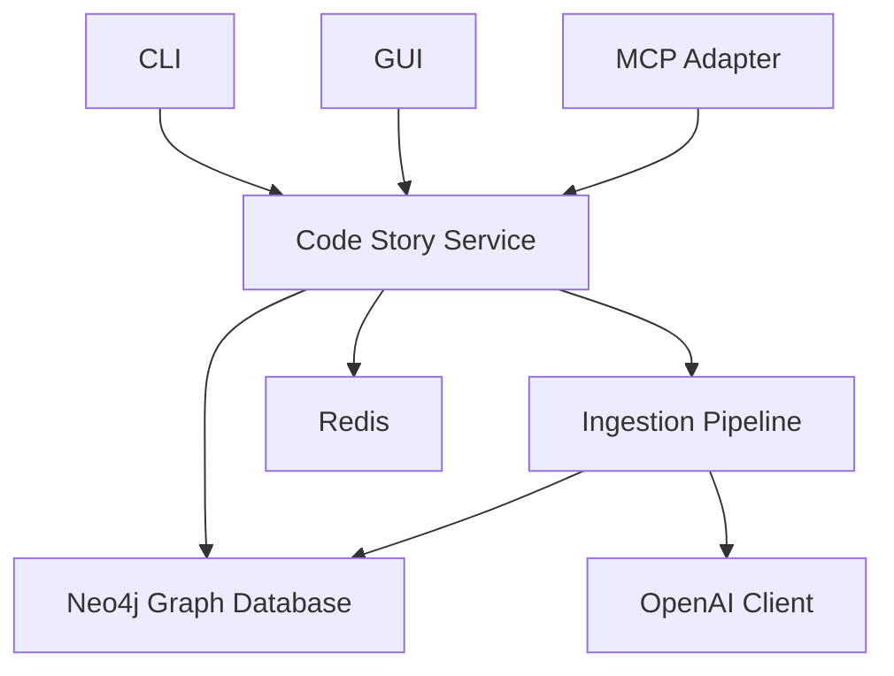

# Code Story

A system to convert codebases into richly-linked knowledge graphs with natural-language summaries.

## Overview

Code Story ingests codebases, analyzes their structure, and produces a knowledge graph where code entities are linked based on their relationships. Each entity is augmented with natural language summaries generated by AI.

## Features

- Multi-language support for codebase analysis
- Plugin-based ingestion pipeline for extensibility
- Neo4j graph database with semantic indexing and vector search
- Interactive 3D visualization of code relationships
- Natural language summaries of code entities and relationships
- API for integration with IDEs and other tools
- Model Context Protocol (MCP) support for AI agent integration

## Quick Start

### Prerequisites

- Python 3.12+
- [uv](https://github.com/astral-sh/uv) (fast Python package manager)
- Docker and Docker Compose
- Node.js 18+ (for GUI development)

### Installation

1. **Clone the repository:**
   ```bash
   git clone https://github.com/rysweet/code-story.git
   cd code-story
   ```

2. **Install uv** (if not already installed):
   ```bash
   # macOS/Linux
   curl -LsSf https://astral.sh/uv/install.sh | sh
   
   # Windows PowerShell
   irm https://astral.sh/uv/install.ps1 | iex
   ```

3. **Set up the Python environment:**
   ```bash
   # Create virtual environment and install dependencies
   uv venv
   uv pip install -e .
   ```

4. **Configure environment** (optional for local development):
   ```bash
   cp .env-template .env
   # Edit .env with your settings if needed
   ```

5. **Start the services:**
   ```bash
   # Start all services with Docker Compose
   docker compose up -d
   
   # Or start just the database services and run the API locally
   docker compose up -d neo4j redis
   uv run uvicorn src.codestory_service.main:app --reload
   ```

6. **Install GUI dependencies** (if developing the web interface):
   ```bash
   npm install
   npm run dev
   ```

### Quick Demo

Try the CLI to ingest a small codebase:

```bash
# Activate the virtual environment
source .venv/bin/activate  # Linux/macOS
# or .venv\Scripts\activate.bat  # Windows

# Run CLI demo
python -m src.codestory_cli ingest ./src --output-format json
```

## Architecture

The system follows a microservices architecture with clear separation of concerns:

### Components

- **Configuration Module** – Manages application configuration from `.env` or Azure Key Vault
- **CLI/GUI** – User interfaces for triggering ingestion and querying the graph
- **Code Story Service** – FastAPI service that orchestrates ingestion and provides REST/WebSocket APIs
- **Ingestion Pipeline** – Plugin-based workflow with steps for parsing, filesystem mapping, summarization, and documentation
- **Storage** – Neo4j graph database with Redis for task queuing and pub/sub
- **MCP Adapter** – Exposes the graph to LLM agents via Model Context Protocol

### Architecture Diagram



## Development

### Running Tests

```bash
# Run all tests
uv run pytest

# Run with coverage
uv run pytest --cov=src

# Run specific test file
uv run pytest tests/unit/test_config.py
```

### Code Quality

```bash
# Run all quality checks
uv run poe check

# Individual tools
uv run ruff check src/        # Linting
uv run ruff format src/       # Formatting
uv run mypy src/              # Type checking
```

### Adding Dependencies

```bash
# Add a new dependency
uv add package-name

# Add a development dependency  
uv add --dev package-name

# Update all dependencies
uv pip install -U -r pyproject.toml
```

## Documentation

- **Demos**: [docs/demos/](docs/demos/) - Interactive walkthroughs
- **API Docs**: [docs/api/](docs/api/) - API reference
- **Architecture**: [docs/architecture/](docs/architecture/) - System design
- **Specifications**: [specs/Main.md](specs/Main.md) - Detailed technical specs

## Deployment

The system can be deployed locally with Docker Compose or to Azure Container Apps. See [docs/deployment/](docs/deployment/) for detailed instructions.

## License

[MIT](LICENSE)
