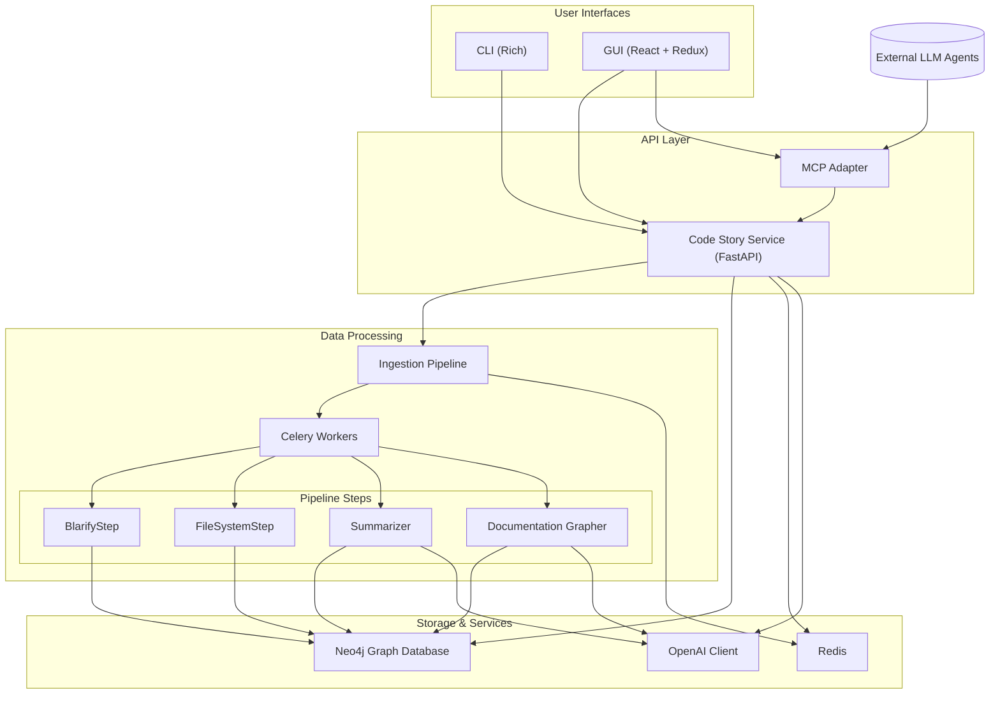

# Code Story

A system to convert codebases into richly-linked knowledge graphs with natural-language summaries.

## Overview

Code Story ingests codebases, analyzes their structure, and produces a knowledge graph where code entities are linked based on their relationships. Each entity is augmented with natural language summaries generated by AI.

## Features

- Multi-language support for codebase analysis
- Plugin-based ingestion pipeline for extensibility
- Neo4j graph database with semantic indexing and vector search
- Interactive 3D visualization of code relationships
- Natural language summaries of code entities and relationships
- API for integration with IDEs and other tools
- Model Context Protocol (MCP) support for AI agent integration

## Architecture

The system follows a microservices architecture with clear separation of concerns and extensible plugins:

### Components and Data Flow

- **Configuration Module** – Manages application configuration from `.env` or Azure Key Vault.
- **User Interfaces** – Trigger ingestion or query the graph:
  - **CLI** – Rich command-line interface using [Rich](https://github.com/Textualize/rich-cli).
  - **GUI** – React + Redux web app with 3D force graph visualization.
- **Code Story Service** – FastAPI service:
  - Orchestrates ingestion pipeline via Celery tasks.
  - Provides REST and WebSocket interfaces for queries and real-time updates.
  - Handles authentication and authorization.
- **Ingestion Pipeline** – Plugin-based workflow steps:
  - **BlarifyStep** – Parses code into AST nodes.
  - **FileSystemStep** – Maps filesystem hierarchy into the graph.
  - **Summarizer** – Generates natural language summaries.
  - **DocumentationGrapher** – Attaches documentation to code nodes.
- **Storage & Services**:
  - **Neo4j Graph Database** – Knowledge graph with semantic index and vector search.
  - **Redis** – Celery backend and WebSocket pub/sub.
  - **OpenAI Client** – Azure OpenAI integration with caching and retry logic.
- **MCP Adapter** – Exposes the graph to LLM agents via Model Context Protocol.

### Deployment Topology

All components can run locally via Docker Compose or be deployed to Azure Container Apps:

- **Neo4j** – Graph database with semantic indexing.
- **Redis** – Backend for Celery and pub/sub.
- **Code Story Service** – Core API container.
- **Celery Workers** – Asynchronous pipeline executors.
- **MCP Adapter** – Model Context Protocol server.
- **GUI** – Web interface container.
- **CLI** – Local executable.

### Cross-Cutting Concerns

- **Auth** – Entra ID bearer JWT for MCP endpoints; `--no-auth` flag for local mode.
- **Observability** – OpenTelemetry traces, Prometheus metrics, Grafana dashboards.
- **Extensibility** – Plugin architecture; customizable prompts in `prompts/`.

### Architecture Overview



## Getting Started

### Prerequisites

- Python 3.12+
- Node.js 18+
- Docker and Docker Compose
- Poetry 1.8+
- Neo4j 5.x
- Redis 7.x

### Installation

1. Clone the repository:
   ```bash
   git clone https://github.com/rysweet/code-story.git
   cd code-story
   ```

2. Create a `.env` file from the template:
   ```bash
   cp .env-template .env
   # Edit .env with your settings
   ```

3. Start the services with the provided script:
   ```bash
   ./infra/scripts/start.sh
   ```

4. Access the GUI at http://localhost:5173

### Production Deployment

For production deployment, use the production Docker Compose file:

```bash
docker compose -f docker-compose.prod.yml up -d
```

### Azure Deployment

#### Option 1: Using Bicep directly

Deploy Code Story to Azure Container Apps using the provided Bicep templates:

1. Login to Azure:
   ```bash
   az login
   ```

2. Deploy the infrastructure:
   ```bash
   ./infra/scripts/deploy_azure.sh -e dev -g code-story-dev
   ```

3. Build and push Docker images to the Azure Container Registry:
   ```bash
   ./infra/scripts/build_push_acr.sh -r <registry-name> -e dev
   ```

#### Option 2: Using Azure Developer CLI (azd)

For a simplified deployment experience, you can use the Azure Developer CLI:

1. Install the Azure Developer CLI:
   ```bash
   curl -fsSL https://aka.ms/install-azd.sh | bash
   ```

2. Login to Azure:
   ```bash
   azd auth login
   ```

3. Initialize a new environment:
   ```bash
   azd init --template .
   ```

4. Configure the environment:
   ```bash
   azd env set NEO4J_PASSWORD <your-neo4j-password>
   ```

5. Deploy the application:
   ```bash
   azd up
   ```

The Azure deployment creates:
- Container Apps for Service, Worker, MCP, and GUI
- Managed Neo4j database
- Redis Cache
- Key Vault for secrets
- Log Analytics and Application Insights
- Container Registry

For detailed infrastructure documentation and architecture diagrams, see the [Infrastructure README](./infra/README.md).

### Development Setup

1. Install Python dependencies:
   ```bash
   poetry install
   ```

2. Install Node.js dependencies:
   ```bash
   npm install
   ```

3. Run the development servers:
   ```bash
   # In one terminal
   poetry run uvicorn src.codestory_service.main:app --reload
   
   # In another terminal
   npm run dev
   ```

## License

[MIT](LICENSE)