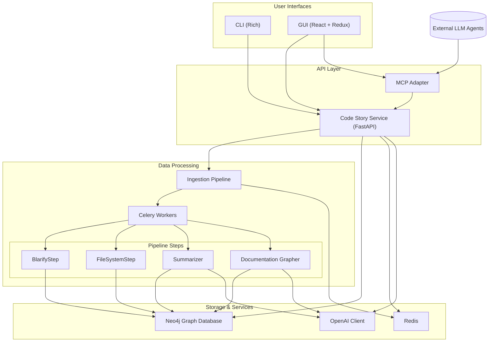

# Code Story

A system to convert codebases into richly-linked knowledge graphs with natural-language summaries.

## Overview

Code Story ingests codebases, analyzes their structure, and produces a knowledge graph where code entities are linked based on their relationships. Each entity is augmented with natural language summaries generated by AI.

## Features

- Multi-language support for codebase analysis
- Plugin-based ingestion pipeline for extensibility
- Neo4j graph database with semantic indexing and vector search
- Interactive 3D visualization of code relationships
- Natural language summaries of code entities and relationships
- API for integration with IDEs and other tools
- Model Context Protocol (MCP) support for AI agent integration

## Architecture

The system follows a microservices architecture with clear separation of concerns and extensible plugins:

### Components and Data Flow

- **Configuration Module** – Manages application configuration from `.env` or Azure Key Vault.
- **User Interfaces** – Trigger ingestion or query the graph:
  - **CLI** – Rich command-line interface using [Rich](https://github.com/Textualize/rich-cli).
  - **GUI** – React + Redux web app with 3D force graph visualization.
- **Code Story Service** – FastAPI service:
  - Orchestrates ingestion pipeline via Celery tasks.
  - Provides REST and WebSocket interfaces for queries and real-time updates.
  - Handles authentication and authorization.
- **Ingestion Pipeline** – Plugin-based workflow steps:
  - **BlarifyStep** – Parses code into AST nodes and binds symbols using LSP
  - **FileSystemStep** – Maps filesystem hierarchy into the graph.
  - **Summarizer** – Generates natural language summaries.
  - **DocumentationGrapher** – Attaches documentation to code nodes.
- **Storage & Services**:
  - **Neo4j Graph Database** – Knowledge graph with semantic index and vector search.
  - **Redis** – Celery backend and WebSocket pub/sub.
  - **OpenAI Client** – Azure OpenAI integration with caching and retry logic.
- **MCP Adapter** – Exposes the graph to LLM agents via Model Context Protocol.

### Deployment Topology

All components can run locally via Docker Compose or be deployed to Azure Container Apps:

- **Neo4j** – Graph database with semantic indexing.
- **Redis** – Backend for Celery and pub/sub.
- **Code Story Service** – Core API container.
- **Celery Workers** – Asynchronous pipeline executors.
- **MCP Adapter** – Model Context Protocol server.
- **GUI** – Web interface container.
- **CLI** – Local executable.

### Cross-Cutting Concerns

- **Auth** – Entra ID bearer JWT for MCP endpoints; `--no-auth` flag for local mode.
- **Observability** – OpenTelemetry traces, Prometheus metrics, Grafana dashboards.
- **Extensibility** – Plugin architecture; customizable prompts in `prompts/`.

### Architecture Overview



## Getting Started

### Prerequisites

- Python 3.12+
- Node.js 18+
- Docker and Docker Compose
- Poetry 1.8+ **or** [uv](https://github.com/astral-sh/uv) (recommended for fast Python dependency management)
- Neo4j 5.x
- Redis 7.x

---

## Python Environment & Package Management with uv

This project supports [uv](https://github.com/astral-sh/uv) for fast, modern Python package and virtual environment management.

### Why uv?
- Much faster dependency resolution and installation than pip/pip-tools
- Simple, single-binary tool for venv, install, and dependency management
- Compatible with pyproject.toml and requirements.txt

### Getting Started with uv

1. **Install uv**
   - Download from https://github.com/astral-sh/uv#installation or use:
     ```powershell
     irm https://astral.sh/uv/install.ps1 | iex
     ```
   - Or use Homebrew, Scoop, or download a release binary.

2. **Create a Virtual Environment**
   ```bash
   uv venv .venv
   ```

3. **Install Dependencies**
   ```bash
   uv pip install -r requirements.txt
   # Or install directly from pyproject.toml:
   uv pip install -r pyproject.toml
   ```

4. **Add/Update Dependencies**
   - To add a package:
     ```bash
     uv pip install <package>
     ```
   - To update all:
     ```bash
     uv pip install -U -r requirements.txt
     ```
   - To recompile requirements.txt from pyproject.toml:
     ```bash
     uv pip compile --all-extras --output-file=requirements.txt pyproject.toml
     ```

5. **Run Project**
   - Activate the venv and use as normal:
     ```powershell
     .venv\Scripts\Activate.ps1  # Windows PowerShell
     source .venv/bin/activate    # Linux/macOS
     ```

**Notes:**
- `uv` is fully compatible with pip and venv workflows.
- You can continue to use Poetry or pip if desired, but `uv` is recommended for speed and simplicity.
- See https://github.com/astral-sh/uv for full documentation.

---

### Installation

1. Clone the repository:
   ```bash
   git clone https://github.com/rysweet/code-story.git
   cd code-story
   ```

2. (Optional) create a `.env` file from the template if you plan to run services locally:
   ```bash
   cp .env-template .env
   # Edit .env with your settings
   ```

3. Install Python dependencies (choose one):
   - With Poetry:
     ```bash
     poetry install
     ```
   - With uv (recommended):
     ```bash
     uv pip install -r requirements.txt
     # or, for editable/development mode:
     uv pip install -e .
     ```

4. Install Node.js dependencies:
   ```bash
   npm install
   ```

5. Explore the interactive demos to get a feel for the system:
   - CLI Demo: [docs/demos/cli_demo.md](docs/demos/cli_demo.md)
   - GUI Demo: [docs/demos/gui_demo.md](docs/demos/gui_demo.md)
   - MCP Demo: [docs/demos/mcp_demo.md](docs/demos/mcp_demo.md)

Refer to the full documentation at [docs/index.md](docs/index.md) for additional walkthroughs.

### Learn More

- Interactive demos overview: [docs/demos/index.md](docs/demos/index.md)
- Complete documentation site: [docs/index.md](docs/index.md)
- Specification suite: [specs/Main.md](specs/Main.md)


### Development Setup

1. (Optional) Create a new virtual environment with uv (if not using Poetry):
   ```bash
   uv venv
   uv pip install -r requirements.txt
   ```

2. Run the development servers:
   ```bash
   # In one terminal
   poetry run uvicorn src.codestory_service.main:app --reload
   # or, if using uv:
   uv pip install uvicorn
   uvicorn src.codestory_service.main:app --reload

   # In another terminal
   npm run dev
   ```

## License

[MIT](LICENSE)
