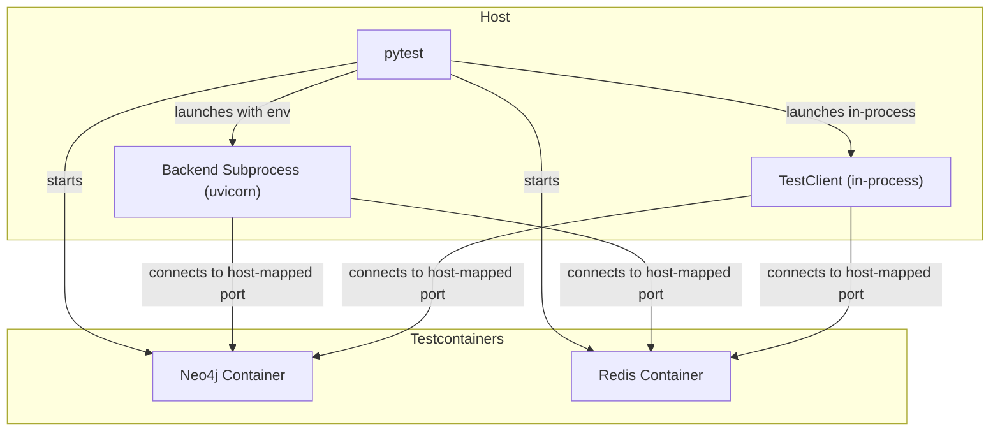

# CLI Integration Test Architecture: Robust Testcontainers and Backend Subprocess Management

## Problem Summary

- Integration tests for the CLI query commands fail because the backend subprocess cannot connect to Neo4j and Redis testcontainers on the expected host-mapped ports.
- Passing tests either connect directly to the testcontainer services using the host-mapped ports, or run the FastAPI app in-process (sharing the host network namespace).
- The failing tests start the backend as a subprocess, but the backend cannot access the testcontainer services due to network isolation or incorrect port mapping.

---

## Key Differences Between Passing and Failing Tests

| Passing Tests (e.g. `test_service.py`, `test_query_minimal.py`) | Failing Tests (e.g. `test_query_integration.py`) |
|---------------------------------------------------------------|--------------------------------------------------|
| Connect directly to Neo4j/Redis using host-mapped ports       | Start backend as a subprocess, expect services on host-mapped ports |
| FastAPI app runs in-process (TestClient)                      | Backend runs as a subprocess (uvicorn)           |
| No network isolation issues                                   | Backend cannot access testcontainer ports        |
| No dependency on external API endpoints                       | Backend API endpoints required for CLI           |

---

## Solution: Robust CLI Integration Test Setup

### 1. Always Use Host-Mapped Ports

- When starting testcontainers for Neo4j and Redis, always use `neo4j.get_exposed_port(7687)` and `redis.get_exposed_port(6379)` to get the host-mapped ports.
- Set these values in the environment variables for the backend subprocess:
  - `CODESTORY_NEO4J__URI`, `NEO4J_URI`, `NEO4J__URI`
  - `CODESTORY_REDIS__URI`, `REDIS_URI`, `REDIS__URI`

### 2. Ensure Testcontainers Are Ready Before Backend Startup

- Wait for Neo4j and Redis testcontainers to be fully ready (accepting connections) before starting the backend subprocess.
- Use health checks and retries as in the minimal passing tests.

### 3. Pass Correct Environment to Backend Subprocess

- When launching the backend subprocess, pass the correct environment variables for the host-mapped ports.
- Example:
  ```python
  neo4j_port = neo4j.get_exposed_port(7687)
  redis_port = redis.get_exposed_port(6379)
  env["CODESTORY_NEO4J__URI"] = f"bolt://localhost:{neo4j_port}"
  env["REDIS__URI"] = f"redis://localhost:{redis_port}/0"
  # ...and so on for all variants
  ```

### 4. (Optional) Run Backend In-Process for Integration Tests

- For tests that do not require a true subprocess, consider running the FastAPI app in-process using `TestClient`.
- This avoids network isolation issues and ensures the app can access testcontainer services directly.

---

## Mermaid Diagram



---

## Action Items

1. Refactor the CLI integration test fixture to:
    - Wait for testcontainers to be ready.
    - Pass the correct host-mapped ports to the backend subprocess.
    - Ensure the backend subprocess is started only after testcontainers are ready.
2. Optionally, migrate tests to use in-process FastAPI app where possible.
3. Document this architecture in this file for future reference.

---

## References

- [pytest testcontainers best practices](https://testcontainers-python.readthedocs.io/en/latest/)
- [FastAPI TestClient](https://fastapi.tiangolo.com/advanced/testing/)
- [Docker networking and port mapping](https://docs.docker.com/network/)
