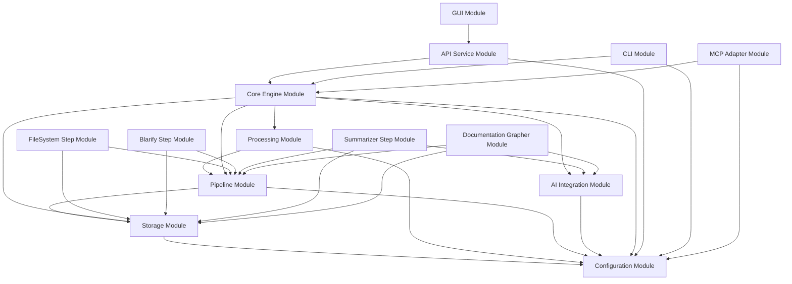

# Code Story: Module Breakdown

This document outlines a modular breakdown of the Code Story system, defining clear boundaries between components and facilitating independent development and testing. Each module is designed with a clear responsibility and a well-defined interface, enabling loose coupling between components and allowing for independent evolution.

## Core Modules

The core modules form the foundation of the Code Story system. They provide essential functionality that is required for the system to operate.

### 1. Storage Module

**Purpose**: Provides persistence and querying capabilities for the code knowledge graph.

**Responsibilities**:
- Store and retrieve graph nodes and relationships
- Execute graph queries
- Manage database connections and resources
- Provide abstraction over different storage backends
- Ensure data consistency and integrity
- Handle serialization and deserialization of graph data
- Manage database schema and migrations

**Key Components**:
- `GraphStorage` interface - Main abstraction for storage operations
- `SQLiteGraphStorage` implementation - Local storage using SQLite
- `Neo4jGraphStorage` implementation - Full graph database using Neo4j
- `NodeRepository` - CRUD operations for nodes
- `RelationshipRepository` - CRUD operations for relationships
- `QueryExecutor` - Executes graph queries
- `SchemaManager` - Manages database schema and migrations
- `ConnectionPool` - Manages database connections
- `StorageTransaction` - Handles atomic operations
- `QueryTranslator` - Converts graph queries between different backends

**Implementation Details**:
- SQLite implementation uses SQLAlchemy for ORM capabilities
- Node and relationship tables with indexes for efficient lookups
- JSON serialization for property storage in SQLite
- Connection pooling for efficient resource usage
- Query translation layer for Cypher-like queries on SQLite
- Transaction support for atomic operations
- Migration tooling for schema updates

**Dependencies**:
- Configuration Module (for connection parameters)

**Public API**:
```python
# Main interface
class GraphStorage(Protocol):
    def connect(self) -> None: 
        """Establish connection to the storage backend."""
        
    def disconnect(self) -> None: 
        """Close connection to the storage backend."""
        
    def create_node(self, label: str, properties: dict) -> str: 
        """Create a new node with the given label and properties.
        
        Args:
            label: Node type label
            properties: Node properties as dictionary
            
        Returns:
            Unique identifier for the created node
        """
        
    def create_relationship(self, start_id: str, end_id: str, type_name: str, properties: dict = None) -> None: 
        """Create a relationship between two nodes.
        
        Args:
            start_id: Source node ID
            end_id: Target node ID
            type_name: Relationship type
            properties: Optional relationship properties
        """
        
    def query(self, query_string: str, params: dict = None) -> list[dict]: 
        """Execute a query against the graph.
        
        Args:
            query_string: Query in Cypher-like syntax
            params: Query parameters
            
        Returns:
            List of result records as dictionaries
        """
        
    def get_node(self, node_id: str) -> dict: 
        """Retrieve a node by its ID.
        
        Args:
            node_id: Node identifier
            
        Returns:
            Node data as dictionary with properties
        """
        
    def get_nodes_by_label(self, label: str, properties: dict = None, limit: int = 100) -> list[dict]:
        """Find nodes by label and optional property filters.
        
        Args:
            label: Node type label
            properties: Optional property filters
            limit: Maximum number of results
            
        Returns:
            List of matching nodes
        """
        
    def get_relationships(self, node_id: str, relationship_type: str = None, direction: str = "OUTGOING") -> list[dict]:
        """Get relationships for a node.
        
        Args:
            node_id: Node identifier
            relationship_type: Optional relationship type filter
            direction: Relationship direction ("OUTGOING", "INCOMING", "BOTH")
            
        Returns:
            List of relationships with connected nodes
        """
        
    def begin_transaction(self) -> "Transaction":
        """Begin a new transaction for atomic operations.
        
        Returns:
            Transaction object with context manager support
        """
        
    def execute_in_transaction(self, func: Callable, *args, **kwargs) -> Any:
        """Execute a function within a transaction.
        
        Args:
            func: Function to execute
            args, kwargs: Arguments to pass to the function
            
        Returns:
            Result of the function execution
        """
    
# Factory function
def get_storage(config: Config) -> GraphStorage: 
    """Create a storage instance based on configuration.
    
    Args:
        config: Application configuration
        
    Returns:
        Configured GraphStorage implementation
    """
```

### 2. Configuration Module

**Purpose**: Manages application settings with a simplified approach.

**Responsibilities**:
- Load configuration from files and environment variables
- Validate configuration values and types
- Provide sensible defaults for optional settings
- Support environment-specific configuration
- Handle sensitive configuration values securely
- Provide a unified access point for all application settings
- Support configuration reloading for dynamic changes
- Detect and report configuration errors
- Support structured configuration with inheritance

**Key Components**:
- `Config` - Main configuration class with nested configuration sections
- `ConfigLoader` - Loads configuration from files and environment variables
- `ConfigValidator` - Validates configuration values and reports errors
- `ConfigSchema` - Defines the structure and validation rules for configuration
- `EnvResolver` - Resolves environment variable references in configuration
- `SecretHandler` - Handles sensitive configuration values
- `ConfigWatcher` - Monitors configuration files for changes
- `ConfigPathResolver` - Resolves configuration file paths

**Implementation Details**:
- Pydantic models for configuration classes with validation
- Support for YAML, JSON, and environment variable sources
- Hierarchical configuration with nested sections
- Environment variable interpolation with ${VAR_NAME} syntax
- Configuration schema with defaults and documentation
- SecretStr type for sensitive values with masking in logs
- Clear error messages for configuration issues
- Support for configuration override layers

**Dependencies**:
- None (foundational module)

**Public API**:
```python
class AppConfig:
    """Application-level configuration."""
    name: str
    version: str
    dev_mode: bool
    log_level: str
    
class StorageConfig:
    """Storage backend configuration."""
    type: Literal["sqlite", "neo4j", "neo4j_embedded"]
    path: Optional[str]  # For file-based storage
    uri: Optional[str]  # For remote storage
    username: Optional[str]
    password: Optional[SecretStr]
    database: Optional[str]
    connection_timeout: int
    max_connection_pool_size: int
    
class AIConfig:
    """AI service configuration."""
    provider: Literal["openai", "azure_openai", "local"]
    api_key: Optional[SecretStr]
    api_endpoint: Optional[str]
    model: str
    embedding_model: str
    timeout: float
    max_retries: int
    cache_enabled: bool
    cache_ttl: int
    
class PipelineConfig:
    """Pipeline configuration."""
    steps: list[dict]
    concurrency: int
    chunk_size: int
    timeout: int
    
class Config:
    """Main configuration class with all settings."""
    app: AppConfig
    storage: StorageConfig
    ai: AIConfig
    pipeline: PipelineConfig
    
    @classmethod
    def load(cls, config_path: str = None) -> 'Config':
        """Load configuration from the specified path or default locations.
        
        Args:
            config_path: Optional path to configuration file
            
        Returns:
            Loaded and validated configuration
            
        Raises:
            ConfigError: If configuration is invalid or cannot be loaded
        """
    
    @classmethod
    def from_dict(cls, config_dict: dict) -> 'Config':
        """Create configuration from a dictionary.
        
        Args:
            config_dict: Configuration as dictionary
            
        Returns:
            Validated configuration object
        """
    
    def get_value(self, key_path: str, default: Any = None) -> Any:
        """Get configuration value by dot-notation path.
        
        Args:
            key_path: Path to configuration value (e.g., "storage.uri")
            default: Default value if path doesn't exist
            
        Returns:
            Configuration value or default
        """
    
    def as_dict(self) -> dict:
        """Convert configuration to dictionary.
        
        Returns:
            Configuration as nested dictionary
        """
    
    def with_overrides(self, overrides: dict) -> 'Config':
        """Create a new configuration with overrides applied.
        
        Args:
            overrides: Dictionary with override values
            
        Returns:
            New configuration instance with overrides
        """
    
    def validate(self) -> list[str]:
        """Validate the configuration and return any validation errors.
        
        Returns:
            List of validation error messages, empty if valid
        """

# Factory function
def get_config(config_path: str = None) -> Config:
    """Get configuration singleton instance.
    
    Args:
        config_path: Optional path to configuration file
        
    Returns:
        Configuration instance
    """
    
def reload_config() -> Config:
    """Reload configuration from source.
    
    Returns:
        Reloaded configuration instance
    """
```

### 3. Processing Module

**Purpose**: Handles execution of pipeline steps and overall workflow.

**Responsibilities**:
- Execute individual pipeline steps
- Orchestrate multi-step pipelines
- Track job status and progress
- Handle job cancellation and timeout
- Manage concurrency and resource allocation
- Provide execution metrics and logs
- Handle execution errors and retries
- Ensure proper cleanup after execution
- Support both synchronous and asynchronous execution
- Provide a consistent interface for different execution engines

**Key Components**:
- `ProcessingEngine` interface - Main abstraction for processing operations
- `DirectProcessingEngine` implementation - In-process synchronous execution
- `AsyncProcessingEngine` implementation - In-process asynchronous execution
- `CeleryProcessingEngine` implementation - Distributed execution via Celery
- `JobTracker` - Tracks job status and metadata
- `ExecutionContext` - Manages execution environment and resources
- `PipelineOrchestrator` - Coordinates execution of multiple steps
- `ResourceMonitor` - Monitors and limits resource usage
- `CancellationManager` - Handles job cancellation requests
- `ExecutionMetrics` - Collects and reports execution metrics

**Implementation Details**:
- Direct execution uses standard Python function calls
- Async execution uses Python's asyncio framework
- Job tracking uses in-memory store with optional persistence
- Unique job IDs generated with UUID4
- Cancellation via threading.Event or asyncio.CancelledError
- Resource monitoring through psutil
- Status reporting via callback or polling
- Pipeline orchestration with dependency resolution
- Timeout handling with graceful cleanup
- Retries with exponential backoff for transient failures

**Dependencies**:
- Configuration Module (for execution settings)
- Pipeline Module (for step definitions)

**Public API**:
```python
class JobStatus(Enum):
    """Possible job status values."""
    PENDING = "PENDING"
    RUNNING = "RUNNING"
    SUCCEEDED = "SUCCEEDED"
    FAILED = "FAILED"
    CANCELLED = "CANCELLED"
    TIMED_OUT = "TIMED_OUT"

class JobStatusInfo:
    """Information about a job's status."""
    job_id: str
    status: JobStatus
    step_name: str
    repository_path: str
    start_time: Optional[datetime]
    end_time: Optional[datetime]
    progress: float  # 0.0 to 1.0
    message: Optional[str]
    error: Optional[str]
    result: Optional[dict]
    metadata: dict

class StepResult:
    """Result of a pipeline step execution."""
    job_id: str
    step_name: str
    success: bool
    result_data: Optional[dict]
    error_message: Optional[str]
    execution_time: float
    resource_usage: dict

class ProcessingEngine(Protocol):
    """Interface for processing engines."""
    
    def execute_step(self, step_name: str, repository_path: str, **config) -> dict:
        """Execute a single pipeline step.
        
        Args:
            step_name: Name of the step to execute
            repository_path: Path to the repository
            config: Step-specific configuration
            
        Returns:
            Dictionary with execution result and job ID
            
        Raises:
            StepNotFoundError: If step is not found
            ExecutionError: If execution fails
        """
    
    def execute_pipeline(self, repository_path: str, steps: list[dict]) -> dict:
        """Execute a sequence of pipeline steps.
        
        Args:
            repository_path: Path to the repository
            steps: List of step configurations
            
        Returns:
            Dictionary with execution result and job ID
            
        Raises:
            PipelineExecutionError: If pipeline execution fails
        """
    
    def get_status(self, job_id: str) -> JobStatusInfo:
        """Get the status of a job.
        
        Args:
            job_id: Unique job identifier
            
        Returns:
            Job status information
            
        Raises:
            JobNotFoundError: If job is not found
        """
    
    def cancel_job(self, job_id: str) -> JobStatusInfo:
        """Cancel a running job.
        
        Args:
            job_id: Unique job identifier
            
        Returns:
            Updated job status information
            
        Raises:
            JobNotFoundError: If job is not found
            JobCancellationError: If job cannot be cancelled
        """
    
    def list_jobs(self, status: Optional[JobStatus] = None, limit: int = 100) -> list[JobStatusInfo]:
        """List jobs with optional status filter.
        
        Args:
            status: Optional status filter
            limit: Maximum number of jobs to return
            
        Returns:
            List of job status information
        """
    
    def cleanup_jobs(self, older_than: datetime = None) -> int:
        """Clean up completed jobs.
        
        Args:
            older_than: Optional timestamp, defaults to 24 hours ago
            
        Returns:
            Number of jobs cleaned up
        """
    
    def get_metrics(self) -> dict:
        """Get execution metrics.
        
        Returns:
            Dictionary with execution metrics
        """
    
# Factory function
def get_processing_engine(config: Config) -> ProcessingEngine:
    """Create a processing engine based on configuration.
    
    Args:
        config: Application configuration
        
    Returns:
        Configured ProcessingEngine implementation
    """

# Helper functions
def wait_for_job(engine: ProcessingEngine, job_id: str, 
                timeout: float = None, poll_interval: float = 0.5) -> JobStatusInfo:
    """Wait for a job to complete.
    
    Args:
        engine: Processing engine
        job_id: Job to wait for
        timeout: Maximum wait time in seconds
        poll_interval: Time between status checks
        
    Returns:
        Final job status
        
    Raises:
        TimeoutError: If timeout is reached
    """
```

### 4. Pipeline Module

**Purpose**: Defines the structure for ingestion pipeline steps.

**Key Components**:
- `PipelineStep` interface
- Step registration mechanism
- Pipeline configuration handling
- Common utilities for steps

**Dependencies**:
- Configuration Module
- Storage Module

**Public API**:
```python
class PipelineStep(Protocol):
    def run(self, repository_path: str, **config) -> str: ...
    def status(self, job_id: str) -> dict: ...
    def stop(self, job_id: str) -> dict: ...
    def cancel(self, job_id: str) -> dict: ...
    
def register_step(name: str, step_class: Type[PipelineStep]) -> None: ...
def get_step(name: str) -> PipelineStep: ...
```

### 5. AI Integration Module

**Purpose**: Provides access to AI services for summarization and analysis.

**Key Components**:
- `AIClient` interface
- `OpenAIClient` implementation
- Local caching
- Rate limiting
- Error handling

**Dependencies**:
- Configuration Module

**Public API**:
```python
class AIClient(Protocol):
    def generate_text(self, prompt: str, **options) -> str: ...
    def generate_embedding(self, text: str) -> list[float]: ...
    def summarize(self, content: str, max_tokens: int = 200) -> str: ...
    
def get_ai_client(config: Config) -> AIClient: ...
```

### 6. Core Engine Module

**Purpose**: Integrates all components and provides the main application logic.

**Key Components**:
- `CodeStoryEngine` - Main application class
- Repository handling
- Graph query operations
- Job orchestration

**Dependencies**:
- All other core modules

**Public API**:
```python
class CodeStoryEngine:
    def __init__(self, config: Config): ...
    
    def ingest_repository(self, repository_path: str, steps: list[str] = None) -> str: ...
    def get_ingestion_status(self, job_id: str) -> dict: ...
    def cancel_ingestion(self, job_id: str) -> dict: ...
    
    def query_graph(self, query: str, params: dict = None) -> list[dict]: ...
    def get_node_by_path(self, file_path: str) -> dict: ...
    def get_node_by_name(self, name: str, node_type: str = None) -> list[dict]: ...
    
    def get_summary(self, node_id: str) -> str: ...
```

## Extension Modules

### 1. API Service Module

**Purpose**: Provides HTTP API access to the Code Story engine.

**Key Components**:
- FastAPI application
- REST endpoints
- WebSocket support
- Authentication (optional)

**Dependencies**:
- Core Engine Module
- Configuration Module

### 2. CLI Module

**Purpose**: Provides command-line interface for Code Story.

**Key Components**:
- Command framework
- Interactive mode
- Repository handling
- Output formatting

**Dependencies**:
- Core Engine Module
- Configuration Module

### 3. GUI Module

**Purpose**: Provides web-based visualization and interaction.

**Key Components**:
- React application
- Graph visualization
- Query interface
- Repository management

**Dependencies**:
- API Service Module (via HTTP)

### 4. MCP Adapter Module

**Purpose**: Exposes Code Story to LLM agents via Model Context Protocol.

**Key Components**:
- MCP server
- Tool definitions
- Query handling
- Authentication

**Dependencies**:
- Core Engine Module
- Configuration Module

## Pipeline Step Modules

Each pipeline step is implemented as a separate module that plugs into the Pipeline Module.

### 1. FileSystem Step Module

**Purpose**: Analyzes file system structure of a repository.

**Dependencies**:
- Pipeline Module
- Storage Module

### 2. Blarify Step Module

**Purpose**: Parses code into AST nodes using Blarify.

**Dependencies**:
- Pipeline Module
- Storage Module

### 3. Summarizer Step Module

**Purpose**: Generates natural language summaries for code entities.

**Dependencies**:
- Pipeline Module
- Storage Module
- AI Integration Module

### 4. Documentation Grapher Step Module

**Purpose**: Attaches documentation to code nodes.

**Dependencies**:
- Pipeline Module
- Storage Module
- AI Integration Module

## Module Dependencies Diagram



## Module Organization

The code will be organized as follows:

```
src/
├── codestory/
│   ├── config/        # Configuration Module
│   ├── storage/       # Storage Module
│   ├── processing/    # Processing Module
│   ├── pipeline/      # Pipeline Module
│   ├── ai/            # AI Integration Module
│   ├── core/          # Core Engine Module
│   │
│   ├── api/           # API Service Module
│   ├── cli/           # CLI Module
│   │
│   └── utils/         # Shared utilities
│
├── codestory_fs/      # FileSystem Step Module
├── codestory_blarify/ # Blarify Step Module
├── codestory_sum/     # Summarizer Step Module
├── codestory_doc/     # Documentation Grapher Module
│
├── codestory_gui/     # GUI Module (React)
└── codestory_mcp/     # MCP Adapter Module
```

## Migration Path

To migrate from the current architecture to this modular structure:

1. **Extract Interfaces**: Create interfaces for each module based on existing functionality
2. **Implement Core Modules**: Starting with Configuration and Storage
3. **Refactor Pipeline Steps**: Update to use new interfaces
4. **Add Processing Abstraction**: Implement direct execution
5. **Update Extension Modules**: Adapt to new core architecture
6. **Finalize Integration**: Connect all modules through the Core Engine

This approach allows for incremental migration while maintaining functionality throughout the process.

## Testing Strategy

Each module will have its own test suite:

1. **Unit Tests**: Test individual components in isolation
2. **Integration Tests**: Test interactions between modules
3. **Acceptance Tests**: Test end-to-end functionality
4. **Benchmarks**: Test performance under different configurations

Mock implementations will be provided for dependencies to enable testing in isolation.

## Conclusion

This modular breakdown creates clear boundaries between components, making the system easier to understand, develop, and test. The module interfaces provide flexibility in implementation while maintaining a consistent architecture.

Each module can be developed and tested independently, allowing for parallel development and incremental adoption of the new architecture. The migration path provides a practical approach to transitioning from the current architecture while maintaining functionality throughout the process.
