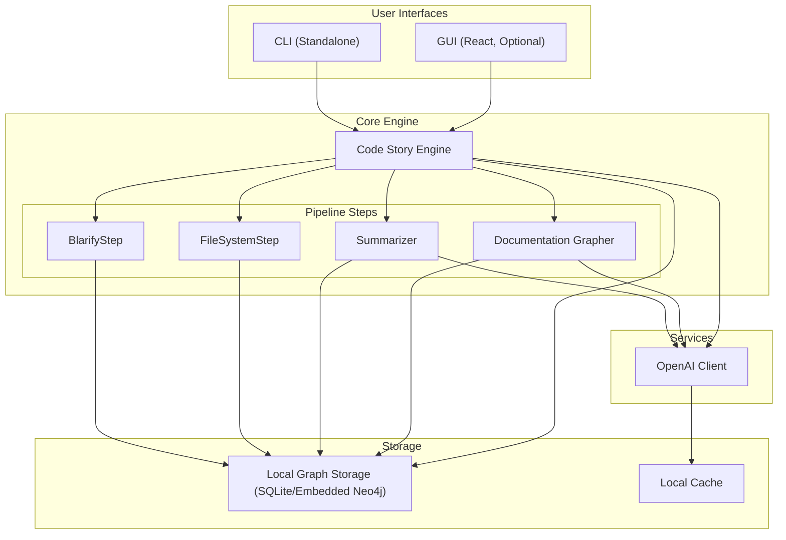

# Code Story: Simplified Architecture

## Overview

This document outlines a simplified architecture for Code Story that is optimized for local development on a single developer's laptop. The goal is to reduce complexity, minimize dependencies, and make the system more reliable and easier to work with.

The current Code Story project uses a microservices architecture with multiple containers and external dependencies, which introduces significant overhead and complexity for local development. This document proposes a simplified architecture that maintains the core functionality while reducing resource requirements and simplifying the developer experience.

## Current Architecture Issues

The current architecture has several pain points that make local development and testing challenging:

1. **Containerization Overhead**: 
   - Running multiple Docker containers (Neo4j, Redis, worker, service) consumes significant resources
   - Container startup and coordination adds complexity and increases startup time
   - Debugging across container boundaries is difficult
   - Volume mounting and container networking adds complexity

2. **Complex Configuration**: 
   - Multi-layered configuration with fallbacks across environment variables, TOML files, and hard-coded defaults creates confusion
   - Different configuration approaches between components
   - Hard-to-debug configuration issues with precedence rules
   - Many configuration parameters have unclear defaults or requirements

3. **Asynchronous Processing Complexity**: 
   - Celery worker, Redis, and task queues add complexity for local development
   - Message serialization and deserialization overhead
   - Additional process management and monitoring requirements
   - Error handling across process boundaries is challenging

4. **Resource-Intensive Dependencies**: 
   - Neo4j requires substantial memory (3-4GB minimum)
   - Redis adds another dependency with its own resource needs
   - JVM startup time for Neo4j increases overall startup time
   - Multiple Python processes for worker and service

5. **Integration Test Fragility**: 
   - Tests depend on complex container setup and coordination
   - Timing issues with asynchronous operations
   - Difficult to debug test failures
   - Long test execution time due to container setup

6. **Many Moving Parts**: 
   - Multiple services need to be running simultaneously for the system to work
   - Component coordination requires careful orchestration
   - Failure in one component can cascade to others
   - Complex restart and recovery procedures

## Simplified Architecture Principles

The simplified architecture follows these key principles to address the issues identified above while maintaining the core functionality of Code Story:

1. **Modularity**: 
   - Clear separation of concerns with well-defined interfaces between components
   - Use of dependency injection to allow component substitution
   - Interface-based design to decouple implementation details
   - Consistent module boundaries with explicit dependencies
   - Public APIs for each module with comprehensive documentation
   - Internal implementation details hidden behind interfaces

2. **Reduced Dependencies**: 
   - Minimize external services and dependencies where possible
   - Replace Neo4j with SQLite or embedded graph database for local development
   - Eliminate Redis dependency for local development
   - Replace Celery with direct Python execution
   - Use Python standard library components where possible
   - Provide adapters for optional external services

3. **Simplified Configuration**: 
   - Single, clear configuration system with sensible defaults
   - Consistent configuration approach across all components
   - Clear documentation of all configuration options
   - Environment variable overrides with consistent naming
   - Validation and error reporting for configuration issues
   - Hierarchical configuration with logical grouping

4. **Local-First Development**: 
   - Optimize for development on a single machine
   - Single-command startup for all components
   - Fast startup time (under 10 seconds)
   - Low resource usage (under 1GB RAM)
   - Built-in development tools (debugger, profiler, etc.)
   - Simplified testing without container dependencies

5. **Graceful Degradation**: 
   - Components should work in isolation when possible
   - Fallback behavior when dependencies are unavailable
   - Clear error messages when dependencies are missing
   - Ability to run partial functionality
   - Local caching of remote resources
   - Resilience to temporary failures

6. **Progressive Enhancement**: 
   - Start with core functionality, add advanced features as needed
   - Clear extension points for adding new capabilities
   - Plugin architecture for pipeline steps
   - Feature flags for enabling/disabling optional components
   - Ability to scale up to full architecture when needed
   - Smooth transition path from local to distributed mode

## Component Architecture

The simplified architecture consists of several core components that work together to provide the functionality of Code Story. Each component is designed to be modular, with clear interfaces and minimal dependencies.

### Core Components

1. **Graph Storage**
   
   The Graph Storage component provides persistence and querying capabilities for the code knowledge graph. It abstracts the underlying storage mechanism to allow for different implementations.
   
   - **Option A**: SQLite + SQLAlchemy for simplified local storage
     - **Pros**: 
       - No external dependencies
       - Lightweight (< 10MB footprint)
       - Standard SQL interface
       - Transactional safety
       - File-based persistence
       - Cross-platform compatibility
       - Zero configuration
     - **Cons**: 
       - Loses native graph query capabilities
       - Less efficient for complex graph traversals
       - Limited concurrency
       - May require custom query translation layer
   
   - **Option B**: Embedded Neo4j or lightweight graph DB alternative
     - **Pros**: 
       - Maintains graph query capabilities
       - Native support for Cypher queries
       - Optimized for graph traversals
       - Schema flexibility
       - Better performance for complex graph operations
     - **Cons**: 
       - Still requires some setup
       - Higher resource requirements than SQLite
       - May need JVM dependency
       - More complex configuration
   
   The storage component will provide a consistent interface regardless of the backend:
   
   ```python
   class GraphStorage(Protocol):
       def connect(self) -> None: ...
       def create_node(self, label: str, properties: dict) -> str: ...
       def create_relationship(self, start_id: str, end_id: str, type_name: str, properties: dict) -> None: ...
       def query(self, query_string: str, params: dict = None) -> list[dict]: ...
       # Additional methods...
   ```

2. **Processing Engine**
   
   The Processing Engine handles the execution of pipeline steps and orchestrates the overall workflow. It replaces the current Celery-based processing with a simpler approach.
   
   - **Direct Execution**: 
     - Synchronous processing by default for simplicity
     - No Redis or Celery dependencies
     - Simple in-process execution model
     - Direct error propagation for easier debugging
     - Support for cancellation through Python's standard mechanisms
   
   - **Async Capabilities**: 
     - Optional async processing via Python's built-in `asyncio` where needed
     - Background task support for long-running operations
     - Task status tracking and management
     - Parallel execution of independent steps
   
   - **Resource Management**:
     - Concurrency control to prevent resource exhaustion
     - Memory usage monitoring and limiting
     - Graceful handling of resource constraints
   
   The processing engine interface will be consistent regardless of execution mode:
   
   ```python
   class ProcessingEngine(Protocol):
       def execute_step(self, step_name: str, repository_path: str, **config) -> dict: ...
       def execute_pipeline(self, repository_path: str, steps: list[dict]) -> dict: ...
       def get_status(self, job_id: str) -> dict: ...
       def cancel_job(self, job_id: str) -> dict: ...
   ```

3. **API Service**
   
   The API Service provides HTTP access to the Code Story engine. It is built with FastAPI but simplified compared to the current implementation.
   
   - **Simplified FastAPI service**: 
     - Direct component access without complex middleware
     - Minimal dependencies and simpler request handling
     - Synchronous endpoints by default with async options
     - Clear error handling and status codes
   
   - **Resource-Oriented Design**:
     - Focus on a RESTful API with clear resource boundaries
     - Consistent URL structure and naming conventions
     - Well-defined request and response schemas
     - Proper use of HTTP methods and status codes
   
   - **Performance Optimizations**:
     - Reduced middleware overhead
     - Efficient data serialization
     - Optional response compression
     - Simplified authentication for local development
   
   The API will provide endpoints for all core operations:
   
   ```
   GET /api/v1/repositories - List repositories
   POST /api/v1/repositories - Create repository
   GET /api/v1/repositories/{id} - Get repository details
   POST /api/v1/repositories/{id}/ingest - Start ingestion
   GET /api/v1/jobs/{id} - Get job status
   POST /api/v1/jobs/{id}/cancel - Cancel job
   GET /api/v1/graph/query - Execute graph query
   GET /api/v1/nodes/{id} - Get node details
   ```

4. **Pipeline Steps**
   
   Pipeline Steps are plugins that perform specific operations in the ingestion process. The simplified architecture maintains the plugin architecture but with cleaner interfaces.
   
   - **Plugin Architecture**:
     - Maintain extensibility through a plugin system
     - Standard interface for all pipeline steps
     - Registration mechanism for discovering steps
     - Configuration validation for each step
   
   - **Simplified Interface**:
     - Reduce boilerplate code in step implementations
     - Clear input and output contracts
     - Consistent error handling
     - Progress reporting mechanism
   
   - **Direct Execution**:
     - Enable direct invocation without worker infrastructure
     - Simpler debugging and testing
     - Ability to run steps in isolation
     - Chainable execution for step sequences
   
   Each pipeline step will implement a standard interface:
   
   ```python
   class PipelineStep(Protocol):
       def run(self, repository_path: str, **config) -> str: ...
       def status(self, job_id: str) -> dict: ...
       def stop(self, job_id: str) -> dict: ...
       def cancel(self, job_id: str) -> dict: ...
   ```

5. **AI Integration**
   
   The AI Integration component provides access to language models and embedding services for code analysis and summarization.
   
   - **Direct API Client**:
     - Simplified OpenAI API client with straightforward interface
     - Configurable model selection
     - Request batching and throttling
     - Error handling and retries
   
   - **Caching Layer**:
     - Simple local caching to reduce API calls
     - Persistent cache for embeddings and completions
     - Cache invalidation policies
     - Memory and disk usage limits
   
   - **Resilience Features**:
     - Graceful degradation when AI services unavailable
     - Fallback to local models or cached results
     - Clear error messages for API issues
     - Cost monitoring and limiting
   
   - **Configurability**:
     - Support for different API providers (OpenAI, Azure OpenAI)
     - Model selection and parameter tuning
     - API key management
     - Usage tracking and reporting
   
   The AI client interface will be consistent regardless of the backend:
   
   ```python
   class AIClient(Protocol):
       def generate_text(self, prompt: str, **options) -> str: ...
       def generate_embedding(self, text: str) -> list[float]: ...
       def summarize(self, content: str, max_tokens: int = 200) -> str: ...
   ```

### Optional Components

In addition to the core components, the simplified architecture includes several optional components that can be enabled or disabled based on needs. These components provide additional functionality but are not required for basic operation.

1. **Web UI**
   
   The Web UI provides a graphical interface for visualizing and interacting with the code knowledge graph.
   
   - **Simplified React UI**:
     - Modern React application with TypeScript
     - Component-based architecture for maintainability
     - Responsive design for different screen sizes
     - Accessibility compliance
     - Minimal dependencies
   
   - **Graph Visualization**:
     - Interactive graph visualization using lightweight libraries
     - Filtering and search capabilities
     - Node and relationship inspection
     - Customizable visualization options
   
   - **Progressive Enhancement**:
     - Core functionality works without advanced features
     - Optional features can be enabled as needed
     - Graceful fallbacks for unavailable features
     - Performance optimizations for large graphs
   
   - **Local Development Mode**:
     - Development server with hot reloading
     - Mock data for UI development without backend
     - Component storybook for isolated UI development
     - Frontend testing without backend dependencies

2. **CLI**
   
   The Command Line Interface provides a text-based interface for working with Code Story, particularly useful for automation and scripting.
   
   - **Standalone Utility**:
     - Python-based CLI using click or typer
     - Direct component access without service dependency
     - Installable as a standalone package
     - Cross-platform compatibility
   
   - **Comprehensive Commands**:
     - Repository management (add, list, remove)
     - Ingestion control (start, stop, status)
     - Query execution and result formatting
     - Configuration management
   
   - **Developer Features**:
     - Debug commands for troubleshooting
     - Performance profiling options
     - Configuration validation
     - Export and import capabilities
   
   - **Integration Capabilities**:
     - Scriptable interface for automation
     - Piping and redirection support
     - JSON output format for machine consumption
     - Exit codes for error handling in scripts

3. **MCP Adapter**
   
   The Model Context Protocol (MCP) Adapter allows Language Learning Models (LLMs) to interact with the Code Story knowledge graph.
   
   - **Agent Integration**:
     - Implementation of Model Context Protocol
     - Tool definitions for code graph interaction
     - Context window management for large graphs
     - Result formatting for LLM consumption
   
   - **Security Features**:
     - Authentication and authorization
     - Rate limiting
     - Request validation
     - Scope limitations
   
   - **Extensibility**:
     - Custom tool definitions
     - Plugin architecture for new capabilities
     - Versioned API support
     - Compatibility with different agent frameworks
   
   - **Local Development**:
     - Can be disabled for simplified local development
     - Development mode with reduced security requirements
     - Mock agent responses for testing
     - Instrumentation for debugging agent interactions

## Simplified Data Flow



## Configuration Simplification

Replace the multi-layered configuration with a simpler approach:

1. **Single Configuration File**: `config.yaml` or `.env` with clear structure
2. **Environment Variable Override**: Allow overriding via environment variables
3. **Sensible Defaults**: Good defaults that work for local development
4. **Configuration Validation**: Clear validation and error messages

Example configuration:
```yaml
# Core settings
app:
  name: code-story
  version: 0.1.0
  dev_mode: true

# Storage settings
storage:
  type: sqlite  # or neo4j_embedded
  path: ./data/codestory.db
  
# AI settings
ai:
  provider: openai  # or azure_openai
  api_key: ${OPENAI_API_KEY}  # Environment variable reference
  model: gpt-4o
  embedding_model: text-embedding-3-small
  
# Pipeline settings
pipeline:
  steps:
    - name: filesystem
      enabled: true
    - name: blarify
      enabled: true
    - name: summarizer
      enabled: true
    - name: docgrapher
      enabled: true
```

## Interface Adapters

To maintain compatibility with existing code while transitioning to the simplified architecture:

1. **Storage Adapter**: Abstract storage interface that can work with SQLite, embedded Neo4j, or full Neo4j
2. **Processing Adapter**: Task execution adapter that can use direct execution or Celery
3. **API Compatibility Layer**: Maintain API compatibility while simplifying internals

## Development Experience

The simplified architecture improves the development experience:

1. **Quick Startup**: Run with a single command without containers
2. **Simplified Testing**: Run tests without complex container setup
3. **Local-First Development**: Everything works locally without network dependencies
4. **Reduced Resource Usage**: Lower memory and CPU footprint
5. **Clearer Error Messages**: Better error reporting and troubleshooting

## Implementation Path

The path to implement this simplified architecture:

1. **Create Storage Abstraction Layer**:
   - Define storage interface
   - Implement SQLite backend
   - Create compatibility layer for Neo4j

2. **Simplify Task Processing**:
   - Create direct execution engine
   - Add compatibility layer for Celery tasks

3. **Consolidate Configuration**:
   - Define new configuration schema
   - Create migration utility for existing configs

4. **Update Pipeline Steps**:
   - Modify step interfaces for direct execution
   - Maintain plugin architecture

5. **Simplify API Service**:
   - Reduce middleware and dependencies
   - Integrate with new storage and processing

6. **Update User Interfaces**:
   - Adapt CLI for direct component access
   - Simplify GUI architecture

## Comparison: Current vs. Simplified

| Aspect | Current Architecture | Simplified Architecture |
|--------|---------------------|------------------------|
| **Dependencies** | Neo4j, Redis, Docker, Celery | Optional embedded DB, Python standard library |
| **Startup Time** | Minutes (container initialization) | Seconds (direct execution) |
| **Resource Usage** | High (multiple containers) | Low (single process) |
| **Configuration** | Complex (multi-layered) | Simple (single source) |
| **Development** | Complex setup required | Quick start with minimal setup |
| **Testing** | Complex fixture setup | Simple unit and integration tests |
| **Reliability** | Multiple failure points | Fewer moving parts |

## Conclusion

The simplified architecture maintains the core functionality and extensibility of Code Story while significantly reducing complexity and resource requirements. It's optimized for local development on a single developer's laptop, making it more accessible and easier to work with.

This architectural approach allows for a progressive enhancement model where more advanced features (like distributed processing) can be added when needed, but the core system remains simple and reliable.
