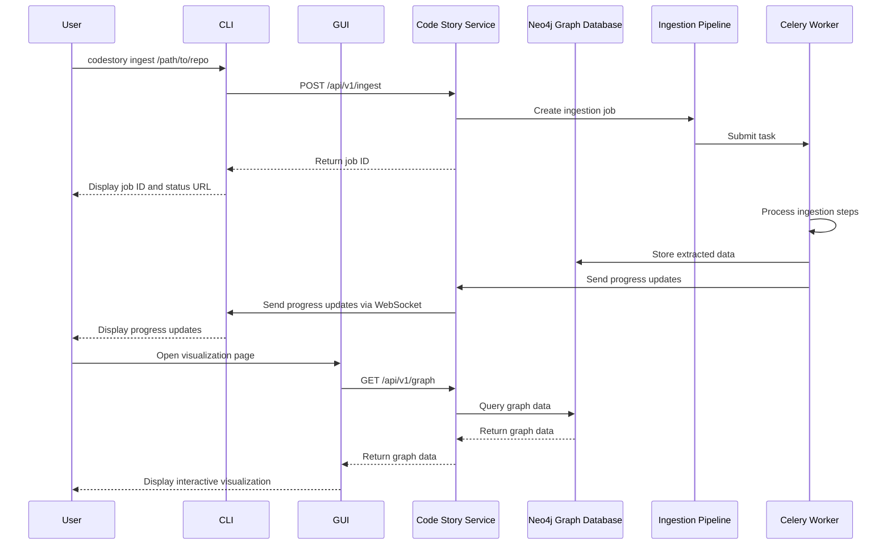
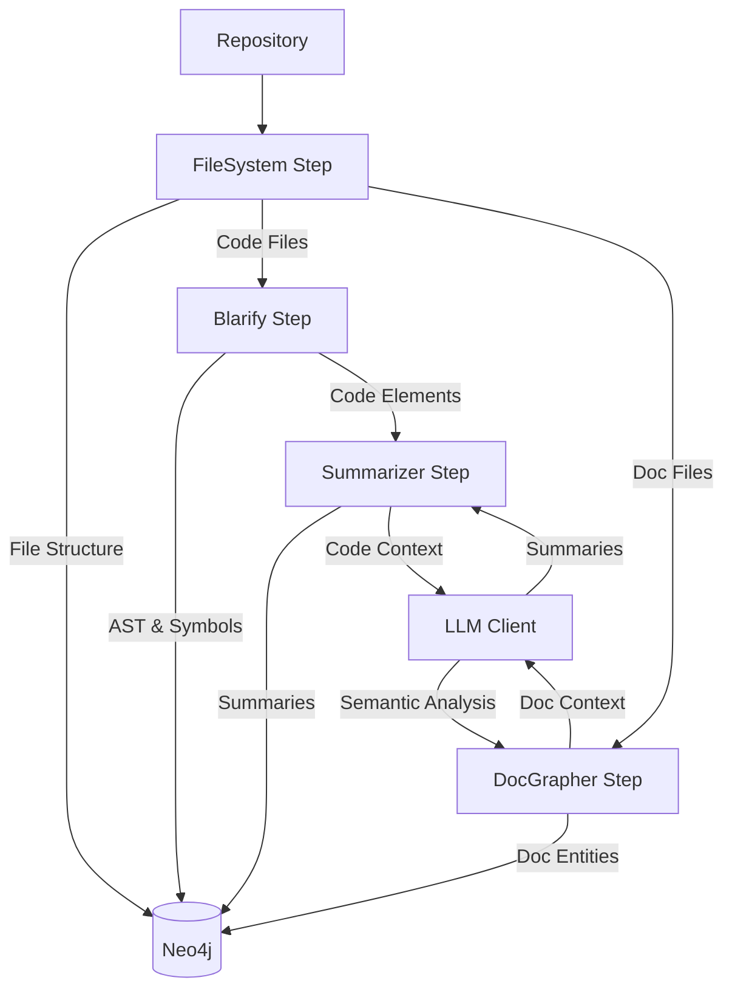
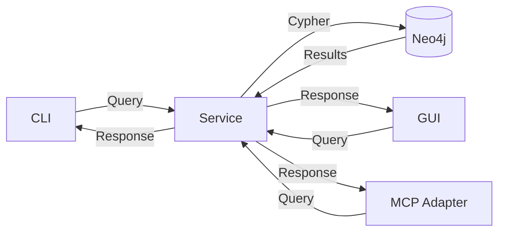
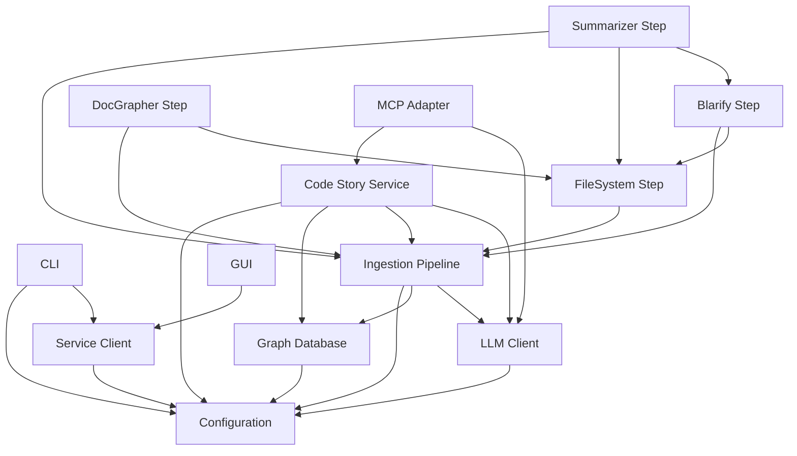
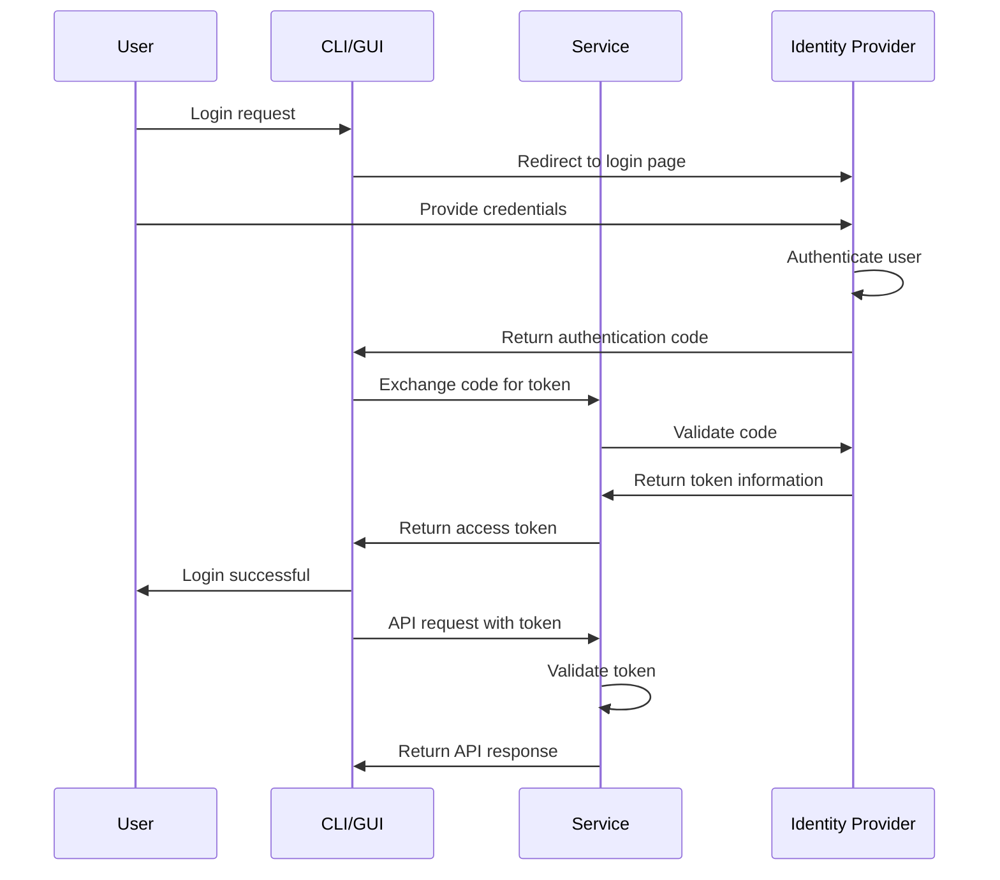

# Component Interactions

This page documents the interactions between the major components of Code Story, explaining how they work together to provide the system's functionality.

## Core Service Interactions



## Data Flow Between Components

### Ingestion Flow



### Query Flow



## Component Dependencies

The following diagram shows the dependencies between different components:



## Communication Protocols

### REST API

The Code Story Service exposes a RESTful API that follows the JSON:API specification. All endpoints are versioned using URL paths (e.g., `/api/v1/ingest`).

Example request:

```http
POST /api/v1/ingest HTTP/1.1
Host: localhost:8000
Content-Type: application/json
Authorization: Bearer <token>

{
  "repository_path": "/path/to/repo",
  "steps": ["filesystem", "blarify", "summarizer", "docgrapher"],
  "options": {
    "exclude_patterns": ["node_modules", ".git"]
  }
}
```

Example response:

```http
HTTP/1.1 201 Created
Content-Type: application/json

{
  "status": "success",
  "data": {
    "job_id": "3f7a2d9e-5b1c-4c07-8f7d-a6b3c4d5e6f7",
    "status": "pending",
    "created_at": "2025-05-11T10:15:30Z",
    "links": {
      "self": "/api/v1/ingest/jobs/3f7a2d9e-5b1c-4c07-8f7d-a6b3c4d5e6f7",
      "websocket": "/api/v1/ws/jobs/3f7a2d9e-5b1c-4c07-8f7d-a6b3c4d5e6f7"
    }
  },
  "errors": []
}
```

### WebSocket API

For real-time updates, especially during long-running processes like ingestion jobs, Code Story uses WebSockets. The connection URL follows the pattern:

```
ws://localhost:8000/api/v1/ws/jobs/{job_id}
```

Messages sent over the WebSocket connection are JSON objects with the following structure:

```json
{
  "type": "progress_update",
  "data": {
    "job_id": "3f7a2d9e-5b1c-4c07-8f7d-a6b3c4d5e6f7",
    "step": "filesystem",
    "progress": 75,
    "message": "Processing directory: /path/to/repo/src",
    "timestamp": "2025-05-11T10:15:45Z"
  }
}
```

### Model Context Protocol (MCP)

The MCP Adapter exposes an API compatible with the Model Context Protocol, allowing AI agents to interact with the Code Story graph database.

Example function definition:

```json
{
  "function": {
    "name": "search_graph",
    "description": "Search the code graph for specific elements",
    "parameters": {
      "type": "object",
      "properties": {
        "query": {
          "type": "string",
          "description": "The search query string"
        },
        "node_types": {
          "type": "array",
          "items": {
            "type": "string"
          },
          "description": "Optional list of node types to search"
        }
      },
      "required": ["query"]
    }
  }
}
```

## Authentication Flow



## Error Handling

Code Story implements a structured approach to error handling:

1. **Domain-specific exceptions**: Each component defines its own exception hierarchy.
2. **Error propagation**: Lower-level components propagate errors to higher-level components.
3. **Structured error responses**: The API returns structured error objects with codes and messages.
4. **Retry mechanisms**: Critical operations implement retry logic with exponential backoff.
5. **Circuit breakers**: Prevent cascading failures when external services are unavailable.

Example error response:

```json
{
  "status": "error",
  "data": null,
  "errors": [
    {
      "code": "GRAPH_DB_ERROR",
      "message": "Failed to connect to Neo4j database",
      "context": {
        "uri": "neo4j://localhost:7687",
        "retry_count": 3
      }
    }
  ]
}
```

## Metrics and Monitoring

Each component exposes metrics through Prometheus endpoints:

- **Service**: HTTP request counts, response times, error rates
- **GraphDB**: Query execution times, connection pool stats, query cache hit rates
- **Pipeline**: Job counts, step execution times, failure rates
- **LLM**: API call latency, token usage, error rates
- **MCP**: Tool invocation counts, execution times, error rates

Grafana dashboards visualize these metrics for real-time monitoring of system health and performance.