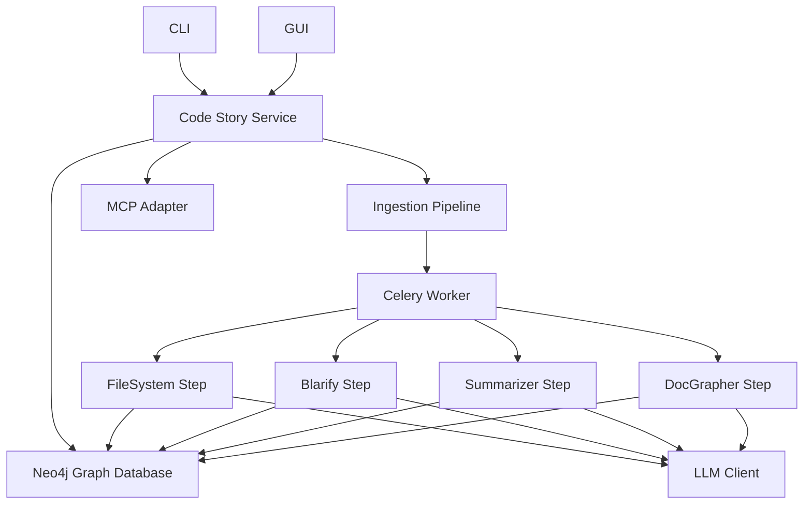

# Architecture Overview

Code Story's architecture consists of several loosely-coupled components that work together to ingest, analyze, and represent codebases as knowledge graphs.

## High-Level Architecture

## Core Components

### 1. Code Story Service

The central component that orchestrates all operations. It provides:

- REST API for client integrations
- WebSocket interface for real-time progress updates
- Graph query operations
- Ingestion job management

### 2. Ingestion Pipeline

A modular, plugin-based system for processing codebases:

- **FileSystem Step**: Extracts codebase structure from files and directories
- **Blarify Step**: Analyzes code for semantic elements and relationships
- **Summarizer Step**: Generates natural language summaries for code entities
- **DocGrapher Step**: Extracts information from documentation and links it to code

### 3. Graph Database

Neo4j database that stores the knowledge graph:

- Custom schema for representing code relationships
- Vector-based semantic indexing for enhanced search
- Efficient graph traversal for complex queries

### 4. LLM Client

The AI integration layer:

- Abstract interface for multiple LLM providers
- Retry logic and error handling
- Caching for efficiency
- Streaming support for real-time interactions

### 5. MCP Adapter

The Model Context Protocol adapter that enables integration with AI agents:

- Exposes graph data to LLMs via standardized tools
- Enables natural language interactions with the code graph
- Supports AI-driven code exploration and understanding

### 6. GUI

The web-based user interface:

- 3D visualization of code relationships
- Query interface for natural language exploration
- Ingestion job management and monitoring
- Configuration management

### 7. CLI

Command-line interface for automation and scripting:

- Ingestion and analysis commands
- Configuration management
- Query capabilities
- Service management

## Key Design Principles

1. **Modularity**: Components are designed to be replaceable and extensible
2. **Scalability**: Services can be scaled independently based on workload
3. **Resilience**: Fault tolerance with retry mechanisms and graceful degradation
4. **Extensibility**: Plugin architecture for adding new functionality
5. **Security**: Configurable authentication and authorization

## Cross-Cutting Concerns

- **Configuration**: Multi-layered configuration system
- **Telemetry**: Comprehensive logging and metrics
- **Error Handling**: Structured error handling and reporting
- **Authentication**: Configurable identity providers

For detailed information on each component, please refer to the specific documentation pages:

- [Component Interactions](components.md)
- [Data Flow](data_flow.md)
- [Design Decisions](design_decisions.md)