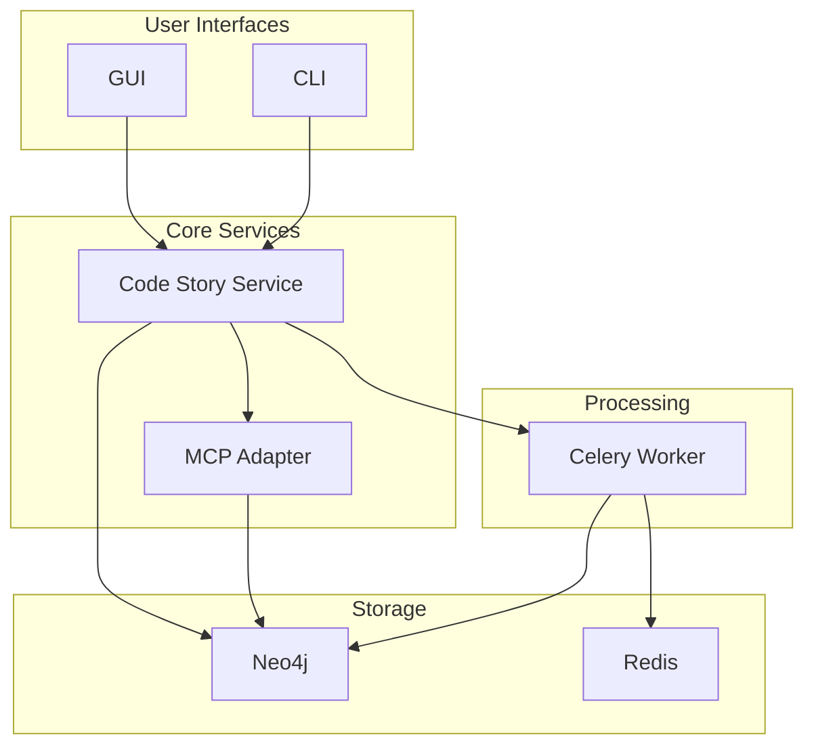

# Deployment Guide

This section covers the different ways to deploy Code Story, from local development to production environments.

## Deployment Options

Code Story can be deployed in several ways:

1. [Local Development](local.md) - Using Docker Compose for local development
2. [Azure Deployment](azure.md) - Deploying to Azure Container Apps
3. [Repository Mounting](repository_mounting.md) - Guide for correctly mounting repositories for ingestion
4. [Azure Authentication](azure_authentication.md) - Managing Azure authentication for OpenAI access

## System Requirements

Regardless of deployment method, Code Story requires:

- Python 3.12+
- Node.js 18+
- Neo4j 5.x
- Redis 7.x
- OpenAI API access (or compatible LLM provider)

## Resource Requirements

The minimum recommended resources for a production deployment:

| Component | CPU | Memory | Storage |
|-----------|-----|--------|---------|
| Service   | 2   | 4 GB   | 10 GB   |
| Worker    | 4   | 8 GB   | 10 GB   |
| MCP       | 2   | 4 GB   | 10 GB   |
| GUI       | 1   | 2 GB   | 5 GB    |
| Neo4j     | 4   | 8 GB   | 50 GB   |
| Redis     | 2   | 4 GB   | 10 GB   |

## Environment Variables

Code Story uses environment variables for configuration. Common variables include:

| Variable | Description | Default |
|----------|-------------|---------|
| `CODESTORY_ENV` | Environment (development, test, production) | `development` |
| `OPENAI_API_KEY` | OpenAI API key | - |
| `NEO4J_URI` | Neo4j connection URI | `neo4j://localhost:7687` |
| `NEO4J_USERNAME` | Neo4j username | `neo4j` |
| `NEO4J_PASSWORD` | Neo4j password | - |
| `REDIS_URI` | Redis connection URI | `redis://localhost:6379` |
| `LOG_LEVEL` | Logging level | `INFO` |

See the [Configuration Guide](../user_guides/workflows/configuration.md) for a complete list of environment variables.

## Deployment Architecture



## Docker Volume Mounts

For the ingestion pipeline to work correctly, the repository being ingested must be accessible to the service containers. When running in Docker, you must mount the repository as a volume:

```bash
# Mount a local repository for ingestion
docker run -v /local/path/to/repo:/mounted/repo/path codestory-service
```

For Docker Compose deployments, add volume mounts in your `docker-compose.yml`:

```yaml
services:
  service:
    image: codestory-service
    volumes:
      - /local/path/to/repo:/mounted/repo/path
      
  worker:
    image: codestory-worker
    volumes:
      - /local/path/to/repo:/mounted/repo/path
```

Important notes:
- The CLI uses absolute paths when communicating with the service
- Both the service and worker containers need access to the repository
- Use consistent mount paths across containers to ensure path references remain valid
- For production environments, consider using shared storage solutions like Azure Files or NFS

## Security Considerations

- All services run as non-root users
- Secrets are stored in Key Vault for Azure deployments
- Network access is restricted by default
- Authentication is enabled for all services

## Monitoring and Logging

Code Story outputs logs in structured JSON format. In production environments, it's recommended to use a centralized logging solution like Azure Log Analytics.

Key metrics to monitor include:

- Ingestion job durations
- API response times
- Graph database query performance
- Worker queue lengths
- LLM API call latency and costs

## Backup and Recovery

For production deployments, regular backups are essential. See the [Disaster Recovery Guide](../developer_guides/disaster_recovery.md) for details on backup and restore procedures.

## Next Steps

Choose a deployment option based on your needs:

- [Local Development](local.md) for development and testing
- [Azure Deployment](azure.md) for production use