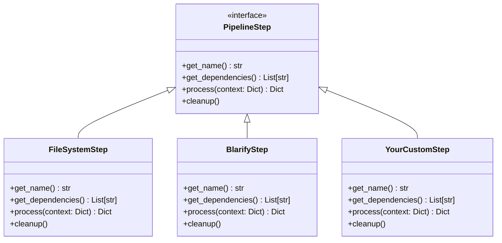

# Creating Custom Pipeline Steps

The Code Story ingestion pipeline is designed to be extensible through custom pipeline steps. This guide will walk you through the process of creating your own pipeline step to extend the functionality of the ingestion process.

## Pipeline Step Architecture

Pipeline steps in Code Story follow a plugin-based architecture using Python's entry points mechanism. Each step is a separate module that implements the `PipelineStep` interface from the `codestory.ingestion_pipeline.step` module.



## Creating a Basic Pipeline Step

### 1. Create a New Package

Start by creating a new Python package for your step. The recommended naming convention is `codestory_yourstepdescription`:

```bash
mkdir -p src/codestory_customstep
touch src/codestory_customstep/__init__.py
touch src/codestory_customstep/step.py
```

### 2. Implement the PipelineStep Interface

In `src/codestory_customstep/step.py`, implement the `PipelineStep` interface:

```python
from typing import Dict, List, Optional

from codestory.ingestion_pipeline.step import PipelineStep


class CustomStep(PipelineStep):
    """Custom pipeline step that demonstrates how to create a new step."""

    def get_name(self) -> str:
        """Return the unique name of this step."""
        return "custom"

    def get_dependencies(self) -> List[str]:
        """Return a list of step names that this step depends on."""
        # This step depends on the filesystem step
        return ["filesystem"]

    def process(self, context: Dict) -> Dict:
        """
        Process the context and return the updated context.
        
        Args:
            context: The pipeline context containing all data from previous steps.
                    
        Returns:
            The updated context with additional data from this step.
            
        Raises:
            StepExecutionError: If the step execution fails.
        """
        # Get the repository path from the context
        repo_path = context.get("repository_path")
        if not repo_path:
            raise ValueError("Repository path not found in context")
            
        # Get data from previous steps
        files = context.get("files", [])
        
        # Report progress
        total_files = len(files)
        for idx, file_info in enumerate(files):
            # Process each file
            file_path = file_info.get("path")
            
            # Report progress (0-100%)
            progress = int((idx + 1) / total_files * 100)
            self.report_progress(progress, f"Processing file {file_path}")
            
            # Your custom processing logic here
            # ...
            
        # Add your results to the context
        context["custom_data"] = {
            "processed_files": total_files,
            "custom_results": []  # Your custom results here
        }
        
        return context

    def cleanup(self) -> None:
        """Clean up resources used by this step."""
        # Clean up any resources your step uses
        pass
```

### 3. Register Your Step with Entry Points

Update your `pyproject.toml` to register your step as an entry point:

```toml
[tool.poetry.plugins."codestory.pipeline.steps"]
custom = "codestory_customstep.step:CustomStep"
```

This registers a step named "custom" that will be automatically discovered by the ingestion pipeline.

## Advanced Step Features

### Progress Reporting

The `PipelineStep` base class provides a `report_progress` method that you can use to report progress updates:

```python
def process(self, context: Dict) -> Dict:
    # ...
    
    # Report progress with a percentage and message
    self.report_progress(50, "Halfway through processing")
    
    # ...
    return context
```

### Error Handling

Proper error handling is crucial for custom steps. Use try-except blocks and raise appropriate exceptions:

```python
from codestory.ingestion_pipeline.exceptions import StepExecutionError

def process(self, context: Dict) -> Dict:
    try:
        # Your processing logic
        return context
    except Exception as e:
        # Include relevant context for debugging
        raise StepExecutionError(f"Failed to execute custom step: {str(e)}") from e
```

### Neo4j Integration

Most steps will need to interact with the Neo4j graph database. Here's how to access the database from your step:

```python
from codestory.graphdb.neo4j_connector import Neo4jConnector

def process(self, context: Dict) -> Dict:
    # Get the Neo4j connector from the context
    connector: Optional[Neo4jConnector] = context.get("neo4j_connector")
    if not connector:
        raise ValueError("Neo4j connector not found in context")
    
    # Use the connector to interact with the database
    with connector.session() as session:
        # Create nodes
        result = session.run(
            """
            CREATE (n:CustomNode {name: $name, type: $type})
            RETURN n
            """,
            name="My Custom Node",
            type="Example"
        )
        
        # Process result
        node_data = result.single()
        
    return context
```

### Passing Data Between Steps

Steps communicate by sharing data through the context dictionary. This is how you can access data from previous steps and provide data for subsequent steps:

```python
def process(self, context: Dict) -> Dict:
    # Access data from previous steps
    files = context.get("files", [])
    directories = context.get("directories", [])
    
    # Add your own data for subsequent steps
    context["custom_data"] = {
        "analysis_results": [],
        "metadata": {}
    }
    
    return context
```

## Testing Your Pipeline Step

### Unit Testing

Create unit tests for your step in the `tests/unit/test_custom_step.py` file:

```python
import pytest
from unittest.mock import MagicMock, patch

from codestory_customstep.step import CustomStep


class TestCustomStep:
    def test_get_name(self):
        step = CustomStep()
        assert step.get_name() == "custom"
        
    def test_get_dependencies(self):
        step = CustomStep()
        assert "filesystem" in step.get_dependencies()
        
    @patch("codestory_customstep.step.CustomStep.report_progress")
    def test_process(self, mock_report_progress):
        # Arrange
        step = CustomStep()
        context = {
            "repository_path": "/path/to/repo",
            "files": [
                {"path": "/path/to/repo/file1.py"},
                {"path": "/path/to/repo/file2.py"},
            ]
        }
        
        # Act
        result = step.process(context)
        
        # Assert
        assert "custom_data" in result
        assert result["custom_data"]["processed_files"] == 2
        mock_report_progress.assert_called()
```

### Integration Testing

Create integration tests in the `tests/integration/test_ingestion_pipeline/test_custom_step_integration.py` file:

```python
import pytest
import os
from pathlib import Path

from codestory.ingestion_pipeline.manager import PipelineManager
from codestory.graphdb.neo4j_connector import Neo4jConnector
from codestory_customstep.step import CustomStep


@pytest.fixture
def pipeline_manager(neo4j_connector):
    """Create a pipeline manager with a Neo4j connector."""
    return PipelineManager(neo4j_connector=neo4j_connector)


@pytest.mark.integration
def test_custom_step_integration(pipeline_manager, test_repo_path):
    """Test the custom step in an actual pipeline run."""
    # Arrange
    context = {
        "repository_path": test_repo_path,
        "steps": ["filesystem", "custom"],
    }
    
    # Act
    result = pipeline_manager.run_pipeline(context)
    
    # Assert
    assert "custom_data" in result
    assert result["custom_data"]["processed_files"] > 0
    # Add more assertions specific to your step
```

## Deploying Your Custom Step

Once your step is implemented, tested, and registered with entry points, it can be used in the ingestion pipeline:

```bash
# Use your step in the CLI
cs ingest /path/to/repo --steps filesystem,custom

# Or configure it as part of the default pipeline in your configuration
cs config set ingestion.default_steps '["filesystem", "blarify", "custom", "summarizer"]'
```

## Best Practices

1. **Keep steps focused**: Each step should have a single responsibility.
2. **Minimize dependencies**: Only depend on steps you absolutely need.
3. **Report progress**: Use the progress reporting mechanism for long-running operations.
4. **Handle errors gracefully**: Catch and handle exceptions appropriately.
5. **Clean up resources**: Implement the `cleanup` method to release resources.
6. **Add comprehensive tests**: Both unit and integration tests are important.
7. **Document your step**: Add clear docstrings and comments explaining your step's purpose and behavior.

## Example: A Code Metrics Step

Here's a more concrete example of a step that analyzes code to extract metrics like cyclomatic complexity, lines of code, etc.:

```python
import os
from typing import Dict, List
import subprocess

from codestory.ingestion_pipeline.step import PipelineStep
from codestory.ingestion_pipeline.exceptions import StepExecutionError


class CodeMetricsStep(PipelineStep):
    """Pipeline step that extracts code metrics using radon."""

    def get_name(self) -> str:
        return "code_metrics"

    def get_dependencies(self) -> List[str]:
        return ["filesystem"]

    def process(self, context: Dict) -> Dict:
        try:
            import radon.complexity
            import radon.metrics
        except ImportError:
            raise StepExecutionError(
                "radon package is required for CodeMetricsStep. "
                "Install it with: pip install radon"
            )

        repo_path = context.get("repository_path")
        if not repo_path:
            raise ValueError("Repository path not found in context")
            
        files = [
            f for f in context.get("files", [])
            if f.get("path", "").endswith(".py")
        ]
        
        metrics_results = {}
        total_files = len(files)
        
        for idx, file_info in enumerate(files):
            file_path = file_info.get("path")
            rel_path = os.path.relpath(file_path, repo_path)
            
            # Report progress
            progress = int((idx + 1) / total_files * 100)
            self.report_progress(progress, f"Analyzing metrics for {rel_path}")
            
            try:
                with open(file_path, 'r', encoding='utf-8') as f:
                    code = f.read()
                    
                # Calculate metrics
                cc = radon.complexity.cc_visit(code)
                mi = radon.metrics.mi_visit(code, multi=True)
                raw = radon.metrics.raw_metrics(code)
                
                # Store metrics
                metrics_results[rel_path] = {
                    "complexity": [
                        {
                            "name": block.name,
                            "complexity": block.complexity,
                            "start_line": block.lineno,
                            "type": block.type
                        }
                        for block in cc
                    ],
                    "maintainability_index": mi,
                    "raw_metrics": {
                        "loc": raw.loc,
                        "lloc": raw.lloc,
                        "sloc": raw.sloc,
                        "comments": raw.comments,
                        "multi": raw.multi,
                        "blank": raw.blank
                    }
                }
            except Exception as e:
                # Log the error but continue processing
                self.logger.error(f"Error processing {file_path}: {str(e)}")
                
        # Add metrics to context
        context["code_metrics"] = metrics_results
        
        # Store metrics in Neo4j if connector is available
        connector = context.get("neo4j_connector")
        if connector:
            with connector.session() as session:
                for file_path, metrics in metrics_results.items():
                    # Create or update metrics for file
                    session.run(
                        """
                        MATCH (f:File {path: $file_path})
                        SET f.metrics = $metrics
                        """,
                        file_path=file_path,
                        metrics=metrics
                    )
        
        return context

    def cleanup(self) -> None:
        # No resources to clean up
        pass
```

## Conclusion

Creating custom pipeline steps allows you to extend Code Story's functionality to meet your specific needs. By following this guide, you can develop and integrate your own processing steps into the ingestion pipeline, enabling new capabilities and insights from your codebase.

For more examples, look at the existing steps in the codebase:
- `codestory_filesystem.step.py`
- `codestory_blarify.step.py`
- `codestory_summarizer.step.py`
- `codestory_docgrapher.step.py`