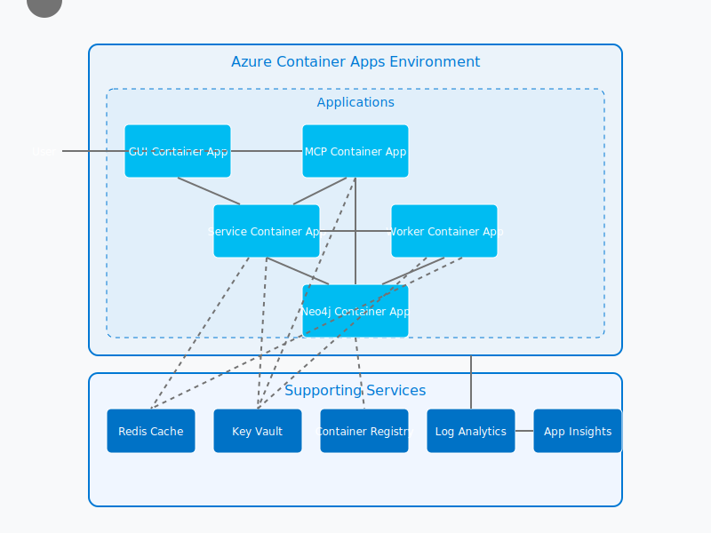

# Code Story Infrastructure

This directory contains the infrastructure as code for Code Story, supporting both local development with Docker Compose and cloud deployment to Azure Container Apps.

## Azure Architecture

The following diagram illustrates the Azure resources and their relationships in the Code Story deployment:



The architecture consists of:
1. **Container Apps Environment** - Hosts all containerized applications
2. **Container Apps** - Service, Worker, MCP, GUI, and Neo4j
3. **Supporting Azure Services** - Redis Cache, Key Vault, Container Registry, and monitoring

### Components and Flow

- **GUI Container App**: React-based web interface for users to interact with Code Story
- **MCP Container App**: Model Context Protocol adapter for LLM integration
- **Service Container App**: Main API service providing business logic and data access
- **Worker Container App**: Background processes for codebase analysis and ingestion
- **Neo4j Container App**: Graph database for storing code relationships and metadata

### Data Flow

1. Users access the application through the GUI or MCP interface
2. The GUI communicates with the Service API for data retrieval and mutations
3. The Service coordinates with Workers for background processing
4. Both Service and Workers store and query data from Neo4j
5. Redis is used for caching and as a message broker between Service and Workers
6. Key Vault securely stores all secrets (database credentials, API keys)
7. Container Registry provides image storage and versioning
8. Log Analytics and Application Insights provide monitoring and diagnostics

## Directory Structure

- `/docker` - Docker build files for all services
  - `service.Dockerfile` - Multi-stage build for service and worker
  - `mcp.Dockerfile` - Build for MCP adapter
  - `gui.Dockerfile` - Build for GUI
  - `nginx.conf` - Nginx config for GUI production build
- `/scripts` - Management scripts
  - `start.sh` - Start local development environment
  - `stop.sh` - Stop local development environment
  - `healthcheck.sh` - Check health of services
  - `deploy_azure.sh` - Deploy to Azure
  - `build_push_acr.sh` - Build and push images to Azure Container Registry
- `/azure` - Azure Bicep templates
  - `main.bicep` - Main deployment template
  - `modules/` - Modular templates for each resource
  - `parameters/` - Environment-specific parameter files

## Local Development

The local development environment uses Docker Compose with development-optimized builds.

### Starting the Environment

```bash
./infra/scripts/start.sh
```

This script:
1. Checks for required dependencies
2. Creates a default `.env` file if not present
3. Starts containers with Docker Compose
4. Waits for services to become healthy
5. Displays endpoints for all services

### Stopping the Environment

```bash
./infra/scripts/stop.sh
```

### Checking Service Health

```bash
./infra/scripts/healthcheck.sh
```

## Azure Deployment

Code Story can be deployed to Azure Container Apps for production or staging environments.

### Prerequisites

- Azure CLI installed and authenticated
- Docker installed locally
- Subscription with permissions to create resources

### Deployment Process

1. **Deploy Infrastructure**

   ```bash
   ./infra/scripts/deploy_azure.sh -e <environment> -g <resource-group> [-l <location>] [-s <subscription>]
   ```

   Options:
   - `-e, --environment`: Environment to deploy (dev, test, prod)
   - `-g, --resource-group`: Azure Resource Group name
   - `-l, --location`: Azure location (default: eastus)
   - `-s, --subscription`: Azure subscription ID

   This script will prompt for sensitive parameters:
   - Neo4j password
   - Azure OpenAI API key
   - OpenAI API key
   - Entra Client Secret (if using authentication)

2. **Build and Push Images**

   ```bash
   ./infra/scripts/build_push_acr.sh -r <registry-name> [-e <environment>] [-s <subscription>] [--no-push]
   ```

   Options:
   - `-r, --registry`: Azure Container Registry name
   - `-e, --environment`: Environment tag for images (dev, prod)
   - `-s, --subscription`: Azure subscription ID
   - `--no-push`: Build images locally only, don't push to ACR

## Multi-Environment Support

The Azure templates support different environments with parameter files:

- `dev.parameters.json` - Development environment (minimal resources)
- `prod.parameters.json` - Production environment (scaled resources)

## Container Architecture

All containers use multi-stage builds to optimize:

1. **Builder Stage** - Installs build dependencies
2. **Development Stage** - Includes development tools and hot-reloading
3. **Production Stage** - Minimal runtime with only required dependencies

The containers implement:
- Health checks for all services
- Resource limits
- Proper signal handling
- Optimized build caching

## VS Code Development Container

A VS Code devcontainer is provided in `/.devcontainer/devcontainer.json` for consistent development environments across team members. It includes:

- All required development tools
- Docker-in-Docker capability
- GitHub CLI integration
- Azure CLI integration
- Pre-configured extensions for Python, TypeScript, and Docker

## Security Considerations

- Secrets are stored in Azure Key Vault
- Managed Identities are used for service authentication
- HTTPS is enforced for all external endpoints
- CORS is properly configured
- Container registries use Managed Identity authentication
- Images use minimal base images to reduce attack surface