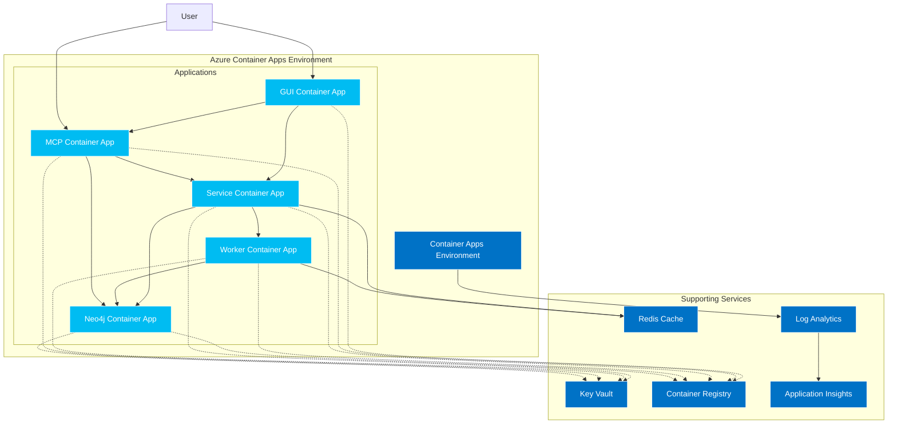

```mermaid
flowchart TB
    subgraph "Azure Container Apps Environment"
        CAE[Container Apps Environment]
        
        subgraph "Applications"
            GUI[GUI Container App]
            MCP[MCP Container App]
            Service[Service Container App]
            Worker[Worker Container App]
            Neo4j[Neo4j Container App]
        end
        
        GUI --> Service
        GUI --> MCP
        MCP --> Service
        Service --> Neo4j
        Worker --> Neo4j
        Service --> Worker
        MCP --> Neo4j
    end
    
    subgraph "Supporting Services"
        Redis[Redis Cache]
        KeyVault[Key Vault]
        ACR[Container Registry]
        LogAnalytics[Log Analytics]
        AppInsights[Application Insights]
    end
    
    Service --> Redis
    Worker --> Redis
    
    Service -.-> KeyVault
    Worker -.-> KeyVault
    MCP -.-> KeyVault
    Neo4j -.-> KeyVault
    
    GUI -.-> ACR
    MCP -.-> ACR
    Service -.-> ACR
    Worker -.-> ACR
    Neo4j -.-> ACR
    
    CAE --> LogAnalytics
    LogAnalytics --> AppInsights
    
    User[User] --> GUI
    User --> MCP
    
    classDef azure fill:#0072C6,stroke:#fff,stroke-width:1px,color:#fff;
    classDef container fill:#00BCF2,stroke:#fff,stroke-width:1px,color:#fff;
    
    class Redis,KeyVault,ACR,LogAnalytics,AppInsights,CAE azure;
    class GUI,MCP,Service,Worker,Neo4j container;
```