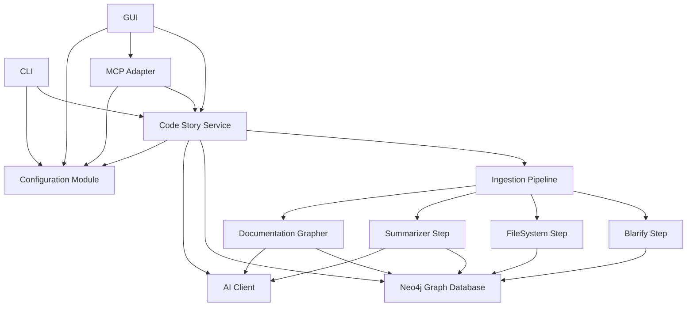
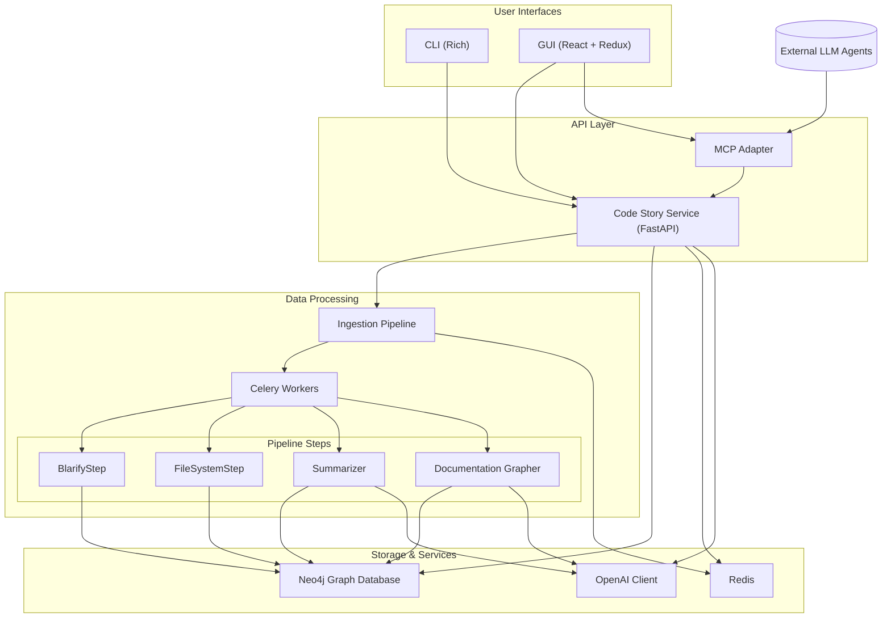

# 1.0 Overview & Architecture

## Table of Contents

1. **Overview & Architecture** (This Document)
   - [Error Handling and Propagation](./error-handling.md)
2. **[Scaffolding](../02-scaffolding/scaffolding.md)** - Project structure and foundational setup 
3. **[Configuration Module](../03-configuration/configuration.md)** - Settings and configuration management
4. **[Graph Database Service](../04-graph-database/graph-database.md)** - Neo4j backend and connectivity
5. **[AI Client](../05-ai-client/ai-client.md)** - OpenAI service integration
6. **[Ingestion Pipeline](../06-ingestion-pipeline/ingestion-pipeline.md)** - Orchestration framework
   - [Blarify Workflow Step](../07-blarify-step/blarify-step.md) - Code parsing
   - [FileSystem Workflow Step](../08-filesystem-step/filesystem-step.md) - Filesystem handling
   - [Summarizer Workflow Step](../09-summarizer-step/summarizer-step.md) - Content summarization
   - [Documentation Grapher Step](../10-docgrapher-step/docgrapher-step.md) - Documentation processing
7. **[Code Story Service](../11-code-story-service/code-story-service.md)** - Main API service
8. **[MCP Adapter](../12-mcp-adapter/mcp-adapter.md)** - Model Context Protocol integration
9. **[CLI](../13-cli/cli.md)** - Command-line interface
10. **[GUI](../14-gui/gui.md)** - Web-based user interface
11. **[Infrastructure](../15-infra/infra.md)** - Deployment and infrastructure
12. **[Documentation](../16-documentation/documentation.md)** - Project documentation

## Component Dependencies

## 1.1 Mission

Convert any codebase into a richly-linked knowledge graph plus natural-language summaries that developers can query through a CLI or GUI and which LLM agents can query through **Model Context Protocol (MCP)**.

## 1.2 Components and Data Flow

* **Configuration Module** – Manages application configuration based on `.env` file or Azure KeyVault.

* **User Interfaces** – Trigger ingestion or query the knowledge graph:
  * **CLI** – Rich command-line interface using [Rich](https://github.com/Textualize/rich-cli).
  * **GUI** – React + Redux web application with 3D force graph visualization.
  * Both consume the same API from the **Code Story Service**.

* **Code Story Service** – FastAPI service that:
  * Manages the ingestion pipeline through Celery tasks
  * Provides query interfaces to the graph database
  * Handles authentication and authorization
  * Exposes WebSocket endpoints for real-time progress updates

* **Ingestion Pipeline** – Orchestrates plug-in workflow steps:
  * **BlarifyStep** – Parses codebase using [Blarify](https://github.com/blarApp/blarify) to generate AST in Neo4j
  * **FileSystemStep** – Creates a graph of filesystem layout and links to AST nodes
  * **Summarizer** – Computes DAG of dependencies, traverses from leaf nodes up to generate summaries
  * **DocumentationGrapher** – Links documentation to relevant code elements

* **Storage & Services**:
  * **Neo4j Graph Database** – Stores knowledge graph with semantic index and vector search
  * **Redis** – Supports Celery task queue and WebSocket pub/sub
  * **OpenAI Client** – Provides access to Azure OpenAI API with bearer token auth

* **MCP Adapter** – Exposes graph to LLM agents via [MCP](https://den.dev/blog/auth-modelcontextprotocol-entra-id/) standard.

## 1.3 Deployment Topology

All services run under `docker-compose` network locally; Azure Container Apps deployment mirrors this layout with container scaling.

* **Neo4j** – Graph database with semantic indexing (container)
* **Redis** – Backend for Celery and pub/sub (container)
* **Code Story Service** – Core API service (container)
* **Celery Workers** – Execute ingestion pipeline steps (container)
* **MCP Adapter** – Model Context Protocol server (container)
* **GUI** – Web interface for visualization and interaction (container)
* **CLI** – Command-line interface (local executable)

## 1.4 Cross-Cutting Concerns

* **Auth** – MCP endpoints protected by Entra ID bearer JWT; local mode can bypass with `--no-auth` flag.
* **Observability** – OpenTelemetry traces, Prometheus metrics from every service, Grafana dashboard template in `infra/`.
* **Extensibility** – Ingestion steps are plug-in entry-points; GUI dynamically reflects new step types; prompts in `prompts/` folder can be customized.

## 1.5 Architecture Overview

Code Story follows a microservices architecture with containerized components that communicate through well-defined APIs. The system is designed to be modular and extensible, with clear separation of concerns between components.

### 1.5.1 Key Architectural Principles

* **Containerized Services** – All components run as Docker containers for consistent deployment.
* **API-First Design** – Components interact through well-defined APIs.
* **Event-Driven Processing** – Asynchronous processing through Celery task queue.
* **Knowledge Graph Foundation** – Neo4j stores multi-layered knowledge about code.
* **Multi-Modal Interfaces** – Both CLI and GUI provide full access to functionality.
* **Extensibility** – Plugin architecture for pipeline steps.
* **Observability** – Comprehensive logging, metrics, and tracing.

This architecture enables Code Story to handle large codebases efficiently while providing multiple interfaces for developers to interact with the knowledge graph, whether through direct queries, natural language questions, or programmatic MCP tools.

---
