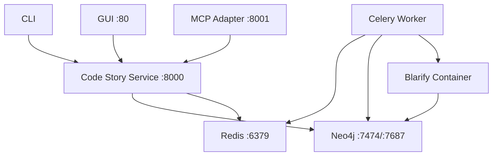

# Host-Native Architecture Proposal

**Specification ID:** 17-host-native-architecture  
**Version:** 1.0  
**Status:** Proposed  
**Date:** 2025-06-05

## Executive Summary

This document proposes a rearchitecture of the Code Story project to move from a fully containerized architecture to a hybrid approach where most components run natively on the host system, with only Blarify remaining containerized due to its Linux-specific requirements.

## Current Architecture Analysis

### Current Containerized Components

1. **Neo4j Database** - Graph database service
2. **Redis** - Message broker and caching layer
3. **Code Story Service** - FastAPI web service
4. **Celery Worker** - Background task processing
5. **GUI** - React/TypeScript frontend (Nginx-served)
6. **MCP Adapter** - Model Context Protocol service
7. **Blarify Step** - Code parsing service (Linux container requirement)

### Current Dependencies and Networking



## Proposed Host-Native Architecture

### Components to Run on Host

#### 1. **Neo4j Database**
- **Deployment:** Native installation or cloud service
- **Configuration:** Direct host networking
- **Benefits:** Better performance, easier debugging, standard operational practices
- **Installation Options:**
  - Native installation via package managers (apt, brew, yum)
  - Neo4j Desktop for development
  - Neo4j Aura Cloud for production

#### 2. **Redis**
- **Deployment:** Native installation or cloud service
- **Configuration:** Standard host networking
- **Benefits:** Reduced container overhead, easier monitoring
- **Installation Options:**
  - Native installation via package managers
  - Redis Cloud for production

#### 3. **Code Story Service (FastAPI)**
- **Deployment:** Python virtual environment on host
- **Process Management:** systemd, PM2, or direct Python execution
- **Configuration:** Environment variables and config files
- **Benefits:** Direct debugging, IDE integration, faster development cycles

#### 4. **Celery Worker**
- **Deployment:** Python virtual environment on host
- **Process Management:** systemd, supervisor, or direct execution
- **Configuration:** Shared config with service
- **Benefits:** Easier debugging, direct file system access

#### 5. **GUI (React/TypeScript)**
- **Development:** Node.js development server on host
- **Production:** Static files served by nginx/Apache on host or CDN
- **Benefits:** Hot reloading, easier debugging, standard web deployment

#### 6. **MCP Adapter**
- **Deployment:** Python virtual environment on host
- **Process Management:** systemd or direct execution
- **Configuration:** Environment variables
- **Benefits:** Easier integration testing, simpler networking

### Components to Remain Containerized

#### 7. **Blarify Step**
- **Deployment:** Docker container (unchanged)
- **Reason:** Linux-specific binary dependencies and toolchain requirements
- **Integration:** Container-to-host communication via network protocols
- **Configuration:** Environment variables for host service endpoints

## Detailed Implementation Plan

### Phase 1: Infrastructure Setup

#### Development Environment

1. **Database Installation**
   ```bash
   # Neo4j (macOS)
   brew install neo4j
   
   # Redis (macOS)  
   brew install redis
   
   # Neo4j (Ubuntu)
   sudo apt install neo4j
   
   # Redis (Ubuntu)
   sudo apt install redis-server
   ```

2. **Python Environment Setup**
   ```bash
   # Create virtual environment
   python -m venv .venv
   source .venv/bin/activate  # or .venv\Scripts\activate on Windows
   
   # Install dependencies
   pip install -e .
   ```

3. **Node.js Environment Setup**
   ```bash
   # Install Node.js dependencies
   npm install
   ```

#### Production Environment

1. **Service Management with systemd**
   ```ini
   # /etc/systemd/system/codestory-service.service
   [Unit]
   Description=Code Story API Service
   After=network.target neo4j.service redis.service
   
   [Service]
   Type=simple
   User=codestory
   WorkingDirectory=/opt/codestory
   Environment=PATH=/opt/codestory/.venv/bin
   ExecStart=/opt/codestory/.venv/bin/uvicorn codestory_service.main:app --host 0.0.0.0 --port 8000
   Restart=always
   
   [Install]
   WantedBy=multi-user.target
   ```

2. **Process Monitoring**
   - Health checks via HTTP endpoints
   - Log aggregation (journald, ELK stack, or cloud logging)
   - Metrics collection (Prometheus exporters)

### Phase 2: Configuration Management

#### Unified Configuration System

```python
# Enhanced settings.py
class HostNativeSettings(BaseSettings):
    # Database connections use host networking
    neo4j: Neo4jSettings = Field(default_factory=lambda: Neo4jSettings(
        uri="bolt://localhost:7687"
    ))
    redis: RedisSettings = Field(default_factory=lambda: RedisSettings(
        uri="redis://localhost:6379"
    ))
    
    # Blarify container configuration
    blarify: BlarifySettings = Field(default_factory=BlarifySettings)
    
    # Service configuration for host deployment
    deployment: DeploymentSettings = Field(default_factory=DeploymentSettings)

class DeploymentSettings(BaseModel):
    mode: str = Field("host", description="Deployment mode: host, docker, or hybrid")
    data_directory: Path = Field(Path.home() / ".codestory", description="Data directory")
    log_directory: Path = Field(Path("/var/log/codestory"), description="Log directory")
    pid_directory: Path = Field(Path("/var/run/codestory"), description="PID directory")

class BlarifySettings(BaseModel):
    docker_image: str = Field("blarapp/blarify:latest", description="Blarify Docker image")
    container_network: str = Field("host", description="Container network mode")
    volume_mounts: dict[str, str] = Field(default_factory=dict, description="Volume mounts")
    environment_variables: dict[str, str] = Field(default_factory=dict, description="Environment variables")
```

#### Environment-Specific Configuration

```toml
# .codestory.host.toml - Host native configuration
[general]
app_name = "code-story"
version = "0.1.0"
environment = "host-native"

[neo4j]
uri = "bolt://localhost:7687"
username = "neo4j"
password = "password"
database = "neo4j"

[redis]
uri = "redis://localhost:6379"

[service]
host = "0.0.0.0"
port = 8000
workers = 4

[blarify]
docker_image = "blarapp/blarify:latest"
container_network = "host"
neo4j_uri = "bolt://localhost:7687"  # Host-accessible Neo4j
```

### Phase 3: Service Integration

#### Blarify Container Integration

```python
# Enhanced BlarifyStep for host integration
class BlarifyStep(PipelineStep):
    def __init__(self, **kwargs):
        super().__init__(**kwargs)
        self.settings = get_settings()
        self.docker_client = docker.from_env()
        
    def run(self, repository_path: str, **config: Any) -> str:
        """Run Blarify in container with host network access."""
        
        # Use host networking for container
        container_config = {
            "image": self.settings.blarify.docker_image,
            "network_mode": "host",  # Access host services directly
            "volumes": {
                repository_path: {"bind": "/workspace", "mode": "ro"},
            },
            "environment": {
                "NEO4J_URI": self.settings.neo4j.uri,
                "NEO4J_USERNAME": self.settings.neo4j.username,
                "NEO4J_PASSWORD": self.settings.neo4j.password.get_secret_value() if self.settings.neo4j.password else "",
                "WORKSPACE_PATH": "/workspace",
            },
            "remove": True,
            "detach": True,
        }
        
        container = self.docker_client.containers.run(**container_config)
        return self._monitor_container(container)
```

#### Service Discovery and Health Checks

```python
# Health check system for host services
class HostServiceHealth:
    async def check_neo4j(self) -> bool:
        """Check Neo4j connectivity."""
        try:
            from codestory.graphdb.neo4j_connector import create_neo4j_connector
            connector = create_neo4j_connector()
            await connector.verify_connectivity()
            return True
        except Exception:
            return False
    
    async def check_redis(self) -> bool:
        """Check Redis connectivity."""
        try:
            import redis
            r = redis.from_url(self.settings.redis.uri)
            r.ping()
            return True
        except Exception:
            return False
    
    async def health_summary(self) -> dict[str, bool]:
        """Get overall health status."""
        return {
            "neo4j": await self.check_neo4j(),
            "redis": await self.check_redis(),
            "service": True,  # If we're running, service is healthy
        }
```

### Phase 4: Development Workflow

#### Enhanced Developer Experience

1. **Simplified Development Setup**
   ```bash
   # Start databases
   brew services start neo4j
   brew services start redis
   
   # Start services in separate terminals
   uvicorn codestory_service.main:app --reload  # API service
   celery -A codestory.ingestion_pipeline.celery_app worker --loglevel=info  # Worker
   npm run dev  # GUI with hot reload
   ```

2. **IDE Integration**
   - Direct debugging of Python services
   - Breakpoints in service and worker code
   - Hot reloading for frontend development
   - Standard Python tooling (mypy, pytest, ruff)

3. **Testing Strategy**
   ```python
   # Test configuration for host environment
   @pytest.fixture
   def host_test_config():
       return {
           "neo4j": {"uri": "bolt://localhost:7687"},
           "redis": {"uri": "redis://localhost:6379"},
           "blarify": {"container_network": "host"},
       }
   
   # Integration tests use host services
   class TestHostIntegration:
       def test_end_to_end_ingestion(self, host_test_config):
           # Test full pipeline with host services
           pass
   ```

### Phase 5: Production Deployment

#### Deployment Options

1. **Traditional Server Deployment**
   ```bash
   # System service installation
   sudo systemctl enable codestory-service
   sudo systemctl enable codestory-worker
   sudo systemctl start codestory-service
   sudo systemctl start codestory-worker
   ```

2. **Cloud Deployment**
   - AWS EC2/ECS with host mode
   - Azure VMs/Container Instances
   - GCP Compute Engine/Cloud Run
   - Use managed databases (RDS, Azure Database, Cloud SQL)

3. **Hybrid Cloud Deployment**
   ```yaml
   # Azure Container Apps with host networking
   apiVersion: apps/v1
   kind: Deployment
   metadata:
     name: codestory-service
   spec:
     template:
       spec:
         hostNetwork: true  # Use host networking
         containers:
         - name: codestory-service
           image: codestory:host-native
           env:
           - name: NEO4J_URI
             value: "bolt://database-host:7687"
   ```

## Migration Strategy

### Phase A: Parallel Development (2-3 weeks)

1. **Setup host-native development environment**
2. **Create host-native configuration system**
3. **Modify Blarify step for host networking**
4. **Update health checks and monitoring**

### Phase B: Integration Testing (1-2 weeks)

1. **End-to-end testing with host services**
2. **Performance comparison**
3. **Security validation**
4. **Documentation updates**

### Phase C: Production Deployment (1 week)

1. **Production environment setup**
2. **Service migration**
3. **Monitoring and alerting**
4. **Rollback procedures**

## Benefits of Host-Native Architecture

### Performance Improvements

1. **Reduced Container Overhead**
   - Eliminated container networking latency
   - Direct file system access
   - Native process scheduling

2. **Better Resource Utilization**
   - No container memory overhead
   - Direct CPU scheduling
   - Efficient I/O operations

### Operational Benefits

1. **Simplified Debugging**
   - Direct IDE integration
   - Standard debugging tools
   - Easier log analysis

2. **Standard Operations**
   - Familiar service management (systemd)
   - Standard monitoring tools
   - Easier backup and recovery

3. **Development Efficiency**
   - Faster startup times
   - Hot reloading capabilities
   - Simplified dependency management

### Security Considerations

1. **Reduced Attack Surface**
   - No container runtime vulnerabilities
   - Standard host security practices
   - Simplified network security

2. **Enhanced Monitoring**
   - Standard host monitoring tools
   - Better visibility into resource usage
   - Simplified compliance auditing

## Risks and Mitigation

### Technical Risks

1. **Environment Consistency**
   - **Risk:** Different behavior across development/production environments
   - **Mitigation:** Standardized installation scripts, configuration management

2. **Dependency Management**
   - **Risk:** Python/Node.js version conflicts
   - **Mitigation:** Virtual environments, version pinning, automated testing

### Operational Risks

1. **Service Management Complexity**
   - **Risk:** Multiple services to manage independently
   - **Mitigation:** Process managers (systemd, supervisor), monitoring automation

2. **Deployment Complexity**
   - **Risk:** More complex deployment procedures
   - **Mitigation:** Infrastructure as Code (Terraform, Ansible), automated deployment

## Testing Strategy

### Unit Testing
- All existing unit tests continue to work
- Enhanced mocking for host services
- Isolated component testing

### Integration Testing
```python
# Host-native integration test suite
class TestHostNativeIntegration:
    def test_service_startup(self):
        """Test service can connect to host databases."""
        pass
    
    def test_blarify_container_communication(self):
        """Test Blarify container can reach host services."""
        pass
    
    def test_end_to_end_workflow(self):
        """Test complete ingestion pipeline."""
        pass
```

### Performance Testing
- Compare container vs host performance
- Resource utilization analysis
- Latency measurements

## Configuration Examples

### Development Environment
```bash
# .env.development
NEO4J_URI=bolt://localhost:7687
REDIS_URI=redis://localhost:6379
DEPLOYMENT_MODE=host
LOG_LEVEL=DEBUG
```

### Production Environment
```bash
# .env.production
NEO4J_URI=bolt://prod-neo4j:7687
REDIS_URI=redis://prod-redis:6379
DEPLOYMENT_MODE=host
LOG_LEVEL=INFO
```

## Monitoring and Observability

### Metrics Collection
```python
# Host-native metrics
from prometheus_client import CollectorRegistry, Counter, Histogram

HOST_METRICS = CollectorRegistry()
REQUEST_COUNT = Counter('codestory_requests_total', 'Total requests', registry=HOST_METRICS)
REQUEST_DURATION = Histogram('codestory_request_duration_seconds', 'Request duration', registry=HOST_METRICS)
```

### Health Checks
```python
# Enhanced health check endpoint
@app.get("/health")
async def health_check():
    health = HostServiceHealth()
    status = await health.health_summary()
    
    if all(status.values()):
        return {"status": "healthy", "services": status}
    else:
        raise HTTPException(status_code=503, detail={"status": "unhealthy", "services": status})
```

## Conclusion

The proposed host-native architecture provides significant benefits in terms of performance, operational simplicity, and development efficiency while maintaining the necessary containerization for Blarify. The migration can be accomplished incrementally with minimal risk through careful planning and thorough testing.

This architecture aligns with modern deployment practices where containerization is used selectively for components that benefit from it, rather than as a universal solution. The result is a more maintainable, performant, and operationally efficient system.

## Next Steps

1. **Review and approval** of this proposal
2. **Detailed implementation planning** for each phase
3. **Resource allocation** for migration effort
4. **Timeline development** with stakeholder alignment
5. **Risk assessment** and mitigation planning

---

**Document Metadata:**
- **Author:** GitHub Copilot
- **Review Status:** Draft
- **Target Completion:** Q2 2025
- **Dependencies:** Current Docker architecture understanding, host environment requirements
