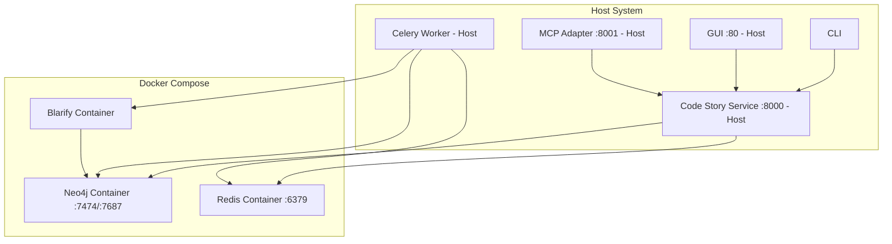

# Host-Native Architecture Proposal

**Specification ID:** 17-host-native-architecture  
**Version:** 1.0  
**Status:** Proposed  
**Date:** 2025-06-05

## Executive Summary

This document proposes a rearchitecture of the Code Story project to move from a fully containerized architecture to a hybrid approach where storage services (Neo4j, Redis) and specialized components (Blarify) remain containerized for consistency and isolation, while application services (Code Story Service, Celery Workers) run natively on the host system for enhanced development efficiency and debugging capabilities.

## Current Architecture Analysis

### Current Containerized Components

1. **Neo4j Database** - Graph database service
2. **Redis** - Message broker and caching layer
3. **Code Story Service** - FastAPI web service
4. **Celery Worker** - Background task processing
5. **GUI** - React/TypeScript frontend (Nginx-served)
6. **MCP Adapter** - Model Context Protocol service
7. **Blarify Step** - Code parsing service (Linux container requirement)

### Proposed Hybrid Architecture

**Containerized Components (via docker-compose):**
- **Neo4j Database** - Graph database with consistent environment and easy data management
- **Redis** - Message broker with isolated caching layer
- **Blarify Step** - Code parsing service (unchanged, Linux container requirement)

**Host-Native Components:**
- **Code Story Service** - FastAPI web service for direct debugging and IDE integration
- **Celery Worker** - Background task processing with direct file system access
- **GUI** - React/TypeScript frontend with hot reloading
- **MCP Adapter** - Model Context Protocol service for simplified development

### Current Dependencies and Networking



## Proposed Host-Native Architecture

### Components to Run on Host

### Components to Remain Containerized

#### 1. **Neo4j Database**
- **Deployment:** Docker container via docker-compose
- **Image:** `neo4j:<latest>-community`
- **Ports:** 7687 (Bolt), 7474 (HTTP) exposed to host
- **Configuration:** Environment variables via docker-compose
- **Benefits:**
  - Consistent database environment across development/production
  - Isolated storage with easy backup/restore
  - No host dependency conflicts
  - Simplified deployment of stateful services
- **Environment Variables:**
  - `NEO4J_URI=bolt://localhost:7687` (host connects to exposed port)
  - `NEO4J_USERNAME=neo4j`
  - `NEO4J_PASSWORD` (injected via docker-compose or test fixtures)

#### 2. **Redis**
- **Deployment:** Docker container via docker-compose
- **Image:** `redis:<latest>`
- **Port:** 6379 exposed to host
- **Configuration:** Standard Redis container setup
- **Benefits:**
  - Isolation and consistent caching layer
  - No version conflicts with host system
  - Easy data persistence and backup
- **Environment Variables:**
  - `REDIS_URI=redis://localhost:6379` (host connects to exposed port)

#### 3. **Blarify Step**
- **Deployment:** Docker container (unchanged from current architecture)
- **Reason:** Linux-specific binary dependencies and toolchain requirements
- **Integration:** Container communicates with containerized Neo4j via internal Docker network
- **Configuration:**
  - `NEO4J_URI=bolt://neo4j:7687` (container-to-container communication)
  - Environment variables injected via docker-compose

### Components to Run on Host

#### 1. **Code Story Service (FastAPI)**
- **Deployment:** Python virtual environment on host
- **Process Management:** systemd, PM2, or direct Python execution
- **Configuration:** Environment variables connecting to containerized databases
- **Benefits:**
  - Direct debugging with IDE breakpoints
  - Hot reloading for faster development cycles
  - Native Python tooling integration
- **Database Connections:** Connects to containerized Neo4j/Redis via exposed ports

#### 2. **Celery Worker**
- **Deployment:** Python virtual environment on host
- **Process Management:** systemd, supervisor, or direct execution
- **Configuration:** Shared config with service, connects to containerized databases
- **Benefits:**
  - Easier debugging and profiling
  - Direct file system access for repository processing
  - Native Python debugging tools

#### 3. **GUI (React/TypeScript)**
- **Development:** Node.js development server on host
- **Production:** Static files served by nginx/Apache on host or CDN
- **Benefits:** Hot reloading, easier debugging, standard web deployment

#### 4. **MCP Adapter**
- **Deployment:** Python virtual environment on host
- **Process Management:** systemd or direct execution
- **Configuration:** Environment variables connecting to host-native services
- **Benefits:** Easier integration testing, simpler networking

## Detailed Implementation Plan

### Phase 1: Infrastructure Setup

#### Development Environment

1. **Container Services Setup**
   ```bash
   # Start containerized services (Neo4j, Redis, Blarify)
   docker compose up -d neo4j redis
   
   # Verify services are running
   docker compose ps
   ```

2. **Python Environment Setup**
   ```bash
   # Create virtual environment
   python -m venv .venv
   source .venv/bin/activate  # or .venv\Scripts\activate on Windows
   
   # Install dependencies
   pip install -e .
   ```

3. **Node.js Environment Setup**
   ```bash
   # Install Node.js dependencies
   npm install
   ```

4. **Service Configuration**
   ```bash
   # Copy configuration template for hybrid architecture
   cp .codestory.host.toml .codestory.toml
   
   # Environment variables for host services to connect to containers
   export NEO4J_URI=bolt://localhost:7687
   export REDIS_URI=redis://localhost:6379
   ```

#### Production Environment

1. **Service Management with systemd**
   ```ini
   # /etc/systemd/system/codestory-service.service
   [Unit]
   Description=Code Story API Service
   After=network.target docker.service
   Requires=docker.service
   
   [Service]
   Type=simple
   User=codestory
   WorkingDirectory=/opt/codestory
   Environment=PATH=/opt/codestory/.venv/bin
   Environment=NEO4J_URI=bolt://localhost:7687
   Environment=REDIS_URI=redis://localhost:6379
   ExecStartPre=/usr/bin/docker compose up -d neo4j redis
   ExecStart=/opt/codestory/.venv/bin/uvicorn codestory_service.main:app --host 0.0.0.0 --port 8000
   ExecStopPost=/usr/bin/docker compose stop neo4j redis
   Restart=always
   
   [Install]
   WantedBy=multi-user.target
   ```

2. **Process Monitoring**
   - Health checks via HTTP endpoints
   - Log aggregation (journald, ELK stack, or cloud logging)
   - Metrics collection (Prometheus exporters)

### Phase 2: Configuration Management

#### Unified Configuration System

```python
# Enhanced settings.py for hybrid architecture
class HybridArchitectureSettings(BaseSettings):
    # Host services connect to containerized databases via exposed ports
    neo4j: Neo4jSettings = Field(default_factory=lambda: Neo4jSettings(
        uri="bolt://localhost:7687"  # Host connects to exposed container port
    ))
    redis: RedisSettings = Field(default_factory=lambda: RedisSettings(
        uri="redis://localhost:6379"  # Host connects to exposed container port
    ))
    
    # Blarify container configuration for docker-compose integration
    blarify: BlarifySettings = Field(default_factory=BlarifySettings)
    
    # Service configuration for hybrid deployment
    deployment: DeploymentSettings = Field(default_factory=DeploymentSettings)

class DeploymentSettings(BaseModel):
    mode: str = Field("hybrid", description="Deployment mode: hybrid (containers + host)")
    data_directory: Path = Field(Path.home() / ".codestory", description="Data directory")
    log_directory: Path = Field(Path("/var/log/codestory"), description="Log directory")
    pid_directory: Path = Field(Path("/var/run/codestory"), description="PID directory")

class BlarifySettings(BaseModel):
    docker_image: str = Field("blarapp/blarify:latest", description="Blarify Docker image")
    container_network: str = Field("codestory_default", description="Docker compose network")
    volume_mounts: dict[str, str] = Field(default_factory=dict, description="Volume mounts")
    environment_variables: dict[str, str] = Field(default_factory=dict, description="Environment variables")
    # Blarify connects to Neo4j via internal container network
    neo4j_uri: str = Field("bolt://neo4j:7687", description="Neo4j URI for container-to-container communication")
```

#### Environment-Specific Configuration

```toml
# .codestory.hybrid.toml - Hybrid architecture configuration
[general]
app_name = "code-story"
version = "0.1.0"
environment = "hybrid"

[neo4j]
uri = "bolt://localhost:7687"  # Host connects to exposed container port
username = "neo4j"
password = "password"
database = "neo4j"

[redis]
uri = "redis://localhost:6379"  # Host connects to exposed container port

[service]
host = "0.0.0.0"
port = 8000
workers = 4

[blarify]
docker_image = "blarapp/blarify:latest"
container_network = "codestory_default"  # Use docker-compose network
neo4j_uri = "bolt://neo4j:7687"  # Container-to-container communication
```

### Phase 3: Service Integration

#### Blarify Container Integration

```python
# Enhanced BlarifyStep for hybrid architecture integration
class BlarifyStep(PipelineStep):
    def __init__(self, **kwargs):
        super().__init__(**kwargs)
        self.settings = get_settings()
        self.docker_client = docker.from_env()
        
    def run(self, repository_path: str, **config: Any) -> str:
        """Run Blarify in container with access to containerized Neo4j."""
        
        # Use docker-compose network for container-to-container communication
        container_config = {
            "image": self.settings.blarify.docker_image,
            "network": self.settings.blarify.container_network,  # docker-compose network
            "volumes": {
                repository_path: {"bind": "/workspace", "mode": "ro"},
            },
            "environment": {
                "NEO4J_URI": self.settings.blarify.neo4j_uri,  # bolt://neo4j:7687
                "NEO4J_USERNAME": self.settings.neo4j.username,
                "NEO4J_PASSWORD": self.settings.neo4j.password.get_secret_value() if self.settings.neo4j.password else "",
                "WORKSPACE_PATH": "/workspace",
            },
            "remove": True,
            "detach": True,
        }
        
        container = self.docker_client.containers.run(**container_config)
        return self._monitor_container(container)
```

#### Service Discovery and Health Checks

```python
# Health check system for host services
class HostServiceHealth:
    async def check_neo4j(self) -> bool:
        """Check Neo4j connectivity."""
        try:
            from codestory.graphdb.neo4j_connector import create_neo4j_connector
            connector = create_neo4j_connector()
            await connector.verify_connectivity()
            return True
        except Exception:
            return False
    
    async def check_redis(self) -> bool:
        """Check Redis connectivity."""
        try:
            import redis
            r = redis.from_url(self.settings.redis.uri)
            r.ping()
            return True
        except Exception:
            return False
    
    async def health_summary(self) -> dict[str, bool]:
        """Get overall health status."""
        return {
            "neo4j": await self.check_neo4j(),
            "redis": await self.check_redis(),
            "service": True,  # If we're running, service is healthy
        }
```

### Phase 4: Development Workflow

#### Enhanced Developer Experience

1. **Simplified Development Setup**
   ```bash
   # Start containerized services
   docker compose up -d neo4j redis
   
   # Start host services in separate terminals
   uvicorn codestory_service.main:app --reload  # API service
   celery -A codestory.ingestion_pipeline.celery_app worker --loglevel=info  # Worker
   npm run dev  # GUI with hot reload
   
   # Check container status
   docker compose ps
   ```

2. **IDE Integration**
   - Direct debugging of Python services
   - Breakpoints in service and worker code
   - Hot reloading for frontend development
   - Standard Python tooling (mypy, pytest, ruff)

3. **Testing Strategy**
   ```python
   # Test configuration for hybrid environment
   @pytest.fixture
   def hybrid_test_config():
       return {
           "neo4j": {"uri": "bolt://localhost:7687"},  # Host connects to container
           "redis": {"uri": "redis://localhost:6379"},  # Host connects to container
           "blarify": {
               "container_network": "codestory_default",
               "neo4j_uri": "bolt://neo4j:7687"  # Container-to-container
           },
       }
   
   # Integration tests use hybrid services
   class TestHybridIntegration:
       def test_end_to_end_ingestion(self, hybrid_test_config):
           # Test full pipeline with containerized storage + host services
           pass
   ```

### Phase 5: Production Deployment

#### Deployment Options

1. **Traditional Server Deployment**
   ```bash
   # System service installation
   sudo systemctl enable codestory-service
   sudo systemctl enable codestory-worker
   sudo systemctl start codestory-service
   sudo systemctl start codestory-worker
   ```

2. **Cloud Deployment**
   - AWS EC2/ECS with host mode
   - Azure VMs/Container Instances
   - GCP Compute Engine/Cloud Run
   - Use managed databases (RDS, Azure Database, Cloud SQL)

3. **Hybrid Cloud Deployment**
   ```yaml
   # Azure Container Apps with host networking
   apiVersion: apps/v1
   kind: Deployment
   metadata:
     name: codestory-service
   spec:
     template:
       spec:
         hostNetwork: true  # Use host networking
         containers:
         - name: codestory-service
           image: codestory:host-native
           env:
           - name: NEO4J_URI
             value: "bolt://database-host:7687"
   ```

## Migration Strategy

### Phase A: Parallel Development (2-3 weeks)

1. **Setup host-native development environment**
2. **Create host-native configuration system**
3. **Modify Blarify step for host networking**
4. **Update health checks and monitoring**

### Phase B: Integration Testing (1-2 weeks)

1. **End-to-end testing with host services**
2. **Performance comparison**
3. **Security validation**
4. **Documentation updates**

### Phase C: Production Deployment (1 week)

1. **Production environment setup**
2. **Service migration**
3. **Monitoring and alerting**
4. **Rollback procedures**

## Benefits of Hybrid Architecture

### Performance Improvements

1. **Optimized Resource Allocation**
   - Containerized storage services for consistency and isolation
   - Host-native application services for reduced latency
   - Direct file system access for workers processing repositories

2. **Better Development Experience**
   - Direct CPU scheduling for application services
   - Container isolation for stateful services
   - Efficient I/O operations for both containers and host

### Operational Benefits

1. **Enhanced Debugging Capabilities**
   - Direct IDE integration for host services
   - Standard debugging tools for application code
   - Container isolation for reproducible database environments

2. **Balanced Operations**
   - Familiar service management (systemd) for application services
   - Container orchestration (docker-compose) for storage services
   - Simplified backup and recovery for containerized databases

3. **Development Efficiency**
   - Hot reloading capabilities for host services
   - Consistent database environments via containers
   - Simplified dependency management with hybrid approach

### Architecture Benefits

1. **Storage Service Consistency**
   - Neo4j and Redis run in consistent container environments
   - Easy database backup/restore with container volumes
   - Isolated storage prevents host dependency conflicts

2. **Application Service Flexibility**
   - Direct debugging and profiling of business logic
   - Native Python tooling integration
   - Faster development cycles with hot reloading

3. **Network Optimization**
   - Container-to-container communication for Blarify→Neo4j
   - Host-to-container communication via exposed ports for services
   - Simplified networking with docker-compose orchestration

## Risks and Mitigation

### Technical Risks

1. **Environment Consistency**
   - **Risk:** Different behavior across development/production environments
   - **Mitigation:** Standardized installation scripts, configuration management

2. **Dependency Management**
   - **Risk:** Python/Node.js version conflicts
   - **Mitigation:** Virtual environments, version pinning, automated testing

### Operational Risks

1. **Service Management Complexity**
   - **Risk:** Multiple services to manage independently
   - **Mitigation:** Process managers (systemd, supervisor), monitoring automation

2. **Deployment Complexity**
   - **Risk:** More complex deployment procedures
   - **Mitigation:** Infrastructure as Code (Terraform, Ansible), automated deployment

## Testing Strategy

### Unit Testing
- All existing unit tests continue to work
- Enhanced mocking for host services
- Isolated component testing

### Integration Testing
```python
# Host-native integration test suite
class TestHostNativeIntegration:
    def test_service_startup(self):
        """Test service can connect to host databases."""
        pass
    
    def test_blarify_container_communication(self):
        """Test Blarify container can reach host services."""
        pass
    
    def test_end_to_end_workflow(self):
        """Test complete ingestion pipeline."""
        pass
```

### Performance Testing
- Compare container vs host performance
- Resource utilization analysis
- Latency measurements

## Configuration Examples

### Development Environment
```bash
# .env.development - Host services connect to local containers
NEO4J_URI=bolt://localhost:7687
REDIS_URI=redis://localhost:6379
DEPLOYMENT_MODE=hybrid
LOG_LEVEL=DEBUG
BLARIFY_NEO4J_URI=bolt://neo4j:7687  # Container-to-container communication
```

### Production Environment
```bash
# .env.production - Host services connect to containerized databases
NEO4J_URI=bolt://localhost:7687
REDIS_URI=redis://localhost:6379
DEPLOYMENT_MODE=hybrid
LOG_LEVEL=INFO
BLARIFY_NEO4J_URI=bolt://neo4j:7687  # Container-to-container communication
```

## Monitoring and Observability

### Metrics Collection
```python
# Host-native metrics
from prometheus_client import CollectorRegistry, Counter, Histogram

HOST_METRICS = CollectorRegistry()
REQUEST_COUNT = Counter('codestory_requests_total', 'Total requests', registry=HOST_METRICS)
REQUEST_DURATION = Histogram('codestory_request_duration_seconds', 'Request duration', registry=HOST_METRICS)
```

### Health Checks
```python
# Enhanced health check endpoint
@app.get("/health")
async def health_check():
    health = HostServiceHealth()
    status = await health.health_summary()
    
    if all(status.values()):
        return {"status": "healthy", "services": status}
    else:
        raise HTTPException(status_code=503, detail={"status": "unhealthy", "services": status})
```

## Conclusion

The proposed hybrid architecture provides significant benefits by strategically containerizing storage services (Neo4j, Redis) and specialized components (Blarify) while running application services (API, Workers) natively on the host. This approach delivers enhanced development efficiency, consistent database environments, and optimized debugging capabilities.

This architecture aligns with modern deployment practices where containerization is used selectively for components that benefit from isolation and consistency, while host-native deployment is used where development efficiency and debugging capabilities are paramount. The result is a balanced system that maximizes both operational consistency and development productivity.

**Key Advantages:**
- **Consistent Storage:** Neo4j and Redis containers ensure reliable database environments
- **Development Efficiency:** Host-native services enable direct debugging and hot reloading
- **Network Optimization:** Container-to-container communication for Blarify, host-to-container for services
- **Operational Balance:** Docker-compose for storage, systemd for application services

## Next Steps

1. **Review and approval** of this proposal
2. **Detailed implementation planning** for each phase
3. **Resource allocation** for migration effort
4. **Timeline development** with stakeholder alignment
5. **Risk assessment** and mitigation planning

---

**Document Metadata:**
- **Author:** GitHub Copilot
- **Review Status:** Draft
- **Target Completion:** Q2 2025
- **Dependencies:** Current Docker architecture understanding, host environment requirements
