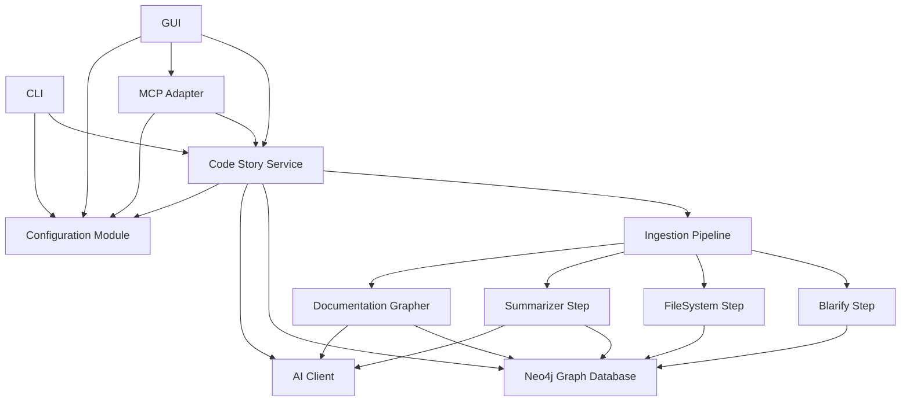

# Code Story - Specification Suite

This specification has been split into modular components. Please refer to the individual specification files for detailed information.

## Table of Contents

1. **[Overview & Architecture](./01-overview/overview.md)**
   - [Error Handling and Propagation](./01-overview/error-handling.md)
2. **[Scaffolding](./02-scaffolding/scaffolding.md)** - Project structure and foundational setup 
3. **[Configuration Module](./03-configuration/configuration.md)** - Settings and configuration management
4. **[Graph Database Service](./04-graph-database/graph-database.md)** - Neo4j backend and connectivity
5. **[AI Client](./05-ai-client/ai-client.md)** - OpenAI service integration
6. **[Ingestion Pipeline](./06-ingestion-pipeline/ingestion-pipeline.md)** - Orchestration framework
   - [Blarify Workflow Step](./07-blarify-step/blarify-step.md) - Code parsing
   - [FileSystem Workflow Step](./08-filesystem-step/filesystem-step.md) - Filesystem handling
   - [Summarizer Workflow Step](./09-summarizer-step/summarizer-step.md) - Content summarization
   - [Documentation Grapher Step](./10-docgrapher-step/docgrapher-step.md) - Documentation processing
7. **[Code Story Service](./11-code-story-service/code-story-service.md)** - Main API service
8. **[MCP Adapter](./12-mcp-adapter/mcp-adapter.md)** - Model Context Protocol integration
9. **[CLI](./13-cli/cli.md)** - Command-line interface
10. **[GUI](./14-gui/gui.md)** - Web-based user interface
11. **[Infrastructure](./15-infra/infra.md)** - Deployment and infrastructure
12. **[Documentation](./16-documentation/documentation.md)** - Project documentation

## Component Dependencies

Please navigate to the [Overview & Architecture](./01-overview/overview.md) to start reading the specifications in detail.