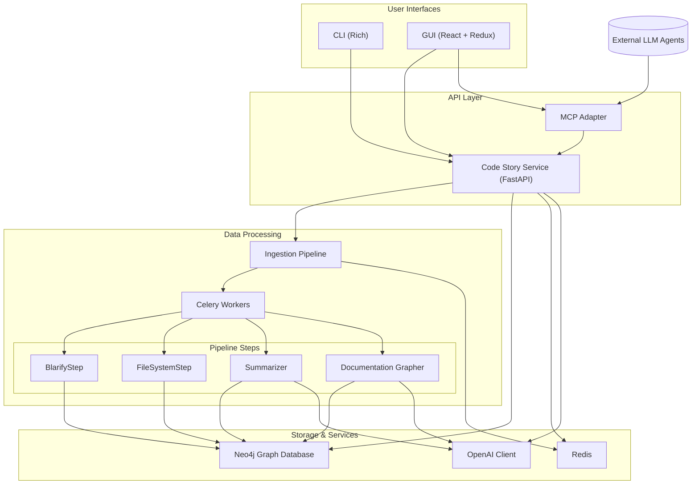

<!-- code-story – Specification Suite (v0.7) -->

# 1.0 Overview & Architecture

## 1.1 Mission

Convert any codebase into a richly-linked knowledge graph plus natural-language summaries that developers can query through a CLI or GUI and which LLM agents can query through **Model Context Protocol (MCP)**.

## 1.2 Components and Data Flow

* **Configuration Module** – Manages application configuration based on `.env` file or Azure KeyVault.

* **User Interfaces** – Trigger ingestion or query the knowledge graph:
  * **CLI** – Rich command-line interface using [Rich](https://github.com/Textualize/rich-cli).
  * **GUI** – React + Redux web application with 3D force graph visualization.
  * Both consume the same API from the **Code Story Service**.

* **Code Story Service** – FastAPI service that:
  * Manages the ingestion pipeline through Celery tasks
  * Provides query interfaces to the graph database
  * Handles authentication and authorization
  * Exposes WebSocket endpoints for real-time progress updates

* **Ingestion Pipeline** – Orchestrates plug-in workflow steps:
  * **BlarifyStep** – Parses codebase using [Blarify](https://github.com/blarApp/blarify) to generate AST in Neo4j
  * **FileSystemStep** – Creates a graph of filesystem layout and links to AST nodes
  * **Summarizer** – Computes DAG of dependencies, traverses from leaf nodes up to generate summaries
  * **DocumentationGrapher** – Links documentation to relevant code elements

* **Storage & Services**:
  * **Neo4j Graph Database** – Stores knowledge graph with semantic index and vector search
  * **Redis** – Supports Celery task queue and WebSocket pub/sub
  * **OpenAI Client** – Provides access to Azure OpenAI API with bearer token auth

* **MCP Adapter** – Exposes graph to LLM agents via [MCP](https://den.dev/blog/auth-modelcontextprotocol-entra-id/) standard.

## 1.3 Deployment Topology

All services run under `docker-compose` network locally; Azure Container Apps deployment mirrors this layout with container scaling.

* **Neo4j** – Graph database with semantic indexing (container)
* **Redis** – Backend for Celery and pub/sub (container)
* **Code Story Service** – Core API service (container)
* **Celery Workers** – Execute ingestion pipeline steps (container)
* **MCP Adapter** – Model Context Protocol server (container)
* **GUI** – Web interface for visualization and interaction (container)
* **CLI** – Command-line interface (local executable)

## 1.4 Cross-Cutting Concerns

* **Auth** – MCP endpoints protected by Entra ID bearer JWT; local mode can bypass with `--no-auth` flag.
* **Observability** – OpenTelemetry traces, Prometheus metrics from every service, Grafana dashboard template in `infra/`.
* **Extensibility** – Ingestion steps are plug-in entry-points; GUI dynamically reflects new step types; prompts in `prompts/` folder can be customized.

## 1.5 Architecture Overview

Code Story follows a microservices architecture with containerized components that communicate through well-defined APIs. The system is designed to be modular and extensible, with clear separation of concerns between components.



### 1.5.1 Key Architectural Principles

* **Containerized Services** – All components run as Docker containers for consistent deployment.
* **API-First Design** – Components interact through well-defined APIs.
* **Event-Driven Processing** – Asynchronous processing through Celery task queue.
* **Knowledge Graph Foundation** – Neo4j stores multi-layered knowledge about code.
* **Multi-Modal Interfaces** – Both CLI and GUI provide full access to functionality.
* **Extensibility** – Plugin architecture for pipeline steps.
* **Observability** – Comprehensive logging, metrics, and tracing.

This architecture enables Code Story to handle large codebases efficiently while providing multiple interfaces for developers to interact with the knowledge graph, whether through direct queries, natural language questions, or programmatic MCP tools.

--
# 2.0 Scaffolding

## 2.1 Purpose
Create a reproducible mono‑repo skeleton for Python 3.12 + TypeScript 5.4 development, containerized with Docker Compose and wired for CI. All later components depend on this foundation.

## 2.2 Directory Layout

```text
code-story/                  # Project root
├─ .devcontainer/            # VS Code & Codespaces
├─ .editorconfig             # Editor config
├─ .env                      # Secrets (not in repo)
├─ .env-template             # Template for secrets
├─ .codestory.toml           # Project configuration defaults
├─ .eslintrc.json            # ESLint config
├─ .github/                  # GitHub configurations
│  ├─ workflows/             # CI pipelines
│  └─ copilot-instructions.md # Copilot instructions
├─ .gitignore                # Git ignore
├─ .mypy.ini                 # Mypy config
├─ .pre-commit-config.yaml   # Pre-commit hooks
├─ .ruff.toml                # Ruff config
├─ docs/                     # Documentation (Sphinx with Markdown)
│  ├─ api/                   # Auto-generated API docs
│  ├─ architecture/          # System architecture docs
│  ├─ user_guides/           # End-user documentation
│  └─ developer_guides/      # Developer documentation
├─ gui/                      # React/Redux GUI app
│  ├─ src/                   # GUI source code
│  └─ public/                # Static assets
├─ infra/                    # Infrastructure code
│  ├─ docker/                # Dockerfiles
│  ├─ scripts/               # Infrastructure scripts
│  └─ azure/                 # Azure deployment (Bicep)
├─ prompts/                  # LLM prompt templates
├─ README.md                 # Project overview
├─ scripts/                  # Helper scripts for development
├─ specs/                    # Markdown specifications
├─ src/                      # Python package root
│  ├─ codestory/             # Core package
│  │  ├─ config/             # Configuration module
│  │  ├─ graphdb/            # Neo4j connector 
│  │  ├─ llm/                # OpenAI client
│  │  ├─ ingestion_pipeline/  # Pipeline orchestration
│  │  └─ cli/                # CLI implementation
│  ├─ codestory_service/     # FastAPI service
│  ├─ codestory_blarify/     # Blarify plugin package
│  ├─ codestory_filesystem/  # Filesystem plugin package
│  ├─ codestory_summarizer/  # Summarizer plugin package
│  └─ codestory_docgrapher/  # Documentation grapher plugin
└─ tests/                    # Test suite
   ├─ unit/                  # Unit tests
   └─ integration/           # Integration tests
```

## 2.3 Toolchain Versions

| Area       | Tool              | Version | Purpose                   |
| ---------- | ----------------- | ------- | ------------------------- |
| Python     | Poetry            | ^1.8    | Dependency & venv manager |
|            | Ruff              | latest  | Lint + format             |
|            | mypy              | latest  | Static typing (–strict)   |
|            | FastAPI           | latest  | API framework             |
|            | Celery            | latest  | Task queue                |
| JS / TS    | pnpm              | latest  | Workspace manager         |
|            | React             | ^18.0   | UI framework              |
|            | Redux Toolkit     | latest  | State management          |
|            | Mantine           | latest  | UI components             |
| Containers | Docker Engine     | ≥ 24.0  | Runtime                   |
|            | Docker Compose    | ≥ 2.0   | Multi-container orchestration |
| CI         | GitHub Actions    | n/a     | Lint + tests              |
| Dev        | devcontainer spec | 0.336.0 | Unified IDE env           |
| Observability | OpenTelemetry  | latest  | Tracing                   |
|              | Prometheus      | latest  | Metrics                   |

## 2.4 Configuration Conventions

| File                | Role                     | Precedence |
| ------------------- | ------------------------ | ---------- |
| `.env` and `.env-template` | secrets & host specifics |  1         |
| `.codestory.toml`   | project defaults         |  2         |
| hard‑coded defaults | safe fallbacks           |  3         |

The configuration module implements this priority chain and provides a singleton `settings: Settings` (Pydantic BaseSettings) accessible to all components. When `AZURE_KEYVAULT_NAME` is set, secret fields are resolved via managed identity.

## 2.5 Implementation Steps

| #  | Action                                                                               |
| -- | ------------------------------------------------------------------------------------ |
|  1 | `git init code-story && cd code-story`                                               |
|  2 | `poetry new src/codestory --name codestory`                                          |
|  3 | `poetry add pydantic rich typer[all] fastapi uvicorn celery redis neo4j openai tenacity prometheus-client structlog opentelemetry-sdk` |
|  4 | `poetry add --dev pytest pytest-asyncio pytest-cov testcontainers ruff mypy httpx pytest-mock` |
|  5 | `pnpm init -y && pnpm add -w vite react react-dom typescript @reduxjs/toolkit @mantine/core @mantine/hooks @vasturiano/3d-force-graph three` |
|  6 | Add `.env-template` with placeholders for all required secrets (`OPENAI_API_KEY`, `NEO4J_URI`, etc.) |
|  7 | Create `.codestory.toml` with default configuration values |
|  8 | Add `.pre-commit-config.yaml` with Ruff, mypy, and other linting/formatting hooks |
|  9 | Add `.github/workflows/ci.yml` for continuous integration |
| 10 | Create root `docker-compose.yaml` with all services (Neo4j, Redis, service, worker, gui, mcp) |
| 11 | Add `.devcontainer/devcontainer.json` pointing to compose services |
| 12 | Create `infra/docker/` Dockerfiles for each service component |
| 13 | Add basic documentation structure in `docs/` |
| 14 | Set up configuration module with precedence as defined in 2.4 |
| 15 | Commit & push – ensure CI passes |

A helper script `scripts/bootstrap.sh` automates steps 1-14.

## 2.6 Testing & Acceptance

* **Unit** – pytest; verify component functionality in isolation.
* **Integration** – Testcontainers for Neo4j and Redis; verify component interactions.
* **Lint** – Ruff, mypy (strict), ESLint for TypeScript/JavaScript.
* **Observability** – Verify metrics exposed via Prometheus endpoints; traces via OpenTelemetry.
* **Acceptance**:
  * `pytest` passes with ≥ 90% coverage on critical modules.
  * `ruff check` and `mypy --strict` pass with no errors.
  * `docker compose up -d` starts all services healthy.
  * Configuration system loads and validates settings correctly from all sources.
  * Dev container can be built and used for local development.

---

# 3.0 Configuration Module

## 3.1 Purpose

Provide a centralized configuration system that loads settings from multiple sources with clear precedence rules, exposes a strongly-typed settings interface to all application components, and handles sensitive values securely. The configuration module is the foundation for all other components, enabling consistent access to settings across the application.

## 3.2 Responsibilities

- Load configuration from multiple sources with defined precedence: environment variables > `.env` file > `.codestory.toml` > hard-coded defaults
- Expose a strongly-typed configuration interface via Pydantic models to all application components
- Provide secure handling of sensitive values with Azure KeyVault integration
- Support hot-reloading of configuration for selected settings without service restart
- Enable component-specific configuration sections with inheritance and overrides
- Validate configuration values and provide helpful error messages
- Support persistence of configuration changes back to `.env` and `.codestory.toml`
- Implement the Singleton pattern to ensure consistent configuration across the application

## 3.3 Configuration Schema

The configuration is organized hierarchically with sections for each major component:

```python
class Settings(BaseSettings):
    # Core settings
    app_name: str = "code-story"
    environment: Literal["development", "testing", "production"] = "development"
    log_level: str = "INFO"
    
    # Database settings
    neo4j: Neo4jSettings
    redis: RedisSettings
    
    # Authentication
    auth_enabled: bool = False  # --no-auth flag for local development
    azure_tenant_id: Optional[str] = None
    azure_client_id: Optional[str] = None
    
    # Azure KeyVault
    azure_keyvault_name: Optional[str] = None
    
    # OpenAI
    openai: OpenAISettings
    
    # Ingestion pipeline
    ingestion: IngestionSettings
    
    # GUI & CLI
    interface: InterfaceSettings
    
    # Service endpoints
    service: ServiceSettings
    
    class Config:
        env_file = ".env"
        env_file_encoding = "utf-8"
        extra = "ignore"
        case_sensitive = False
        
        @classmethod
        def customise_sources(cls, init_settings, env_settings, file_secret_settings):
            return (
                env_settings,                      # 1. Environment variables
                init_settings,                     # 2. Initialization values
                file_secret_settings,              # 3. .env file
                cls._toml_config,                  # 4. .codestory.toml
                cls._keyvault_settings,            # 5. Azure KeyVault (only for marked fields)
            )
        
        @classmethod
        def _toml_config(cls, settings):
            # Load settings from .codestory.toml
            pass
            
        @classmethod
        def _keyvault_settings(cls, settings):
            # Load secrets from Azure KeyVault if configured
            pass
```

Component-specific settings classes that inherit from Pydantic's `BaseSettings`:

```python
class Neo4jSettings(BaseSettings):
    uri: str = "bolt://localhost:7687"
    username: str = "neo4j"
    password: SecretStr = SecretStr("password")  # Marked for KeyVault resolution
    connection_timeout: int = 30
    max_connection_pool_size: int = 50
    connection_acquisition_timeout: int = 60
    
class OpenAISettings(BaseSettings):
    endpoint: str = "https://api.openai.com/v1"
    api_key: SecretStr  # Marked for KeyVault resolution
    embedding_model: str = "text-embedding-3-small"
    chat_model: str = "gpt-4o"
    reasoning_model: str = "gpt-4o"
    max_retries: int = 3
    retry_backoff_factor: float = 2.0
    
class IngestionSettings(BaseSettings):
    config_path: str = "pipeline_config.yml"
    steps: Dict[str, Dict[str, Any]] = {}  # Step-specific configuration
    max_retries: int = 3
    concurrency: int = 5
```

## 3.4 Implementation Details

### 3.4.1 Singleton Pattern

```python
# src/codestory/config/settings.py
from functools import lru_cache
from pydantic import BaseSettings

class Settings(BaseSettings):
    # ... as defined above ...
    pass

@lru_cache()
def get_settings() -> Settings:
    """Return a cached instance of the Settings."""
    return Settings()
```

### 3.4.2 Azure KeyVault Integration

For secure values (marked with `SecretStr`), the configuration module can load values from Azure KeyVault when `AZURE_KEYVAULT_NAME` is set:

```python
def load_from_keyvault(settings):
    """Load secret values from Azure KeyVault."""
    if not settings.azure_keyvault_name:
        return settings
        
    from azure.identity import DefaultAzureCredential
    from azure.keyvault.secrets import SecretClient
    
    credential = DefaultAzureCredential()
    client = SecretClient(
        vault_url=f"https://{settings.azure_keyvault_name}.vault.azure.net/", 
        credential=credential
    )
    
    # Example of resolving a secret
    if not settings.neo4j.password.get_secret_value():
        secret = client.get_secret("neo4j-password")
        settings.neo4j.password = SecretStr(secret.value)
    
    return settings
```

### 3.4.3 Configuration Persistence

```python
# src/codestory/config/writer.py
import os
import toml
from typing import Dict, Any, Optional
from dotenv import set_key

def update_env(key: str, value: str, env_file: str = '.env'):
    """Update a value in the .env file."""
    set_key(env_file, key, value)

def update_toml(section: str, key: str, value: Any, toml_file: str = '.codestory.toml'):
    """Update a value in the .codestory.toml file."""
    try:
        config = toml.load(toml_file) if os.path.exists(toml_file) else {}
    except Exception:
        config = {}
    
    if section not in config:
        config[section] = {}
    
    config[section][key] = value
    
    with open(toml_file, 'w') as f:
        toml.dump(config, f)

def update_config(section: str, key: str, value: Any, persist_to: str = 'env'):
    """Update configuration in memory and optionally persist to file."""
    from .settings import get_settings
    
    # Update in-memory settings
    settings = get_settings()
    if hasattr(settings, section) and hasattr(getattr(settings, section), key):
        setattr(getattr(settings, section), key, value)
    
    # Persist to file if requested
    if persist_to == 'env':
        update_env(f"{section.upper()}_{key.upper()}", str(value))
    elif persist_to == 'toml':
        update_toml(section, key, value)
```

### 3.4.4 Configuration Access Example

```python
# Example usage in another module
from codestory.config.settings import get_settings

def connect_to_neo4j():
    settings = get_settings()
    
    from neo4j import GraphDatabase
    driver = GraphDatabase.driver(
        settings.neo4j.uri,
        auth=(settings.neo4j.username, settings.neo4j.password.get_secret_value()),
        max_connection_pool_size=settings.neo4j.max_connection_pool_size
    )
    return driver
```

## 3.5 Example Configuration Files

### 3.5.1 .env-template Example

```
# Core settings
ENVIRONMENT=development
LOG_LEVEL=INFO

# Neo4j settings
NEO4J_URI=bolt://localhost:7687
NEO4J_USERNAME=neo4j
NEO4J_PASSWORD=password

# Redis settings
REDIS_URI=redis://localhost:6379/0

# Azure OpenAI
OPENAI_ENDPOINT=https://your-resource.openai.azure.com
OPENAI_API_KEY=your-api-key-here
OPENAI_EMBEDDING_MODEL=text-embedding-3-small
OPENAI_CHAT_MODEL=gpt-4o
OPENAI_REASONING_MODEL=gpt-4o

# Authentication (for production)
# AUTH_ENABLED=true
# AZURE_TENANT_ID=your-tenant-id
# AZURE_CLIENT_ID=your-client-id

# Azure KeyVault (uncomment to use)
# AZURE_KEYVAULT_NAME=your-keyvault-name
```

### 3.5.2 .codestory.toml Example

```toml
[neo4j]
connection_timeout = 30
max_connection_pool_size = 50
connection_acquisition_timeout = 60

[openai]
max_retries = 3
retry_backoff_factor = 2.0

[ingestion]
config_path = "pipeline_config.yml"
max_retries = 3
concurrency = 5

# Step-specific configuration
[ingestion.steps.blarify]
timeout = 300
docker_image = "codestory/blarify:latest"

[ingestion.steps.filesystem]
ignore_patterns = ["node_modules/", ".git/", "__pycache__/"]

[ingestion.steps.summarizer]
max_concurrency = 5
max_tokens_per_file = 8000

[service]
host = "0.0.0.0"
port = 8000
workers = 4
```

## 3.6 User Stories and Acceptance Criteria

| User Story | Acceptance Criteria |
|------------|---------------------|
| As a developer, I want to access configuration values through a consistent interface so that I can configure components without worrying about implementation details. | • Configuration is accessible through the `get_settings()` function.<br>• Settings are strongly-typed with appropriate defaults.<br>• Settings are validated on load with helpful error messages for invalid values.<br>• The settings object is immutable to prevent unexpected changes. |
| As a developer, I want to store configuration in different sources with clear precedence rules so that I can override settings for different environments. | • Environment variables take precedence over file-based settings.<br>• `.env` file takes precedence over `.codestory.toml`.<br>• Hard-coded defaults are used as a last resort.<br>• The configuration system correctly merges settings from all sources. |
| As a developer, I want to manage sensitive configuration values securely so that I don't expose secrets in code or configuration files. | • Sensitive values are marked with `SecretStr` and redacted in logs and errors.<br>• Azure KeyVault integration works when configured.<br>• Secrets can be stored in environment variables or `.env` file.<br>• Secret values are only accessible through controlled methods. |
| As a developer, I want to be able to update configuration at runtime and have changes persist so that I can adjust settings without restarting the application. | • The configuration can be updated programmatically.<br>• Changes can be persisted to `.env` or `.codestory.toml` files.<br>• The configuration module provides methods for safely writing configuration changes.<br>• Components can observe configuration changes when relevant. |
| As a developer, I want to organize configuration into logical sections so that component-specific settings can be managed together. | • Configuration is organized into component-specific sections.<br>• Each section has its own Pydantic model.<br>• Components can access only their relevant configuration sections.<br>• The structure is reflected in file-based configuration. |
| As a developer, I want comprehensive documentation and examples so that I can understand how to use the configuration system effectively. | • The configuration module is fully documented with docstrings.<br>• Example configuration files are provided.<br>• Usage examples show how to access and update settings.<br>• Documentation explains how settings are resolved from different sources. |

## 3.7 Testing Strategy

* **Unit tests** - Verify loading from different sources, precedence rules, type validation, and KeyVault integration.
* **Integration tests** - Verify interaction with actual files and environment variables.

## 3.8 Implementation Steps

1. **Create basic settings models**
   - Implement `Settings` base class with all required fields
   - Define component-specific settings models
   - Set up Pydantic model validation

2. **Implement multi-source loading**
   - Environment variables loader
   - `.env` file loader
   - `.codestory.toml` loader
   - Default values fallback

3. **Add Azure KeyVault integration**
   - Implement secret resolution from KeyVault
   - Add mechanism to mark fields for KeyVault resolution
   - Handle authentication with DefaultAzureCredential

4. **Create persistence mechanism**
   - Implement `.env` file writer
   - Implement `.codestory.toml` file writer
   - Add safety checks for file writing

5. **Implement configuration singleton**
   - Set up caching with lru_cache
   - Ensure thread safety
   - Add refresh mechanism for hot reloading

6. **Add comprehensive error handling**
   - Custom validation errors
   - Helpful error messages
   - Fallback strategies

7. **Write comprehensive tests**
   - Unit tests for each component
   - Integration tests for file operations
   - Mock tests for Azure KeyVault

8. **Create example configurations**
   - `.env-template` with commented explanations
   - Example `.codestory.toml`
   - Documentation with usage examples

9. **Implement configuration documentation**
   - Add comprehensive docstrings
   - Generate API documentation
   - Create usage examples


---

# 4.0 Graph Database Service

## 4.1 Purpose

Provide a self‑hosted **Neo4j 5.x** backend with semantic index and vector search capability for storing and querying the code knowledge graph. The service is designed to run in a container locally or in Azure Container Apps, with mounted `plugins/` directory for APOC and vector search extensions, and persistent data storage in a named volume `neo4j_data`.

## 4.2 Responsibilities

- Create, initialize, and maintain the Neo4j database schema, constraints, and indexes
- Provide a unified `Neo4jConnector` interface with connection pooling and error handling for other components
- Support both synchronous and asynchronous query execution patterns
- Enable efficient storage and retrieval of various node types (AST, filesystem, documentation, summaries)
- Support semantic search through vector indexes and embeddings
- Manage connection lifecycle and provide retry mechanisms for transient failures
- Expose metrics for monitoring database performance and connection health
- Facilitate Docker-based local development and Azure Container Apps deployment

## 4.3 Architecture and Code Structure

```text
src/codestory/graphdb/
├── __init__.py                  # Exports Neo4jConnector
├── neo4j_connector.py           # Primary connector interface with pooling, async and vector search
├── schema.py                    # Schema definitions and initialization
├── exceptions.py                # Graph-specific exception classes
├── models.py                    # Data models for graph entities
└── metrics.py                   # Prometheus metrics for Neo4j operations
```

### 4.3.1 Neo4jConnector Interface

The `Neo4jConnector` class provides a unified interface for interacting with Neo4j, supporting both synchronous and asynchronous operations:

```python
class Neo4jConnector:
    def __init__(self, uri=None, username=None, password=None, **config_options):
        """Initialize connector with connection parameters from env vars or args."""
        
    # Synchronous methods
    def execute_query(self, query, params=None, write=False, retry_count=3):
        """Execute a Cypher query with automatic connection management."""
        
    def execute_many(self, queries, params_list=None, write=False):
        """Execute multiple queries in a single transaction."""
    
    # Asynchronous methods
    async def execute_query_async(self, query, params=None, write=False):
        """Execute a Cypher query asynchronously."""
        
    async def check_connection_async(self):
        """Check database connectivity asynchronously."""
        
    async def close_async(self):
        """Close connections asynchronously."""
    
    # Schema management
    def initialize_schema(self):
        """Create constraints, indexes, and schema elements."""
        
    def create_vector_index(self, label, property_name, dimensions, similarity="cosine"):
        """Create a vector index for semantic search."""
    
    # Vector search
    def semantic_search(self, query_embedding, node_label, limit=10):
        """Perform vector similarity search using the provided embedding."""
    
    # Connection management
    def check_connection(self):
        """Check if database is accessible and return basic info."""
        
    def close(self):
        """Close all connections in the pool."""
        
    # Context manager support
    def __enter__(self):
        """Support for context manager protocol."""
        
    def __exit__(self, exc_type, exc_val, exc_tb):
        """Clean up resources when exiting context."""
```

## 4.4 Data Model and Schema

The graph database stores multiple types of interlinked nodes representing different aspects of the codebase:

### 4.4.1 Core Node Types

- **File** - Represents a file in the repository (properties: path, size, content, etc.)
- **Directory** - Represents a directory in the repository (properties: path, etc.)
- **Class** - Represents a class definition (properties: name, documentation, etc.)
- **Function/Method** - Represents a function or method (properties: name, signature, documentation, etc.)
- **Module** - Represents a module or package (properties: name, path, etc.)
- **Summary** - Contains natural language summaries generated by LLMs (properties: text, embedding)
- **Documentation** - Represents documentation content (properties: content, type, embedding)

### 4.4.2 Relationship Types

- **CONTAINS** - Directory contains files/subdirectories, file contains classes/functions
- **IMPORTS** - Module imports another module
- **CALLS** - Function calls another function
- **INHERITS_FROM** - Class inherits from another class
- **DOCUMENTED_BY** - Code element is documented by a Documentation node
- **SUMMARIZED_BY** - Code element is summarized by a Summary node

### 4.4.3 Constraints and Indexes

```cypher
// Unique constraints
CREATE CONSTRAINT IF NOT EXISTS ON (f:File) ASSERT f.path IS UNIQUE;
CREATE CONSTRAINT IF NOT EXISTS ON (d:Directory) ASSERT d.path IS UNIQUE;
CREATE CONSTRAINT IF NOT EXISTS ON (c:Class) ASSERT (c.name, c.module) IS UNIQUE;

// Full-text indexes
CREATE FULLTEXT INDEX file_content IF NOT EXISTS FOR (f:File) ON EACH [f.content];
CREATE FULLTEXT INDEX code_name IF NOT EXISTS FOR (n:Class|Function|Module) ON EACH [n.name];

// Vector indexes (for semantic search)
CREATE VECTOR INDEX summary_embedding IF NOT EXISTS FOR (s:Summary) 
ON s.embedding
OPTIONS {indexConfig: {
  `vector.dimensions`: 1536, 
  `vector.similarity_function`: "cosine"
}};

CREATE VECTOR INDEX documentation_embedding IF NOT EXISTS FOR (d:Documentation) 
ON d.embedding
OPTIONS {indexConfig: {
  `vector.dimensions`: 1536, 
  `vector.similarity_function`: "cosine"
}};
```

## 4.5 Connection Management

The `Neo4jConnector` implements smart connection pooling with these features:

- **Dynamic Pool Sizing** - Scales connections based on load with configurable min/max size
- **Connection Validation** - Checks connection health before returning from pool
- **Automatic Retry** - Exponential backoff for transient failures
- **Metrics Collection** - Tracks connection usage and query performance
- **Transaction Management** - Ensures proper transaction handling for write operations
- **Resource Cleanup** - Graceful connection closure on service shutdown

Configuration parameters are integrated with the global settings pattern from section 3.0:

```python
from codestory.config.settings import get_settings

def create_connector():
    settings = get_settings()
    
    connector = Neo4jConnector(
        uri=settings.neo4j.uri,
        username=settings.neo4j.username,
        password=settings.neo4j.password.get_secret_value(),
        max_connection_pool_size=settings.neo4j.max_connection_pool_size,
        connection_timeout=settings.neo4j.connection_timeout,
        max_transaction_retry_time=settings.neo4j.max_transaction_retry_time
    )
    
    return connector
```

## 4.6 Vector Search Implementation

Vector search is implemented directly in the `Neo4jConnector` class using Neo4j 5.x's native vector index capabilities:

```python
def semantic_search(self, query_embedding, node_label, limit=10):
    """
    Perform vector similarity search using the provided embedding.
    
    Args:
        query_embedding: The vector embedding to search against
        node_label: The node label to search within
        limit: Maximum number of results
        
    Returns:
        List of nodes with similarity scores
    """
    cypher = f"""
    MATCH (n:{node_label})
    WHERE n.embedding IS NOT NULL
    WITH n, gds.similarity.cosine(n.embedding, $embedding) AS score
    ORDER BY score DESC
    LIMIT $limit
    RETURN n, score
    """
    
    return self.execute_query(
        cypher, 
        {"embedding": query_embedding, "limit": limit}
    )
```

## 4.7 Error Handling Strategy

The connector implements a comprehensive error handling strategy:

- **Categorized Exceptions** - Custom exception hierarchy for different error types
- **Automatic Retries** - Configurable retry policy for transient failures
- **Detailed Logging** - Structured logging of all errors with context
- **Graceful Degradation** - Fallback mechanisms for non-critical failures
- **Circuit Breaking** - Protection against cascading failures during outages

Error hierarchy:

```python
class Neo4jError(Exception):
    """Base exception for all Neo4j-related errors."""
    
class ConnectionError(Neo4jError):
    """Error establishing connection to Neo4j."""
    
class QueryError(Neo4jError):
    """Error executing a Cypher query."""
    
class SchemaError(Neo4jError):
    """Error with graph schema operation."""
    
class TransactionError(Neo4jError):
    """Error in transaction management."""
```

## 4.8 Usage Examples

### 4.8.1 Basic Query Execution

```python
from codestory.graphdb import Neo4jConnector

# Using context manager for automatic resource cleanup
with Neo4jConnector() as connector:
    # Simple query
    result = connector.execute_query(
        "MATCH (f:File) WHERE f.path CONTAINS $keyword RETURN f.path",
        {"keyword": "README"}
    )
    
    # Print results
    for record in result:
        print(record["f.path"])
```

### 4.8.2 Transaction Management

```python
# Multiple operations in a single transaction
def create_class_hierarchy(connector, base_class, derived_classes):
    queries = []
    params_list = []
    
    # Create base class
    queries.append("CREATE (c:Class {name: $name, module: $module})")
    params_list.append({"name": base_class["name"], "module": base_class["module"]})
    
    # Create derived classes with inheritance relationships
    for derived in derived_classes:
        queries.append("""
        MATCH (base:Class {name: $base_name, module: $base_module})
        CREATE (derived:Class {name: $derived_name, module: $derived_module})
        CREATE (derived)-[:INHERITS_FROM]->(base)
        """)
        params_list.append({
            "base_name": base_class["name"], 
            "base_module": base_class["module"],
            "derived_name": derived["name"],
            "derived_module": derived["module"]
        })
    
    # Execute all in one transaction
    connector.execute_many(queries, params_list, write=True)
```

### 4.8.3 Async Usage with FastAPI

```python
from fastapi import FastAPI, Depends
from codestory.graphdb import Neo4jConnector

app = FastAPI()
connector = Neo4jConnector()

@app.on_event("shutdown")
async def shutdown():
    await connector.close_async()

@app.get("/files/{path}")
async def get_file_info(path: str):
    query = "MATCH (f:File {path: $path}) RETURN f"
    result = await connector.execute_query_async(query, {"path": path})
    
    if not result:
        return {"error": "File not found"}
    
    return {"file": dict(result[0]["f"])}
```

## 4.9 Docker Configuration

The Neo4j database runs in a Docker container with the following configuration:

```yaml
neo4j:
  image: neo4j:5.11
  ports:
    - "7474:7474"  # HTTP for browser access
    - "7687:7687"  # Bolt protocol
  environment:
    - NEO4J_AUTH=neo4j/password  # Default credentials
    - NEO4J_apoc_export_file_enabled=true
    - NEO4J_apoc_import_file_enabled=true
    - NEO4J_dbms_security_procedures_unrestricted=apoc.*,gds.*
    - NEO4J_dbms_memory_heap_initial__size=1G
    - NEO4J_dbms_memory_heap_max__size=2G
  volumes:
    - neo4j_data:/data  # Persistent data
    - ./plugins:/plugins  # Custom plugins
  healthcheck:
    test: ["CMD", "wget", "-q", "-O", "-", "http://localhost:7474"]
    interval: 10s
    timeout: 5s
    retries: 5
```

## 4.10 User Stories and Acceptance Criteria

| User Story | Acceptance Criteria |
|------------|---------------------|
| As a developer, I want to be able to run the Neo4j database in a container so that I can develop and test the graph service locally. | • The Neo4j database can be started and stopped using the provided scripts.<br>• The Neo4j database can be queried using the Neo4j Connector module.<br>• Data persists between container restarts via volume mounting. |
| As a developer, I want to be able to run the Neo4j database in Azure Container Apps so that I can deploy the graph service in Azure. | • The Neo4j database can be deployed to Azure Container Apps.<br>• The Neo4j database can be securely accessed from other Azure services.<br>• Data is persistently stored in Azure. |
| As a developer, I want to easily execute Cypher queries against the graph service so that I can retrieve and manipulate graph data. | • The Neo4j Connector provides intuitive methods for executing queries.<br>• Query parameters are properly sanitized to prevent injection.<br>• Results are returned in a consistent, easy-to-use format. |
| As a developer, I want reliable connection handling so that transient database issues don't crash my application. | • Connection failures are automatically retried with backoff.<br>• Connection pooling optimizes resource usage.<br>• Clear error messages are provided when retries are exhausted. |
| As a developer, I want to access advanced APOC features so that I can use the graph service to its full potential. | • APOC plugins are properly installed and configured.<br>• The Neo4j Connector provides methods to utilize APOC features.<br>• APOC functions can be called securely from queries. |
| As a developer, I want to use vector search for semantic similarity so that I can find related code elements by meaning. | • Vector indexes are properly configured for embedding properties.<br>• The Neo4j Connector provides methods for vector similarity search.<br>• Search performance is optimized for large numbers of embeddings. |
| As a developer, I want transaction management so I can perform multiple operations atomically. | • The Neo4j Connector provides methods for transaction management.<br>• Transactions are automatically retried on transient failures.<br>• Nested transactions are properly handled. |
| As a developer, I want to observe database performance metrics so I can identify and address bottlenecks. | • The Neo4j Connector exposes Prometheus metrics for query performance.<br>• Connection pool utilization is tracked.<br>• Error rates and types are monitored. |
| As a developer, I want to use the Neo4j browser interface for debugging so I can visually inspect the graph. | • The Neo4j browser is accessible at http://localhost:7474.<br>• Authentication works with configured credentials.<br>• Graph visualization aids in understanding complex relationships. |
| As a developer, I want async-compatible database access so I can use it with FastAPI endpoints. | • The Neo4jConnector class provides non-blocking database operations through async methods.<br>• Async operations have equivalent functionality to sync operations.<br>• Resource management works correctly in async contexts. |

## 4.11 Testing Strategy

- **Unit Tests**
  - Test Neo4jConnector methods with mocked driver
  - Test error handling and retry logic
  - Test vector search functionality
  - Test async connector operations

- **Integration Tests**
  - Use Neo4j Testcontainers to spin up actual database
  - Test schema initialization
  - Test data persistence between connections
  - Test connection pooling behavior under load
  - Test vector index creation and search

## 4.12 Implementation Steps

1. **Set up Neo4j container configuration**
   - Configure Neo4j image in docker-compose.yaml
   - Set up volume mounting for data persistence
   - Configure environment variables for plugins and settings
   - Add health check for container orchestration

2. **Implement core Neo4jConnector class**
   - Create base connector with connection pooling
   - Implement query execution methods (both sync and async)
   - Add transaction management
   - Set up retry logic for transient failures
   - Integrate with configuration system
   - Implement vector search capabilities

3. **Create schema initialization**
   - Implement constraint and index creation
   - Set up vector indexes for embeddings
   - Create utility for schema verification
   - Design schema update mechanism for migrations

4. **Add monitoring and metrics**
   - Implement Prometheus metrics for query performance
   - Track connection pool statistics
   - Add logging for query execution and errors
   - Create health check endpoint

5. **Create helper scripts**
   - Add database initialization script
   - Create backup/restore utilities
   - Implement schema migration tool
   - Add data export/import utilities

6. **Write comprehensive tests**
   - Unit tests for all connector methods
   - Integration tests with testcontainers
   - Performance benchmarks for critical operations
   - Chaos testing for resilience verification

7. **Document API and usage**
   - Add detailed docstrings to all public methods
   - Create usage examples for common patterns
   - Document error handling strategies
   - Create visualization of database schema

8. **Finalize deployment configurations**
   - Optimize container settings for production
   - Configure Azure Container Apps deployment
   - Set up backup and monitoring in cloud environment
   - Document production deployment best practices

---

# 5.0 AI Client

## 5.1 Purpose

Provide low‑level async/sync access to Azure OpenAI services using bearer-token authentication, with support for completions, embeddings, and chat capabilities. The client implements retry logic, throttling back-off, and metrics collection while allowing multiple models to be used for different tasks. This module handles the communication with Azure OpenAI but keeps domain-specific logic (like summarization) elsewhere. Support for o1/o3 reasoning models, gpt-4o chat models, and `text-embedding-3-small` embeddings is required.

## 5.2 Responsibilities

- **Authentication**: Bearer-token auth via `AZURE_OAI_KEY` and `AZURE_OAI_ENDPOINT`
- **Model Support**: Work with o1/o3 reasoning models, gpt-4o chat models, and `text-embedding-3-small` embeddings
- **Error Handling**: Implement retry logic with exponential back-off for rate limits (429 errors)
- **API Methods**: Provide unified `complete()`, `embed()`, and `chat()` methods
- **Observability**: Expose Prometheus metrics and OpenTelemetry traces
- **Model Flexibility**: Support both chat completion and reasoning models with appropriate parameters
- **Multi-model Usage**: Allow different models to be specified for different tasks
- **Async Support**: Implement both synchronous and asynchronous request patterns

## 5.3 Architecture and Code Structure

```text
src/codestory/llm/
├── __init__.py                  # Package exports for OpenAIClient
├── client.py                    # Main OpenAIClient implementation 
├── models.py                    # Pydantic models for requests/responses
├── backoff.py                   # Retry and throttling logic
├── exceptions.py                # Custom exception types
└── metrics.py                   # Prometheus metrics collection
```

### 5.3.1 OpenAIClient Interface

The `OpenAIClient` class provides a unified interface for interacting with Azure OpenAI:

```python
class OpenAIClient:
    def __init__(self, api_key=None, endpoint=None, **config_options):
        """Initialize client with Azure OpenAI credentials and options."""
        
    # Synchronous methods
    def complete(self, prompt, model=None, max_tokens=None, temperature=None, **kwargs):
        """Generate completions using specified model."""
        
    def chat(self, messages, model=None, max_tokens=None, temperature=None, **kwargs):
        """Generate chat completions from message list."""
        
    def embed(self, texts, model=None, **kwargs):
        """Generate embeddings for provided texts."""
        
    # Asynchronous methods
    async def complete_async(self, prompt, model=None, max_tokens=None, temperature=None, **kwargs):
        """Asynchronous version of complete() method."""
        
    async def chat_async(self, messages, model=None, max_tokens=None, temperature=None, **kwargs):
        """Asynchronous version of chat() method."""
        
    async def embed_async(self, texts, model=None, **kwargs):
        """Asynchronous version of embed() method."""
```

## 5.4 Implementation Details

### 5.4.1 Configuration Integration

The client integrates with the configuration module from section 3.0:

```python
from codestory.config.settings import get_settings

def create_client():
    settings = get_settings()
    
    client = OpenAIClient(
        api_key=settings.openai.api_key.get_secret_value(),
        endpoint=settings.openai.endpoint,
        embedding_model=settings.openai.embedding_model,
        chat_model=settings.openai.chat_model,
        reasoning_model=settings.openai.reasoning_model,
        max_retries=settings.openai.max_retries,
        retry_backoff_factor=settings.openai.retry_backoff_factor
    )
    
    return client
```

### 5.4.2 Error Handling Strategy

The client implements a comprehensive error handling strategy:

```python
# src/codestory/llm/exceptions.py
class OpenAIError(Exception):
    """Base exception for all OpenAI-related errors."""
    
class AuthenticationError(OpenAIError):
    """Error with API key or authentication."""
    
class RateLimitError(OpenAIError):
    """Rate limit or quota exceeded."""
    
class InvalidRequestError(OpenAIError):
    """Invalid request parameters."""
    
class ServiceUnavailableError(OpenAIError):
    """OpenAI service unavailable or internal server error."""
```

### 5.4.3 Retry Logic

Using tenacity for robust retry handling:

```python
# src/codestory/llm/backoff.py
from tenacity import retry, stop_after_attempt, wait_exponential, retry_if_exception_type

@retry(
    stop=stop_after_attempt(max_retries),
    wait=wait_exponential(multiplier=retry_backoff_factor, min=1, max=60),
    retry=retry_if_exception_type(RateLimitError),
    before_sleep=before_sleep_log(logger, logging.WARNING)
)
def retry_api_call(func, *args, **kwargs):
    """Wrapper for API calls with exponential backoff retry."""
    try:
        return func(*args, **kwargs)
    except openai.RateLimitError as e:
        raise RateLimitError(f"Rate limit exceeded: {str(e)}") from e
```

## 5.5 Example Usage

### 5.5.1 Text Completion

```python
from codestory.llm.client import OpenAIClient

client = OpenAIClient()
response = client.complete(
    prompt="What is the capital of France?",
    model="gpt-4o",
    max_tokens=50,
    temperature=0.7
)
print(response.choices[0].text)
```

### 5.5.2 Chat Completion

```python
messages = [
    {"role": "system", "content": "You are a helpful assistant."},
    {"role": "user", "content": "Explain quantum computing in simple terms."}
]

response = client.chat(
    messages=messages,
    model="gpt-4o",
    max_tokens=150
)
print(response.choices[0].message.content)
```

### 5.5.3 Embeddings

```python
texts = ["This is a sample text", "This is another sample"]
embeddings = client.embed(texts, model="text-embedding-3-small")
print(f"First embedding vector (truncated): {embeddings.data[0].embedding[:5]}...")
```

### 5.5.4 Async Usage

```python
async def get_embedding_async():
    client = OpenAIClient()
    result = await client.embed_async(["Asynchronous embedding example"])
    return result

# In an async context
embeddings = await get_embedding_async()
```

## 5.6 User Stories and Acceptance Criteria

| User Story | Acceptance Criteria |
|------------|---------------------|
| As a developer, I want to generate completions from OpenAI models so that I can create text for various purposes. | • The client provides a `complete()` method that handles different completion models.<br>• Parameters like temperature and max_tokens are properly passed to the API.<br>• Results are returned in a consistent format. |
| As a developer, I want to generate chat completions with message history so that I can implement conversational features. | • The client provides a `chat()` method that accepts message arrays.<br>• The method handles system, user, and assistant message roles.<br>• Chat history can be maintained across multiple calls. |
| As a developer, I want to generate embeddings for semantic search so that I can find related content in the graph database. | • The client provides an `embed()` method that returns vector embeddings.<br>• Multiple texts can be embedded in a single call for efficiency.<br>• Embeddings work with the Neo4j vector search capability. |
| As a developer, I want automatic retry on rate limiting so that my application remains resilient. | • The client automatically retries on 429 errors with exponential backoff.<br>• Maximum retry attempts and backoff parameters are configurable.<br>• Metrics are collected on retry attempts. |
| As a developer, I want to use different models for different purposes so that I can optimize for performance and cost. | • The client allows specifying different models for completions, chat, and embeddings.<br>• Default models can be configured globally.<br>• The client correctly handles different parameter requirements for each model. |
| As a developer, I want to make asynchronous API calls so that I can use the client in async web applications. | • The client provides async versions of all methods (`complete_async()`, `chat_async()`, `embed_async()`).<br>• Async methods have the same interface as their synchronous counterparts.<br>• Resource cleanup happens properly in async contexts. |
| As an operator, I want to monitor API usage and performance so that I can troubleshoot issues and optimize costs. | • Prometheus metrics track API calls, latency, and errors.<br>• OpenTelemetry traces provide detailed request tracking.<br>• Error rates and types are tracked for monitoring. |
| As a developer, I want to handle different error types appropriately so that I can provide relevant feedback to users. | • Different error types (authentication, rate limiting, invalid requests) are properly categorized.<br>• Error messages provide actionable information.<br>• The client doesn't expose sensitive information in error messages. |

## 5.7 Testing Strategy

- **Unit Tests**
  - Test client methods with mocked API responses
  - Test retry logic with simulated rate limiting
  - Test error handling for various error conditions
  - Test parameter validation and formatting
  - Test integration with configuration system

- **Integration Tests**
  - Test with actual Azure OpenAI endpoints (in test environment)
  - Verify embedding dimensions and formats
  - Verify authentication and error handling with real API

## 5.8 Implementation Steps

1. **Set up project structure**
   - Create module directory structure as outlined in section 5.3
   - Set up package exports in `__init__.py`

2. **Install dependencies**
   ```bash
   poetry add openai azure-identity azure-core tenacity prometheus-client structlog opentelemetry-sdk
   poetry add --dev pytest pytest-asyncio pytest-mock pytest-cov
   ```

3. **Implement core client**
   - Create base client class with configuration integration
   - Implement synchronous methods for completions, chat, and embeddings
   - Add parameter validation and formatting
   - Create response parsing and error handling

4. **Add retry logic**
   - Implement exponential backoff using tenacity
   - Create custom exception types
   - Add logging for retry attempts
   - Configure retry parameters from settings

5. **Add async support**
   - Implement async versions of all client methods
   - Ensure proper resource management in async context
   - Test with async frameworks

6. **Add monitoring**
   - Implement Prometheus metrics collection
   - Add OpenTelemetry tracing
   - Create health check endpoint

7. **Create unit tests**
   - Write comprehensive unit tests with mocked API
   - Test error handling and retry logic
   - Test parameter validation and formatting

8. **Create integration tests**
   - Set up test environment with Azure OpenAI
   - Write tests for actual API calls
   - Test embedding dimensions and formats

9. **Document API**
   - Add comprehensive docstrings
   - Create usage examples
   - Document error handling and retry strategies
---

# 6.0 Ingestion Pipeline

## 6.1 Purpose

**Ingestion Pipeline** is a library that can be embedded into the a service such as the code-story service that runs all of the steps in the ingestion workflow. Each step is a plug‑in. System can be extended by adding new plugins.  Each step in the workflow is an independent module that is not part of the ingestion pipeline. The order of execution is governed by a configuration file. Ingestion module workflow steps are python modules that implement the `PipelineStep` interface. The pipeline is a Celery task queue and workers for running the ingestion pipeline. The pipeline will run in a container locally or in Azure Container Apps.

## 6.2 Responsibilities

- When a new ingestion job is started, the pipeline will run all of the steps in the ingestion workflow in the order specified in the configuration file.
- The Ingestion Pipeline library will have methods for starting, stopping, and managing the status of ingestion jobs.
- The Ingestion Pipeline will consist of multiple workflow steps that can be added or modified as needed.
- The Ingestion Pipeline will have a configuration file that specifies the order of execution of the workflow steps.
- When workflows fail, the pipeline will be able to retry the failed steps or the entire workflow.
- Workflow steps can optionally have an "Ingestion Update" mode that will update the graph with the results of the step without running the entire pipeline.
- Each workflow step will log its execution status and any errors encountered during processing.

## 6.3 Architecture and Code Structure

The Ingestion Pipeline orchestrates standalone “step” modules—discovered via entry points—and uses Redis-backed Celery for task management. Steps live in separate plugin packages, allowing extensibility without modifying the core pipeline.

1. **Pipeline Manager**  
   - **Location**: `src/codestory/ingestion_pipeline/manager.py`  
   - **Responsibilities**:  
     - Load `pipeline_config.yml` (at project root) defining the ordered list of step names and per-step options (concurrency, retries).  
     - Discover registered steps via the `codestory.pipeline.steps` entry-point group declared by each plugin.  
     - Invoke each step’s Celery task, passing the repository path and config.  
     - Aggregate step statuses and expose overall pipeline status to the Code Story Service.

2. **Plugin Discovery & Step Modules**  
   - **Entry-Point Registration** (in each plugin’s `pyproject.toml`):  
     ```toml
     [project.entry-points."codestory.pipeline.steps"]
     blarify = "codestory_blarify.step:BlarifyStep"
     filesystem = "codestory_filesystem.step:FileSystemStep"
     summarizer = "codestory_summarizer.step:SummarizerStep"
     documentation_grapher = "codestory_docgrapher.step:DocumentationGrapherStep"
     ```  
   - **Plugin Packages** (examples):  
     - `src/codestory_blarify/step.py`  
     - `src/codestory_filesystem/step.py`  
     - `src/codestory_summarizer/step.py`  
     - `src/codestory_docgrapher/step.py`

3. **Redis-Backed Celery Integration**  
   - **Docker Compose** (`docker-compose.yaml` snippet):  
     ```yaml
     services:
       redis:
         image: redis:7-alpine
         ports:
           - "6379:6379"
     ```  
   - **Celery App** (`src/codestory/ingestion_pipeline/celery_app.py`):  
     ```python
     from celery import Celery

     app = Celery(
         'ingestion_pipeline',
         broker='redis://redis:6379/0',
         backend='redis://redis:6379/1',
     )
     app.autodiscover_tasks()  # Discovers tasks in all installed apps
     ```  
   - **Task Definition** (example in plugin):  
     ```python
     from ingestion_pipeline.celery_app import app
     from codestory_blarify.step import BlarifyStep

     @app.task(name="codestory.pipeline.steps.blarify.run", bind=True)
     def run(self, repository_path, config):
         return BlarifyStep().run(repository_path, **config)
     ```

4. **Configuration File**  
   - `pipeline_config.yml`:  
     ```yaml
     steps:
       - name: blarify
         concurrency: 1
       - name: filesystem
         concurrency: 1
       - name: summarizer
         concurrency: 5
       - name: documentation_grapher
         concurrency: 2
     retry:
       max_retries: 3
       back_off_seconds: 10
     ```

5. **Directory Layout**  
   ```text
   src/
   ├── codestory/ingestion_pipeline/
   │   ├── manager.py           # Orchestration logic
   │   ├── celery_app.py        # Celery instance & Redis settings
   │   └── utils.py             # Shared helpers (logging, metrics)
   ├── codestory_blarify/       # Blarify plugin package
   │   └── step.py              # BlarifyStep implementation
   ├── codestory_filesystem/    # FileSystem plugin package
   │   └── step.py              # FileSystemStep implementation
   ├── codestory_summarizer/    # Summarizer plugin package
   │   └── step.py              # SummarizerStep implementation
   └── codestory_docgrapher/    # DocumentationGrapher plugin package
       └── step.py              # DocumentationGrapherStep implementation
   ```
	
6.	Error Handling & Observability
	•	Celery’s retry and back-off configured via pipeline_config.yml.
	•	Each step logs to the centralized logger (OpenTelemetry → Prometheus).
	•	A health-check endpoint (/v1/ingest/health) in the Code Story Service verifies Redis connectivity and worker status.


## 6.4 Ingestion Pipeline Workflow Steps

The following steps are the default workflow of the ingestion pipeline but are separate modules, not part of the Ingestion Pipeline module. 

   - *BlarifyStep* runs [Blarify](https://github.com/blarApp/blarify) to parse the codebase and store the raw AST in the **Graph Service**.
   - *Summariser* computes a DAG of code dependencies and walks from leaf nodes to the top and computes summaries for each module using the Azure AI model endpoints and stores them in the **Graph Service**.
   - *FileSystemStep* creates a graph of the filesystem layout of the codebase and links it to the AST nodes.
   - *DocumentationGrapher* creates a knowledge graph of the documentation and links it to the relevant AST, Filesystem, and Summary nodes.

## 6.5 Workflow Steps API

Each workflow step must implement the following operations, inherited from the `PipelineStep` interface:
- `run(repository)`: Run the workflow step with the specified configuration and input data (location of the repo, neo4j connection information, etc.). The operation returns an identifier for the job that can be used to check the status of the job.
- `status(job_id)`: Check the status of the workflow step. The operation returns the current status of the job (e.g., running (% complete), completed, failed).
- `stop(job_id)`: Stop the workflow step. The operation returns the current status of the job (e.g., running, completed, failed).
- `cancel(job_id)`: Cancel the workflow step. The operation returns the current status of the job (e.g., running, completed, failed).
- `ingestion_update(repository)`: Update the graph with the results of the workflow step without running the entire pipeline. The operation returns a job_id that can be used to check the status of the job.

## 6.6 Code Example of calling the Ingestion Pipeline

```python
import time
from codestory.ingestion_pipeline.manager import PipelineManager

def run_ingestion():
    # 1. Path to the repository you want to ingest
    repo_path = "/path/to/your/codebase"

    # 2. Initialize the PipelineManager with the config file
    manager = PipelineManager(config_path="pipeline_config.yml")

    # 3. Kick off a new ingestion job
    job_id = manager.start_job(repository_path=repo_path)
    print(f"Started ingestion job: {job_id}")

    # 4. Poll the job status until it completes or fails
    while True:
        status = manager.status(job_id)
        print(f"[{job_id}] Status: {status}")
        if status in ("COMPLETED", "FAILED"):
            break
        time.sleep(5)

    # 5. Check final outcome
    if status == "COMPLETED":
        print("✅ Ingestion pipeline completed successfully.")
    else:
        print("❌ Ingestion pipeline failed. Check logs for details.")

if __name__ == "__main__":
    run_ingestion()
```
The above code shows how to use the Ingestion Pipeline to run the ingestion process. The `PipelineManager` class is used to start a new ingestion job, check the status of the job, and stop or cancel the job if needed. The `pipeline_config.yml` file is used to configure the order of execution of the workflow steps and their parameters.

## 6.7 User Stories and Acceptance Criteria

| User Story | Acceptance Criteria |
|------------|---------------------|
| As a developer, I want the ingestion pipeline to execute workflow steps in a configurable order so that I can easily manage and modify the ingestion process. | • Workflow steps execute in the order specified by the configuration file.<br>• Changing the configuration file updates the execution order without code changes. |
| As a developer, I want to be able to start, stop, and monitor ingestion jobs so that I can control and track the ingestion process effectively. | • Methods exist to start, stop, and check the status of ingestion jobs.<br>• Job statuses are accurately reported and logged. |
| As a developer, I want the ingestion pipeline to support adding new workflow steps as plugins so that I can extend the system functionality without modifying core pipeline code. | • New workflow steps can be added as plugins without altering existing pipeline code.<br>• Newly added plugins are recognized and executed by the pipeline. |
| As a developer, I want the ingestion pipeline to retry failed workflow steps or entire workflows so that transient errors do not require manual intervention. | • Failed workflow steps can be retried individually.<br>• Entire workflows can be retried from the beginning.<br>• Retry attempts are logged clearly. |
| As a developer, I want workflow steps to optionally support an "Ingestion Update" mode so that I can update the graph incrementally without rerunning the entire pipeline. | • Workflow steps can be executed individually in "Ingestion Update" mode.<br>• Graph updates occur correctly without executing unrelated steps. |
| As a developer, I want detailed logging of workflow step execution and errors so that I can easily diagnose and resolve issues. | • Execution status and errors for each workflow step are logged clearly.<br>• Logs contain sufficient context to diagnose issues quickly. |

---

# 7.0 Blarify Workflow Step

## 7.1 Purpose

**BlarifyStep** is a workflow step in the ingestion pipeline that runs [Blarify](https://github.com/blarApp/blarify) in a linux container to parse the codebase and store the raw AST in the **Graph Service** with bindings to the symbol table derived from LSPs by blarify. Blarify directly parses the codebase and generates a graph of the codebase in neo4j. Thus the Blarify Step depends upon the Neo4J Graph Database Service. The BlarifyStep will run in Docker locally or in Azure Container Apps. 

## 7.2 Responsibilities

- Implement the `PipelineStep` interface.
- Run the Blarify tool in a linux container to parse the codebase and store the raw AST and symbol bindings in the **Graph Service**.
- The BlarifyStep will run in a container locally or in Azure Container Apps.
- Estimate the status of the job based on the progress of the Blarify tool.

## 7.3 Code Structure

The Blarify Workflow Step is delivered as a standalone plugin package (codestory_blarify) that implements the PipelineStep interface and registers itself via entry-points.

```text
src/
└── codestory_blarify/
    ├── __init__.py
    ├── step.py               # BlarifyStep implementation
    ├── Dockerfile            # Builds the container image with Blarify
    └── requirements.txt      # Step-specific dependencies (blarify, neo4j-driver)
```

step.py snippet:

```python
from codestory.ingestion_pipeline.base import PipelineStep
from ingestion_pipeline.celery_app import app
from codestory.graphdb.neo4j_connector import Neo4jConnector

class BlarifyStep(PipelineStep):
    def __init__(self, docker_image=None, timeout=None):
        self.image = docker_image or config.DEFAULT_IMAGE
        self.timeout = timeout or config.DEFAULT_TIMEOUT
        self.neo4j = Neo4jConnector()

    def run(self, repository_path: str, **kwargs) -> str:
        """Launch Blarify container to parse code and write AST+symbols into Neo4j."""
        # 1. Pull or build the Docker image
        # 2. Mount `repository_path` into /workspace in container
        # 3. Execute `blarify parse /workspace --output neo4j://...`
        # 4. Return a Celery task_id for tracking
        ...

    def status(self, run_id: str) -> StepStatus:
        """Query Celery for task status and container logs."""
        ...

    def cancel(self, run_id: str) -> None:
        """Revoke the Celery task and stop the container if running."""
        ...

    def ingestion_update(self, repository_path: str, **kwargs) -> str:
        """Re-run parsing incrementally for changed files."""
        ...
      def stop(self, run_id: str) -> None:
         """Stop the Blarify container and clean up resources."""
         ...
   ```

	•	Entry-Point Registration (in pyproject.toml):
   ```toml 
   [project.entry-points."codestory.pipeline.steps"]
   blarify = "codestory_blarify.step:BlarifyStep"
   ```

## 7.4 Testing strategy

- **Unit** - unit tests for each method of the BlarifyStep class.
- **Integration** - integration tests depend on the actual database and Blarify tool. Ensure that the BlarifyStep can be started and stopped successfully. Ensure that the BlarifyStep can be queried successfully. Ensure that the resulting data in the graph database is correct. Use a small known repository for the ingestion testing. 


---

# 8.0 FileSystem Workflow Step

## 8.1 Purpose

**FileSystemStep** is a workflow step in the ingestion pipeline that creates a graph of the filesystem layout of the codebase and links it to the AST+symbol nodes. Its operation involves two key functions:
- Obtaining the filesystem layout of the codebase and creating a corresponding graph of the filesystem layout in Neo4J
- Linking the filesystem nodes to the related AST+symbol nodes in the graph database (e.g., linking a file to the class it implements, or the function it contains, etc.)

The FileSystemStep depends upon the Neo4J Graph Database Service, the BlarifyStep (which must run first to create AST nodes), and the Ingestion Pipeline.

## 8.2 Responsibilities
- Implement the `PipelineStep` interface.
- Recursively traverse the repository file system to identify all files and directories.
- Apply configured ignore patterns to skip irrelevant files (e.g., .git, `node_modules`).
- Create `Directory` and `File` nodes in the graph database with appropriate properties.
- Establish relationships between filesystem nodes (e.g., `CONTAINS` relationships).
- Link filesystem nodes to AST nodes created by BlarifyStep through appropriate relationships.
- Extract basic metadata such as file size, extension, last modified date, etc.
- Estimate the status of the job based on the progress of the filesystem graph creation process.
- Allow for incremental updates when files change through `ingestion_update`.

## 8.3 Code Structure

The FileSystem Workflow Step is delivered as a standalone plugin package (codestory_filesystem) that implements the PipelineStep interface and registers itself via entry-points.

```text
src/
└── codestory_filesystem/
    ├── __init__.py                   # Package initialization
    ├── step.py                       # FileSystemStep implementation
    ├── scanner.py                    # Filesystem traversal and analysis
    ├── linker.py                     # Links File nodes to AST nodes
    ├── models.py                     # Data models for filesystem entities
    └── utils/
        ├── __init__.py
        ├── path_utils.py             # Path manipulation utilities
        └── progress_tracker.py       # Job progress tracking
```

### 8.3.1 Usage Example

```python
from codestory_filesystem.step import FileSystemStep
import time

# Initialize the filesystem step with custom ignore patterns
filesystem_step = FileSystemStep(ignore_patterns=[
    ".git/", "node_modules/", "__pycache__/", ".venv/",
    "*.pyc", "*.log", "*.tmp", "build/", "dist/"
])

# Start processing a repository
repository_path = "/path/to/your/repository"
job_id = filesystem_step.run(repository_path)
print(f"Started filesystem processing with job ID: {job_id}")

# Poll for status until complete
while True:
    status = filesystem_step.status(job_id)
    print(f"Progress: {status.progress_percentage}%, Status: {status.state}")
    
    if status.state in ("COMPLETED", "FAILED", "CANCELLED"):
        break
        
    time.sleep(5)  # Check every 5 seconds

# Once complete, display results summary
if status.state == "COMPLETED":
    print(f"Created {status.stats['directories']} directories and {status.stats['files']} files")
    print(f"Linked {status.stats['linked_ast_nodes']} AST nodes to filesystem nodes")
    
    # Later, when files change, you can run incremental update
    update_job_id = filesystem_step.ingestion_update(repository_path)
    print(f"Started incremental update with job ID: {update_job_id}")
else:
    print(f"Job failed with error: {status.error_message}")
    
    # If needed, you can cancel a long-running job
    filesystem_step.cancel(job_id)
```

Entry-Point Registration (in pyproject.toml):
```toml
[project.entry-points."codestory.pipeline.steps"]
filesystem = "codestory_filesystem.step:FileSystemStep"
```

## 8.4 Neo4J Data Model

The FileSystemStep creates and maintains the following node types and relationships:

**Nodes:**
- `Directory` - Properties: path, name, last_modified
- `File` - Properties: path, name, size, extension, content_type, last_modified, content (optional)

**Relationships:**
- `CONTAINS` - Directory contains subdirectories or files
- `IMPLEMENTS` - File implements AST node (e.g., class, interface)
- `DEFINES` - File defines an AST node (e.g., function, variable)
- `DESCRIBES` - File describes an AST node (e.g., documentation)

## 8.5 Process Flow

The filesystem step follows this process:
1. Start filesystem traversal from repository root
2. For each directory encountered:
   - Create `Directory` node if it doesn't exist
   - Establish `CONTAINS` relationship with parent directory
3. For each file encountered:
   - Create `File` node with metadata properties
   - Establish `CONTAINS` relationship with parent directory
   - Apply content-type detection for common file formats
4. After all filesystem nodes are created:
   - Query AST nodes created by BlarifyStep
   - Establish relationships between File nodes and corresponding AST nodes
5. Update job status throughout the process for progress tracking

## 8.6 Testing Strategy

- **Unit Tests**
  - Test directory and file traversal logic with mock filesystem
  - Test ignore pattern application
  - Test node and relationship creation
  - Test AST linking algorithm
  
- **Integration Tests**
  - Test with actual repository with known structure
  - Verify correct graph representation in Neo4j
  - Validate linking between filesystem and AST nodes
  - Test incremental update functionality

- **Performance Tests**
  - Benchmark with repositories of various sizes
  - Test optimized bulk loading for large repositories
  - Measure memory consumption during traversal

## 8.7 Acceptance Criteria

- The FileSystemStep accurately represents the repository filesystem structure in Neo4j.
- All files and directories are properly linked with `CONTAINS` relationships.
- Ignore patterns correctly exclude specified files and directories.
- File metadata (size, extension, etc.) is accurately captured.
- FileSystemStep successfully links filesystem nodes to corresponding AST nodes.
- Progress reporting provides accurate status during processing.
- The step can be stopped and restarted without data corruption.
- Incremental updates efficiently process only changed files.
- Performance is acceptable even for large repositories with many files.

---

# 9.0 Summarizer Workflow Step

## 9.1 Purpose

**Summarizer** is a workflow step in the ingestion pipeline that computes a DAG of code dependencies and walks from leaf nodes to the top and computes natural language English summaries for each AST or filesystem node using an LLM (from the ai module) and stores them in the **Graph Service** with links to the nodes they describe. Each directory or larger module of the code base should have an overall summary as well, along with a top level summary of the whole repository. The Summarizer will run in a container locally or in Azure Container Apps.  Every leaf node shall be processed in parallel up to a configurable limit (default = 5), and the DAG will be traversed in parallel as well. 

## 9.2 Responsibilities

- Implement the `PipelineStep` interface.
- Using the contents of the code, compute natural language English summaries or explanations for each AST or filesystem node.
- Process leaf nodes in parallel up to a configurable limit.
- Store summaries in the **Graph Service** with links to the nodes they describe.
- Compute a top level summary of the whole repository.
- Compute a summary for each directory or larger module of the code base.
- Estimate the status of the job based on the progress of the summarization process.

## 9.3 Architecture and Code Structure

```text
src/codestory/ingestion/steps/summarizer/
├── __init__.py                # Exports public APIs
├── summarizer_step.py         # Main SummarizerStep class implementing PipelineStep interface
├── dependency_analyzer.py     # Builds and analyzes the DAG of code dependencies
├── parallel_executor.py       # Manages parallel processing of nodes with configurable limits
├── models.py                  # Data models for summaries and intermediate representations
├── prompts/                   # Directory containing prompt templates for different node types
│   ├── __init__.py
│   ├── file_node.py           # Prompt templates for file nodes
│   ├── class_node.py          # Prompt templates for class nodes
│   ├── function_node.py       # Prompt templates for function/method nodes
│   ├── module_node.py         # Prompt templates for module nodes
│   └── directory_node.py      # Prompt templates for directory nodes
└── utils/
    ├── __init__.py
    ├── content_extractor.py   # Utilities for extracting code content to summarize
    └── progress_tracker.py    # Utilities for tracking and reporting summarization progress
```

Key components:

1. **SummarizerStep**: Implements the `PipelineStep` interface and orchestrates the overall summarization process.

2. **DependencyAnalyzer**: Builds a directed acyclic graph (DAG) of code dependencies by querying the Neo4j database for AST and filesystem nodes. It identifies leaf nodes for initial processing.

3. **ParallelExecutor**: Manages parallel processing of nodes with configurable concurrency limits. Implements throttling and work queuing.

4. **Prompts Package**: Contains templated prompts for different node types to achieve consistent and high-quality summaries. Each module provides specialized prompt construction for its node type.

5. **Models**: Data classes for representing summaries and intermediate data structures during processing.

6. **Utils Package**:
   - ContentExtractor: Collects code snippets and context for summarization
   - ProgressTracker: Tracks summarization progress for status reporting

The summarization process follows these steps:
1. Build the dependency DAG by querying Neo4j for AST and filesystem nodes
2. Identify leaf nodes in the DAG for initial processing
3. Process leaf nodes in parallel (up to the configured limit)
4. For each node:
   - Extract relevant code and context
   - Generate a summary using the appropriate prompt template and the LLM client
   - Store the summary in Neo4j with links to the corresponding node
5. Continue traversing the DAG upward, processing nodes whose dependencies have already been summarized
6. Generate higher-level summaries for directories and modules
7. Finally, generate a top-level repository summary

# 10.0 Documentation Grapher Workflow Step

## 10.1 Purpose

**DocumentationGrapher** is a workflow step in the ingestion pipeline that creates a knowledge graph of the documentation and links it to the relevant AST, Filesystem, and Summary nodes. It searches the repository for any documentation files (e.g., README, markdown files, etc.) and parses them to extract relevant information. The extracted information is then stored in the **Graph Service** with links to the parts of the software that they describe. 

## 10.2 Responsibilities
- Implement the `PipelineStep` interface.
- Search the repository for any documentation files (e.g., README, markdown files, etc.) and parse them to extract relevant information.
- Create a knowledge graph of the documentation and link it to the relevant AST, Filesystem, and Summary nodes in the **Graph Service**.

## 10.3 Code Structure

```text
src/codestory/ingestion/steps/documentation_grapher/
├── __init__.py                # Exports public APIs
├── documentation_grapher_step.py # Main class implementing PipelineStep interface
├── document_finder.py         # Locates documentation files in the repository
├── parsers/                   # Package for different document format parsers
│   ├── __init__.py
│   ├── markdown_parser.py     # Parser for Markdown files
│   ├── rst_parser.py          # Parser for ReStructuredText files
│   ├── docstring_parser.py    # Parser for code docstrings
│   └── parser_factory.py      # Factory for creating appropriate parsers
├── models.py                  # Data models for documentation entities and relationships
├── entity_linker.py           # Links documentation entities to code entities
├── knowledge_graph.py         # Builds the knowledge graph of documentation
└── utils/
    ├── __init__.py
    ├── content_analyzer.py    # Analyzes documentation content for entities and relationships
    ├── path_matcher.py        # Matches documentation references to filesystem paths
    └── progress_tracker.py    # Tracks progress of documentation processing
```

Key components:

1. **DocumentationGrapherStep**: Implements the `PipelineStep` interface and orchestrates the documentation graphing process.

2. **DocumentFinder**: Searches the repository for documentation files (README, markdown files, docstrings, etc.).

3. **Parsers Package**: Contains parsers for different documentation formats:
   - MarkdownParser: Parses Markdown files
   - RstParser: Parses ReStructuredText files
   - DocstringParser: Extracts and parses docstrings from code files
   - ParserFactory: Creates appropriate parsers based on file types

4. **EntityLinker**: Creates connections between documentation entities and code entities in the graph.

5. **KnowledgeGraph**: Builds the knowledge graph representation of documentation and relationships.

6. **Models**: Data classes for representing documentation entities and relationships.

7. **Utils Package**:
   - ContentAnalyzer: Analyzes documentation content for entities and relationships
   - PathMatcher: Resolves references in documentation to actual filesystem paths
   - ProgressTracker: Tracks processing progress for status reporting

The documentation graphing process follows these steps:
1. Search the repository for documentation files
2. Parse each documentation file using the appropriate parser
3. Extract entities and relationships from the documentation
4. Link documentation entities to code entities in the graph
5. Create the knowledge graph of documentation
6. Store the knowledge graph in Neo4j with links to related code entities
## 10.4 Testing strategy
- **Unit** - unit tests for each method of the DocumentationGrapher class.
- **Integration** - integration tests depend on the actual database and OpenAI API. Ensure that the DocumentationGrapher can be started and stopped successfully. Ensure that the DocumentationGrapher can be queried successfully. Ensure that the resulting data in the graph database is correct. Use a small known repository for the ingestion testing.

---

# 11.0 Code Story Service

## 11.1 Purpose

Provide a self‑hosted API service that is responsible for running the ingestion pipeline and exposing the graph service to the CLI, GUI, and MCP adapter. It will also handle the OpenAI API calls for LLM inference.  This will depend upon other components such as the Graph Database Service, Ingestion Pipeline, and OpenAI Client.  It will run in a container locally or in Azure Container Apps. The code-story service uses the **Ingestion Pipeline** library to run the ingestion pipeline and the **Graph Database Service** to query the graph database. The code-story service will also handle authentication and authorization for the REST API using Entra-ID or tokens embedded in the environment when in local dev mode. 

## 11.2 Responsibilities

- Expose a REST API for the MCP, CLI, and GUI to interact with the graph service. Including:
  - support for querying and managing graph data
  - authentication mechanisms
  - start, stop, manage status of ingestion jobs
  - manage configuration and secrets
  - health check endpoint for service, ingestion, database, and OpenAI API
  - local dev mode with token auth passed to clients through the environment
- logging and monitoring capabilities
- error handling and response formatting
- Docker container and compose file to run the service and its dependencies.
- Start and Stop scripts for the service and its supporting services.

## 11.3 Architecture and Code Structure

### 11.3.1 High-Level Design
The Code Story Service is a stateless FastAPI application that mediates between external clients (CLI, GUI, MCP) and internal subsystems (Ingestion Pipeline, Graph DB, AI Client, Config).  The design goal is to surface **every capability required by the CLI and GUI features** enumerated in sections 13 and 14 while remaining cleanly layered and portable to Azure Container Apps.

Layers (outer → inner):

1. **API Layer** – FastAPI routers (`api/`) expose:
   • Ingestion management endpoints (`/v1/ingest/*`)  
   • Graph query & Cypher execution (`/v1/query`, `/v1/query/cypher`)  
   • Natural-language ask proxy (`/v1/ask`) for GUI/CLI “ask” command  
   • Configuration CRUD (`/v1/config`) used by both CLI `cs cfg` and GUI Config Editor  
   • Service control hooks (`/v1/service/{start|stop}`) for CLI `cs ss` / `cs sx` (no-op in Prod)  
   • Health (`/v1/health`) and Prometheus `/metrics`  
   • Auth helper endpoints (`/v1/auth/login`, only in local dev)  
   All routes produce JSON:API style payloads with `data`, `meta`, `errors`.

2. **Application Layer** – orchestrators in `application/` implementing use-cases:
   • `IngestionService` – start/stop/status, streams progress over Redis PubSub → WebSocket `/ws/status/{job_id}` consumed by GUI progress panel & CLI live bar.  
   • `GraphService` – safe wrapper around Neo4j driver (read-only vs write) and high-level helpers (`find_path`, `vector_search`) that back MCP tools and `/v1/query`.  
   • `ConfigService` – loads & persists `.codestory.toml` / `.env`; fires “config-updated” event so live CLI/GUI reload their caches.  
   • `AuthService` – JWT validation in prod, passthrough token in local mode (satisfies CLI token pass-through).  

3. **Domain Layer** – pure Pydantic models: IngestionJob, StepStatus, CypherQuery, QueryResult, ConfigKey, etc.

4. **Infrastructure Layer** – adapters to external systems:
   • `Neo4jConnector`, `CeleryAdapter`, `OpenAIAdapter`, `MSALValidator`.

### 11.3.2 Package Layout
```
src/codestory_service/
├── main.py                     # FastAPI factory
├── settings.py                 # Pydantic BaseSettings
├── api/
│   ├── ingest.py               # /v1/ingest
│   ├── graph.py                # /v1/query & /v1/ask
│   ├── config.py               # /v1/config
│   ├── service.py              # /v1/service/start|stop
│   ├── health.py               # /v1/health
│   ├── auth.py                 # /v1/auth/*
│   └── websocket.py            # /ws/status/{job_id}
├── application/
│   ├── ingestion_service.py
│   ├── graph_service.py
│   ├── config_service.py
│   └── auth_service.py
├── domain/
│   ├── ingestion.py
│   ├── graph.py
│   └── config.py
└── infrastructure/
    ├── neo4j_adapter.py
    ├── celery_adapter.py
    ├── openai_adapter.py
    └── msal_validator.py
```

### 11.3.3 API ⇄ Client Capability Matrix
| Feature (CLI / GUI section)          | Endpoint / Mechanism                         | Implementation Detail |
|--------------------------------------|---------------------------------------------|-----------------------|
| Start ingestion (`cs ingest`, GUI)   | `POST /v1/ingest`                           | Enqueues Celery job; returns `job_id` |
| Live progress bar / dashboard        | `GET /ws/status/{job_id}` (WebSocket)       | Emits structured events `{step, pct}` |
| Stop/Cancel ingestion (`cs is`)      | `POST /v1/ingest/{job_id}/cancel`           | Revokes Celery task |
| List jobs (`cs ij`, GUI table)       | `GET /v1/ingest`                            | Paginated list |
| Cypher query (`cs q`)                | `POST /v1/query/cypher`                     | Accepts raw Cypher, returns rows & meta |
| MCP tool proxy (GUI playground)      | Handled by separate MCP adapter             | GraphService shared code |
| Natural-language ask (`cs ask`, GUI) | `POST /v1/ask`                              | GraphService + OpenAI embeddings |
| Config show/update (`cs cfg`, GUI)   | `GET /v1/config` / `PATCH /v1/config`       | Hot-reload when possible |
| Service start/stop (`cs ss/sx`)      | `POST /v1/service/start|stop` (dev only)    | No-ops in prod; used by CLI launcher |
| Health (`/v1/health`)               | Checks DB, Celery, Redis, OpenAI            | JSON report |
| Metrics dashboard                    | `/metrics` (Prometheus)                     | FastAPI middleware |

This mapping guarantees that every action listed in sections 13 (CLI) and 14 (GUI) is backed by a concrete HTTP or WebSocket endpoint.

### 11.3.4 Request Flow – Ingestion Run
1. CLI sends `POST /v1/ingest` with repo URL/path →  
2. `api.ingest.router` validates `IngestionRequest` →  
3. `IngestionService.start_job` publishes Celery task via `CeleryAdapter`, stores status in Redis →  
4. WebSocket `/ws/status/{job_id}` streams progress (Redis PubSub) →  
5. Job completion triggers Webhook event that GUI listens to for toast notification.

### 11.3.5 Observability
• **Logging** – structlog JSON; trace-id correlation.  
• **Metrics** – Prometheus counters for request_total, neo4j_latency, ingestion_duration.  
• **Tracing** – OpenTelemetry auto-instrumentation for FastAPI, Neo4j, Celery; exported to OTLP.

### 11.3.6 Configuration & Secrets
Precedence: *env vars* > `.env` > `.codestory.toml` > defaults.  When `AZURE_KEYVAULT_NAME` is set, secret fields are resolved via managed identity.

### 11.3.7 Local vs Azure
| Concern            | Local (Docker Compose)        | Azure Container Apps                    |
|--------------------|--------------------------------|-----------------------------------------|
| Auth               | `--no-auth` flag              | MSAL JWT validation                     |
| Neo4j              | `bolt://neo4j:7687`           | `neo4j+ssc://…` (TLS self-signed)       |
| WebSocket ingress  | Port 8000 direct              | Web App Gateway → ACA Ingress with ws   |
| Secrets            | `.env` volume                 | Key Vault reference                     |

### 11.3.8 Startup / Shutdown
```python
# filepath: src/codestory_service/main.py
from contextlib import asynccontextmanager
from fastapi import FastAPI
from codestory_service.infrastructure.neo4j_adapter import Neo4jConnector

@asynccontextmanager
async def lifespan(app: FastAPI):
    app.state.db = Neo4jConnector()
    await app.state.db.check()
    yield
    await app.state.db.close()

def create_app() -> FastAPI:
    app = FastAPI(lifespan=lifespan, title="Code Story Service")
    # mount routers…
    return app
```

## 11.4 API Endpoints

All endpoints are version-prefixed (`/v1`) and return JSON:API compliant payloads  
(`data`, `meta`, `errors`).  The request / response models listed below correspond
to Pydantic classes in `src/codestory_service/domain/*`.

### 11.4.1 Ingestion

| Method | Path                                | Request Model          | Response ‑ `200/202`                     | Notes |
|--------|-------------------------------------|------------------------|------------------------------------------|-------|
| POST   | `/v1/ingest`                        | `IngestionRequest`     | `IngestionStarted` (`202 Accepted`)      | Starts a new job and returns `job_id`; CLI `cs ingest`, GUI “Ingest” |
| GET    | `/v1/ingest`                        | —                      | `Paginated[IngestionJob]`                | List jobs; sorting & filtering supported (`status`, `repo`) |
| GET    | `/v1/ingest/{job_id}`               | —                      | `IngestionJob`                           | Get single job details |
| POST   | `/v1/ingest/{job_id}/cancel`        | —                      | `IngestionJob`                           | Attempts to cancel / revoke job |
| WebSocket | `/ws/status/{job_id}`            | —                      | stream `JobProgressEvent`                | Emits `{step, pct, message}` every ≤ 1 s |

### 11.4.2 Graph & Query

| Method | Path                   | Request Model      | Response Model          | Notes |
|--------|------------------------|--------------------|-------------------------|-------|
| POST   | `/v1/query/cypher`     | `CypherQuery`      | `QueryResult`           | Raw Cypher; returns columns/rows |
| POST   | `/v1/query/vector`     | `VectorQuery`      | `VectorResult`          | Semantic / embedding search |
| POST   | `/v1/query/path`       | `PathRequest`      | `PathResult`            | Shortest / k-paths between nodes |

### 11.4.3 Natural-Language “Ask”

| Method | Path      | Request Model | Response Model | Notes |
|--------|-----------|---------------|----------------|-------|
| POST   | `/v1/ask` | `AskRequest`  | `AskAnswer`    | Delegates to OpenAI + GraphService; backs CLI `cs ask` & GUI “Ask” |

### 11.4.4 Configuration

| Method | Path            | Request Model   | Response Model        | Notes |
|--------|-----------------|-----------------|-----------------------|-------|
| GET    | `/v1/config`    | —               | `ConfigDump`          | Full config; sensitive keys redacted |
| PATCH  | `/v1/config`    | `ConfigPatch`   | `ConfigDump`          | Partial update; hot-reload when safe |
| GET    | `/v1/config/schema` | —           | `ConfigSchema`        | JSON Schema used by GUI form generation |

### 11.4.5 Service Control (dev-only)

| Method | Path                       | Notes |
|--------|----------------------------|-------|
| POST   | `/v1/service/start`        | CLI `cs ss`; no-op in prod |
| POST   | `/v1/service/stop`         | CLI `cs sx`; no-op in prod |

### 11.4.6 Authentication

| Method | Path            | Purpose                              |
|--------|-----------------|--------------------------------------|
| POST   | `/v1/auth/login`| Local-dev token mint (username / pwd) |
| GET    | `/v1/auth/whoami` | Echo back current principal claims |

### 11.4.7 Health & Observability

| Method | Path          | Response | Notes |
|--------|---------------|----------|-------|
| GET    | `/v1/health`  | `HealthReport` | DB, Celery, Redis, OpenAI, build SHA |
| GET    | `/metrics`    | Prometheus text | Exposed via Starlette middleware |

### 11.4.8 Error Handling

All errors return a JSON array under `errors` following RFC 9457:  

```json
{
  "errors": [
    {
      "status": "404",
      "title": "Job Not Found",
      "detail": "No ingestion job with id '8cbb…' exists",
      "meta": {"job_id": "8cbb…"}
    }
  ]
}
```

Standard HTTP codes: `400` validation, `401/403` auth, `404` missing,
`409` conflict, `500` unhandled.


## 11.5 User Stories and Acceptance Criteria

| User Story | Acceptance Criteria |
|------------|---------------------|
| As a developer, I want to be able to run the code-story service in a container so that I can develop and test the service locally. | • The code-story service can be started and stopped using the provided scripts.<br>• The code-story service can be queried using the REST API. |
| As a developer, I want to be able to run the code-story service in Azure Container Apps so that I can deploy the service in Azure. | • The code-story service can be started and stopped using the provided scripts.<br>• The code-story service can be queried using the REST API. |
| As a developer, I want to query and manage graph data using cypher queries through a REST API so that I can interact with the graph service programmatically. | • The REST API provides endpoints for querying and managing graph data with cypher queries.<br>• Queries return correctly formatted responses. |
| As a developer, I want to use vector search capabilities to find semantically similar content in the graph. | • The `/v1/query/vector` endpoint accepts semantic search parameters.<br>• Vector search results include relevance scores and content snippets. |
| As a developer, I want to perform path finding between graph nodes so I can understand relationships in the codebase. | • The `/v1/query/path` endpoint successfully finds paths between specified nodes.<br>• Path results include all intermediate nodes and relationships. |
| As a developer, I want to ask natural language questions about the codebase and get meaningful answers. | • The `/v1/ask` endpoint accepts natural language questions.<br>• Responses combine graph data with LLM-generated explanations. |
| As a developer, I want Entra-ID authentication mechanisms for the REST API so that I can secure access to the graph service. | • The REST API endpoints require valid authentication tokens.<br>• Unauthorized requests are rejected with appropriate HTTP status codes. |
| As a developer, I want to start, stop, and manage the status of ingestion jobs via the REST API so that I can control ingestion workflows. | • The REST API provides endpoints to start, stop, and check the status of ingestion jobs.<br>• Job statuses are accurately reported. |
| As a developer, I want to receive real-time ingestion progress updates so I can monitor long-running jobs. | • The WebSocket endpoint `/ws/status/{job_id}` streams progress events.<br>• Progress events include step name, completion percentage, and status messages. |
| As a developer, I want to manage configuration and secrets through the REST API so that I can dynamically adjust service settings. | • The REST API provides endpoints to retrieve and update configuration and secrets.<br>• Configuration changes take effect without service restarts when possible. |
| As a developer, I want to control service lifecycle (start/stop) via the API so the CLI and other clients can manage services. | • The `/v1/service/start` and `/v1/service/stop` endpoints function correctly in dev mode.<br>• Service control endpoints are safely disabled in production. |
| As a developer, I want a health check endpoint so that I can verify the operational status of the service, ingestion pipeline, database, and OpenAI API. | • The health check endpoint accurately reports the status of all components.<br>• Health check responses clearly indicate the status of each component. |
| As a developer, I want logging and monitoring capabilities so that I can observe and troubleshoot the service effectively. | • Logs are generated for key events and errors.<br>• Monitoring metrics are exposed through the `/metrics` endpoint for Prometheus integration. |
| As a developer, I want consistent error handling and response formatting so that I can reliably handle API responses. | • Errors are returned with clear, consistent formatting following JSON:API standards.<br>• API responses follow the documented schema with `data`, `meta`, and `errors` sections. |
| As a developer, I want a local development mode with token authentication passed through the environment so that I can easily test the service locally. | • Local development mode can be enabled via configuration.<br>• Authentication tokens are correctly passed and validated in local mode. |


## 11.6 Testing Strategy

- **Unit** - unit tests for each method of API
- **Integration** - integration tests depend on the actual database and OpenAI API. Ensure that the service can be started and stopped successfully. Ensure that the service can be queried successfully. Ensure that the service can be queried with cypher queries successfully. Validate all acceptance criteria.

## 11.7 Implementation Steps
1. **Set up project structure**
   - Create the directory structure as outlined in section 11.3.2
   - Set up a dedicated Python package `codestory_service`
   - Create empty `__init__.py` files in all directories

2. **Install dependencies**
   ```bash
   poetry add fastapi uvicorn pydantic python-multipart websockets aioredis prometheus-client structlog opentelemetry-sdk opentelemetry-instrumentation-fastapi opentelemetry-exporter-otlp neo4j celery redis msal
   poetry add --dev pytest pytest-asyncio httpx pytest-cov pytest-mock
   ```

3. **Implement infrastructure layer**
   - Implement `neo4j_adapter.py` with:
     - Connection pooling to efficiently manage Neo4j connections
     - Retry logic with exponential backoff for transient failures
     - Connection lifecycle management (graceful open/close)
     - Metrics for connection performance and errors
   - Implement `celery_adapter.py` for task queue operations
   - Implement `openai_adapter.py` for LLM interactions
   - Implement `msal_validator.py` for token validation

4. **Implement domain models**
   - Create Pydantic models in `domain/ingestion.py`, `domain/graph.py`, and `domain/config.py`
   - Include validators and custom methods for domain operations
   - Add proper typing for all models

5. **Implement application services**
   - Implement `graph_service.py` as a thin façade over `neo4j_adapter.py`, focusing on business logic rather than connection details
   - Implement `ingestion_service.py` for pipeline orchestration
   - Implement `config_service.py` for reading/writing configuration
   - Implement `auth_service.py` for authentication logic

6. **Implement API layer**
   - Create the API routers in `api/` with proper endpoint handlers
   - Implement websocket handler for real-time progress updates
   - Add middleware for authentication, logging, and metrics

7. **Implement app factory and settings**
   - Create `main.py` with FastAPI app factory
   - Implement `settings.py` with configuration management
   - Set up lifespan context managers for resource management

8. **Set up Docker environment**
   - Create `Dockerfile` for the service
   - Add service to project-level `docker-compose.yaml`
   - Configure environment variables and volumes

9. **Write unit tests**
   - Create tests for each component with high coverage
   - Mock external dependencies appropriately
   - Test both success and error paths

10. **Write integration tests**
    - Create tests that verify interaction between components
    - Test end-to-end API flows with test fixtures
    - Verify WebSocket functionality

11. **Implement observability**
    - Set up structured logging with request correlation
    - Configure Prometheus metrics endpoint
    - Add OpenTelemetry tracing

12. **Create helper scripts**
    - Write startup script for local development
    - Create healthcheck utility
    - Add database initialization script

13. **Documentation**
    - Add docstrings to all public functions and classes
    - Create OpenAPI documentation
    - Add README with usage instructions

14. **Quality checks**
    - Run linting and formatting
    - Perform static type checking
    - Validate against security best practices

15. **Deployment verification**
    - Test local deployment with Docker Compose
    - Verify Azure Container Apps compatibility
    - Ensure proper secret handling in both environments

16. **Acceptance criteria validation**
    - Verify all user stories in section 11.5 are satisfied
    - Run a full system test covering all endpoints
    - Document any limitations or known issues

---

# 12.0 MCP Adapter

## 12.1 Purpose

The **MCP Adapter** serves as a Model Context Protocol server that exposes the Code Story graph database to LLM agents in a secure, structured way. It translates natural language or tool-based queries from agents into graph operations, enabling AI systems to efficiently extract knowledge from and reason about codebases. The adapter follows the [MCP specification](https://github.com/microsoft/modelcontextprotocol) and is secured through Microsoft Entra ID integration.

## 12.2 Responsibilities

- Implement a fully MCP-compliant server exposing graph data through standardized tools
- Secure all endpoints with Microsoft Entra ID (Azure AD) authentication
- Translate agent tool calls into efficient graph operations
- Map between high-level semantic operations and low-level Cypher queries
- Provide vector search capabilities for semantic similarity
- Support both gRPC and HTTP transport protocols
- Limit agent operations based on authorization scope
- Collect usage metrics and enforce rate limits
- Ensure consistent serialization of graph structures into MCP-compatible formats

## 12.3 Architecture and Code Structure

```text
src/codestory_mcp/
├── __init__.py                  # Package exports
├── server.py                    # MCP server implementation
├── tools/                       # Tool implementations
│   ├── __init__.py              # Tool registration
│   ├── search_graph.py          # Graph search operations
│   ├── summarize_node.py        # Node summarization
│   ├── path_to.py               # Path finding between nodes
│   └── similar_code.py          # Semantic similarity search
├── auth/                        # Authentication handling
│   ├── __init__.py
│   ├── entra_validator.py       # JWT validation for Microsoft Entra ID
│   └── scope_manager.py         # Authorization scope handling
├── adapters/                    # Service adapters
│   ├── __init__.py
│   ├── graph_service.py         # Adapter to Graph Service
│   └── openai_service.py        # Adapter to OpenAI Client
└── utils/
    ├── __init__.py
    ├── serializers.py           # Graph data serialization
    ├── metrics.py               # Prometheus metrics collection
    └── config.py                # MCP-specific configuration
```

### 12.3.1 MCP Tools Implementation

The MCP Adapter exposes a set of standardized tools that agents can use to interact with the code graph:

```python
class SearchGraphTool(BaseTool):
    """Tool for searching the code graph using various criteria."""
    
    name = "searchGraph"
    description = "Search for nodes in the code graph by name, type, or semantic similarity"
    
    parameters = {
        "type": "object",
        "properties": {
            "query": {
                "type": "string",
                "description": "Search term or natural language description"
            },
            "node_types": {
                "type": "array",
                "items": {"type": "string"},
                "description": "Optional filter for specific node types (e.g., 'Class', 'Function')"
            },
            "limit": {
                "type": "integer",
                "description": "Maximum number of results to return"
            }
        },
        "required": ["query"]
    }
    
    async def __call__(self, params: dict) -> dict:
        """Execute graph search with the given parameters."""
        query = params.get("query")
        node_types = params.get("node_types", [])
        limit = params.get("limit", 10)
        
        # Delegate to graph service for actual search
        results = await self.graph_service.search(
            query=query,
            node_types=node_types,
            limit=limit
        )
        
        # Format results according to MCP specification
        return {
            "matches": [
                {
                    "id": node.id,
                    "type": node.labels[0],
                    "name": node.get("name", ""),
                    "path": node.get("path", ""),
                    "properties": node.properties,
                    "score": score
                }
                for node, score in results
            ]
        }
```

### 12.3.2 Authentication Flow

Authentication follows the [Model Context Protocol authentication pattern](https://den.dev/blog/auth-modelcontextprotocol-entra-id/), leveraging Microsoft Entra ID:

```python
class EntraValidator:
    """JWT token validator for Microsoft Entra ID."""
    
    def __init__(self, tenant_id: str, audience: str):
        self.tenant_id = tenant_id
        self.audience = audience
        self.jwks_client = PyJWKClient(
            f"https://login.microsoftonline.com/{tenant_id}/discovery/v2.0/keys"
        )
        
    async def validate_token(self, token: str) -> dict:
        """Validate JWT token and return claims if valid."""
        try:
            signing_key = self.jwks_client.get_signing_key_from_jwt(token)
            
            # Decode and validate token
            claims = jwt.decode(
                token,
                signing_key.key,
                algorithms=["RS256"],
                audience=self.audience,
                options={"verify_signature": True}
            )
            
            # Verify required scopes are present
            self._verify_scopes(claims)
            
            return claims
            
        except Exception as e:
            raise AuthenticationError(f"Token validation failed: {str(e)}")
    
    def _verify_scopes(self, claims: dict) -> None:
        """Verify the token contains required scopes."""
        # Extract scopes from claims
        scopes = claims.get("scp", "").split()
        
        # Ensure at least one required scope is present
        required_scopes = {"code-story.read", "code-story.query"}
        if not any(scope in required_scopes for scope in scopes):
            raise AuthorizationError("Token lacks required scopes")
```

## 12.4 MCP Tool Specifications

| Tool Name | Description | Parameters | Result Structure |
|-----------|-------------|------------|------------------|
| `searchGraph` | Search for code elements using name, type, or semantic similarity. | `query` (string), `node_types` (array, optional), `limit` (integer, optional) | Array of matching nodes with scores |
| `summarizeNode` | Generate a natural language summary of a code element. | `node_id` (string), `include_context` (boolean, optional) | Summary text and references |
| `pathTo` | Find paths between two code elements. | `from_id` (string), `to_id` (string), `max_paths` (integer, optional) | Array of paths with nodes and relationships |
| `similarCode` | Find semantically similar code to a given snippet. | `code` (string), `limit` (integer, optional) | Array of similar code elements with similarity scores |

## 12.5 Configuration and Environment Variables

| Variable | Required | Default | Description |
|----------|----------|---------|-------------|
| `MCP_PORT` | No | `8001` | Port for the MCP server |
| `MCP_HOST` | No | `0.0.0.0` | Host address to bind |
| `MCP_WORKERS` | No | `4` | Number of worker processes |
| `AZURE_TENANT_ID` | Yes | - | Microsoft Entra ID tenant ID |
| `AZURE_CLIENT_ID` | Yes | - | Client ID for the MCP adapter |
| `AUTH_ENABLED` | No | `true` | Enable/disable authentication (for development) |
| `CODE_STORY_SERVICE_URL` | Yes | - | URL of the Code Story service |

## 12.6 Integration with Model Context Protocol

The MCP Adapter implements both the gRPC and HTTP interfaces defined in the Model Context Protocol specification:

- **gRPC Service**: Implements `ToolCallService` for efficient binary communication
- **HTTP Endpoints**: REST API exposing the same functionality for broader compatibility
- **OpenAPI Documentation**: Auto-generated at `/docs` endpoint
- **Health Check**: Available at `/health` endpoint

Example MCP client usage:

```python
from modelcontextprotocol import ToolCallClient

# Connect to MCP Adapter
client = ToolCallClient(
    host="localhost",
    port=8001,
    credentials=AccessTokenCredential("your_access_token")
)

# Call a tool
response = await client.call_tool(
    "searchGraph",
    {
        "query": "findAll classes implementing Serializable",
        "limit": 5
    }
)

# Process results
for match in response["matches"]:
    print(f"Found: {match['name']} ({match['type']}) - Score: {match['score']}")
```

## 12.7 Configuring AI Agents to Use Code Story MCP

### 12.7.1 Claude Code Integration

To configure Claude Code to use the Code Story MCP server:

1. First, obtain an access token for the MCP server:

```bash
# Using the CLI to get a token (in development mode)
export MCP_TOKEN=$(codestory auth token)
```

2. Create a Claude Code configuration file at `~/.claude-code/config.json`:

```json
{
  "tools": [
    {
      "name": "code-story",
      "type": "mcp",
      "endpoint": "http://localhost:8001",
      "auth": {
        "type": "bearer",
        "token": "YOUR_MCP_TOKEN"
      },
      "description": "Code Story provides semantic code analysis capabilities"
    }
  ]
}
```

3. In your Claude Code extension settings, enable the custom tools feature and reference this configuration file.

4. When using Claude Code, you can now prompt it to use Code Story tools:

```
Can you analyze the structure of my codebase using Code Story? I'm specifically interested in understanding the dependency structure of the authentication module.
```

### 12.7.2 GitHub Copilot Integration

To configure GitHub Copilot Chat to use the Code Story MCP server:

1. Create a Copilot plugin configuration in your repository at `.github/copilot/mcp-config.json`:

```json
{
  "name": "code-story",
  "description": "Code Story provides semantic code insights",
  "version": "1.0.0",
  "mcp": {
    "endpoint": "http://localhost:8001",
    "auth": {
      "type": "bearer",
      "token": "${env:MCP_TOKEN}"
    }
  },
  "tools": [
    {
      "name": "searchGraph",
      "description": "Search the code graph for specific elements"
    },
    {
      "name": "summarizeNode",
      "description": "Get a summary of a code element"
    },
    {
      "name": "pathTo",
      "description": "Find paths between code elements"
    },
    {
      "name": "similarCode",
      "description": "Find semantically similar code"
    }
  ]
}
```

2. Add the `MCP_TOKEN` environment variable to your VS Code settings:

```json
{
  "terminal.integrated.env.windows": {
    "MCP_TOKEN": "your-mcp-token-here"
  },
  "terminal.integrated.env.osx": {
    "MCP_TOKEN": "your-mcp-token-here"
  },
  "terminal.integrated.env.linux": {
    "MCP_TOKEN": "your-mcp-token-here"
  }
}
```

3. Once configured, you can use Copilot Chat with Code Story tools:

```
/code-story searchGraph: Find all service classes in the codebase
```

or

```
@workspace Can you use code-story to help me understand the relationship between the AuthService and UserRepository?
```

## 12.8 Docker Configuration

```yaml
mcp:
  build:
    context: .
    dockerfile: infra/docker/Dockerfile.mcp
  ports:
    - "8001:8001"
  environment:
    - CODE_STORY_SERVICE_URL=http://service:8000
    - AUTH_ENABLED=${AUTH_ENABLED:-true}
    - AZURE_TENANT_ID=${AZURE_TENANT_ID}
    - AZURE_CLIENT_ID=${AZURE_CLIENT_ID}
    - MCP_WORKERS=4
  healthcheck:
    test: ["CMD", "curl", "-f", "http://localhost:8001/health"]
    interval: 10s
    timeout: 5s
    retries: 3
  depends_on:
    - service
```

## 12.9 User Stories and Acceptance Criteria

| User Story | Acceptance Criteria |
|------------|---------------------|
| As an LLM agent, I want to query the code graph so I can answer questions about code structure. | • The `searchGraph` tool accepts natural language queries.<br>• Results include relevant code elements with metadata.<br>• Query results are sorted by relevance score. |
| As an LLM agent, I want to find paths between code elements so I can understand dependencies. | • The `pathTo` tool finds connections between two nodes.<br>• Multiple path options are returned when available.<br>• Path results include all intermediary nodes and relationships. |
| As a developer, I want secure agent access to my code graph so unauthorized users can't access sensitive information. | • All endpoints require valid authentication tokens.<br>• Tokens are validated against Microsoft Entra ID.<br>• Appropriate scopes are required for authorization.<br>• Failed authentication attempts are logged. |
| As a system administrator, I want to monitor MCP Adapter usage so I can optimize resources. | • Prometheus metrics track tool calls, response times, and error rates.<br>• Request logs include correlation IDs for tracing.<br>• Health check endpoint provides service status. |
| As a developer, I want the MCP Adapter to integrate with my agent framework so my agents can leverage code understanding. | • Standard MCP interfaces are fully implemented.<br>• Both gRPC and HTTP endpoints work correctly.<br>• Documentation at `/docs` shows available tools and usage. |
| As a developer using Claude Code, I want to connect it to Code Story so I can get intelligent code assistance. | • Claude Code can be configured to use the MCP server.<br>• Authentication works correctly with the token system.<br>• Claude can efficiently query code structure information. |
| As a developer using GitHub Copilot, I want to connect it to Code Story so I can get repository-aware responses. | • GitHub Copilot can be configured to use the MCP server.<br>• The plugin configuration works with environment variables.<br>• Copilot can access Code Story tools through natural language requests. |

## 12.10 Testing Strategy

- **Unit Tests**
  - Test each tool implementation with mocked graph service
  - Verify token validation logic with mock JWTs
  - Test serialization/deserialization of graph data
  - Test error handling for invalid inputs

- **Integration Tests**
  - Test with actual Code Story Service (in container)
  - Verify tool call execution flow end-to-end
  - Test authentication with valid and invalid tokens
  - Benchmark performance with realistic queries

- **Security Tests**
  - Validate token handling and JWT parsing
  - Test authorization scope enforcement
  - Ensure sensitive information is properly protected

- **Agent Integration Tests**
  - Verify Claude Code can successfully call tools
  - Test GitHub Copilot plugin configuration
  - Validate complete question-answering workflows

## 12.11 Implementation Steps

1. **Set up MCP server foundation**
   - Install Model Context Protocol libraries
   - Implement basic HTTP and gRPC server structure
   - Define tool interfaces and registration mechanism
   - Set up health check and metrics endpoints

2. **Implement authentication**
   - Create Entra ID JWT validator
   - Implement scope verification
   - Add authentication middleware
   - Create development mode bypass for local testing

3. **Develop core tools**
   - Implement `searchGraph` tool
   - Implement `pathTo` tool  
   - Implement `summarizeNode` tool
   - Implement `similarCode` tool

4. **Create Code Story Service adapter**
   - Implement client for Code Story API
   - Map tool parameters to service requests
   - Transform service responses to tool responses

5. **Add metrics and observability**
   - Implement Prometheus metrics collection
   - Add structured logging
   - Set up distributed tracing with OpenTelemetry

6. **Create Docker container**
   - Create Dockerfile with multi-stage build
   - Configure environment variables
   - Add health check and resource limits

7. **Develop agent integration**
   - Create documentation for Claude Code configuration
   - Create GitHub Copilot plugin configuration
   - Test integrations with various prompt patterns

8. **Write comprehensive tests**
   - Unit tests for each component
   - Integration tests with Neo4j and Code Story Service
   - Performance benchmarks for common operations

9. **Create documentation**
   - Generate OpenAPI documentation
   - Create usage examples for different agent types
   - Document authentication flow and token acquisition

---

# 13.0 CLI

## 13.1 Purpose

Offer a **Rich -based** command‑line interface enabling developers to:

* Stop and Start the code-story service and MCP adapter (if another command is run before the service is started it will start the service automatically)
* Trigger ingestion runs
* Manage ingestion jobs (stop, cancel, status, etc.)
* Query the graph database using Cypher or MCP tool calls
* Query the graph database using natural language queries (using the MCP adapter)
* Query graph summaries (`search`, `path`, etc.)
* Show or update the configuration (except secrets)
* Open the GUI in a browser
* Show help for each command
* Show the status of the code-story service and MCP adapter
* Output an HTML visualization of the graph database with a color-coded key and a 3D force-directed graph visualization.
* Is just a wrapper around the code-story service API and MCP adapter, so it does not need to know about the details of the implementation of the code-story service or the MCP adapter.

## 13.2 Commands

| Command                          | Alias    | Description                                                |
| -------------------------------- | -------- | ---------------------------------------------------------- |
| `codestory ingest <path-or-url>` | `cs in`  | Kick off ingestion and stream progress bar.                |
| `codestory status <run-id>`      | `cs st`  | Show status table for a previous run.                      |
| `codestory query <cypher or mcp>`| `cs q`   | Run ad‑hoc Cypher or MCP tool call.                        |
| `codestory config <key=value>`   | `cs cfg` | Set Configuration values                                   |
| `codestory ui`                   | `cs ui`  | Open GUI at `http://localhost:5173`.                       |
| `codestory service start`        | `cs ss`  | Start the code-story service and MCP adapter.              |
| `codestory service stop`         | `cs sx`  | Stop the code-story service and MCP adapter.               |
| `codestory ingest stop <run-id>` | `cs is`  | Stop a running ingestion job.                              |
| `codestory ingest jobs`          | `cs ij`  | List all ingestion jobs with their statuses.               |
| `codestory ask <query>`          | `cs gs`  | Query graph summaries using natural language.              |
| `codestory config show`          | `cs cfs` | Display current configuration settings.                    |
| `codestory visualize`            | `cs vz`  | Output an HTML visualization of the graph database with a color-coded key and a 3D force-directed graph visualization. |

## 13.3 Implementation Steps

1. `poetry add rich rich-markdown rich-click`
2. Create `cli/__main__.py` registering Typer app.
3. Use Rich live progress: subscribe to Redis `status::<run_id>`.
4. Implement config TUI via `rich.prompt` + TOML editing.
5. Package entry‑point in `pyproject.toml` → `console_scripts = { codestory = 'codestory.cli:app' }`.

## 13.4 Testing

- **Unit** - ensure cli commands parse and invoke the correct methods
- **Integration** - run CLI commands against a real Code-story instance; validate output format and data integrity.

## 13.5 Acceptance Criteria

- Typing `cs in .` on fresh repo prints colored progress and ends with green “Completed”.
- `cs q "MATCH (n) RETURN count(n)"` returns Rich table.
- Typing `cs st <run-id>` displays a clearly formatted Rich table showing the detailed status of the specified ingestion run.
- Typing `cs q "<cypher or mcp>"` executes the provided Cypher or MCP query and returns results formatted in a readable Rich table.
- Typing `cs cfg <key=value>` successfully updates the specified configuration setting and confirms the update with a clear message.
- Typing `cs ui` opens the default web browser at `http://localhost:5173` and loads the GUI successfully.
- Typing `cs ss` starts the code-story service and MCP adapter, displaying a confirmation message upon successful startup.
- Typing `cs sx` stops the code-story service and MCP adapter, displaying a confirmation message upon successful shutdown.
- Typing `cs is <run-id>` successfully stops the specified ingestion job and confirms the action with a clear message.
- Typing `cs ij` lists all ingestion jobs along with their statuses in a clearly formatted Rich table.
- Typing `cs gs "<query>"` executes the natural language query against the graph summaries and returns relevant results formatted clearly.
- Typing `cs cfs` displays all current configuration settings in a clearly formatted Rich table.
- Typing `cs vz` outputs an HTML visualization of the graph database with a color-coded key and a 3D force-directed graph visualization.
- The CLI is able to handle errors gracefully, providing clear error messages and suggestions for resolution.
- The CLI is able to handle invalid input gracefully, providing clear error messages and suggestions for resolution.


---

# 14.0 GUI

## 14.1 Purpose

Provide a **React + Redux** single‑page application that visualises the Neo4j graph in 3‑D (using `3d-force-graph`), lets users control ingestion runs, query graph data, and edit configuration.  Users may also ask natural language questions about the graph and get answers back. The GUI will run in a container locally or in Azure Container Apps.  The GUI will be a wrapper around the code-story service API and MCP adapter, so it does not need to know about the details of the implementation of the code-story service or the MCP adapter.

## 14.2 Key Features

* 3‑D force‑directed graph view with Neo4j integration, showing node/edge metadata and data on hover/click. 
* Ingestion dashboard: start run, show progress per step.
* Config editor form bound to `.env` / `.codestory.toml` via REST.
* MCP playground tab to issue tool calls and view JSON.
* Natural language query tab to ask questions about the graph and get answers back.
* Responsive design for desktop and mobile.
* Offers all the features of the CLI, but in a user-friendly web interface.
* Uses the code-story service API and MCP adapter to interact with the graph database and ingestion pipeline. Does not use the CLI for any of its functionality.
* Uses the `@vasturiano/force-graph` library to render the graph in 3D.

## 14.3 Tech Stack

* Typescript + React
* Redux Toolkit + RTK Query
* Mantine UI components; `3d-force-graph` for visualisation
* Axios for API calls; WebSocket for live progress

## 14.4 Code Structure

## 14.4 Code Structure

```
gui/
├── src/
│   ├── main.tsx                    # Application entry point
│   ├── App.tsx                     # Root component
│   ├── store/                      # Redux store
│   │   ├── index.ts                # Store configuration
│   │   ├── slices/                 # Redux state slices
│   │   │   ├── configSlice.ts      # Configuration state
│   │   │   └── uiSlice.ts          # UI state (active tab, etc.)
│   │   └── api/                    # RTK Query API definitions
│   │       ├── graphApi.ts         # Graph query endpoints
│   │       ├── ingestApi.ts        # Ingestion control endpoints
│   │       └── configApi.ts        # Configuration endpoints
│   ├── components/                 # Reusable UI components
│   │   ├── common/                 # Shared components
│   │   │   ├── Header.tsx
│   │   │   ├── Sidebar.tsx
│   │   │   ├── LoadingSpinner.tsx
│   │   │   └── ErrorBoundary.tsx
│   │   ├── graph/                  # Graph visualization components
│   │   │   ├── GraphViewer.tsx     # 3D force graph container
│   │   │   ├── NodeDetails.tsx     # Node property panel
│   │   │   ├── EdgeDetails.tsx     # Edge property panel
│   │   │   └── GraphControls.tsx   # Zoom, filter controls
│   │   ├── ingest/                 # Ingestion components
│   │   │   ├── IngestionPanel.tsx  # Start new ingestion
│   │   │   ├── JobsList.tsx        # List of ingestion jobs
│   │   │   └── ProgressTracker.tsx # WebSocket progress bar
│   │   ├── config/                 # Configuration components
│   │   │   ├── ConfigEditor.tsx    # Form for .env/.toml
│   │   │   └── ConfigSchema.tsx    # Dynamic form generator
│   │   ├── mcp/                    # MCP playground components
│   │   │   ├── McpPlayground.tsx   # Tool call interface
│   │   │   └── ResponseViewer.tsx  # JSON response formatter
│   │   └── ask/                    # Natural language components
│   │       ├── QueryInput.tsx      # Question input form
│   │       └── AnswerDisplay.tsx   # Formatted answer display
│   ├── hooks/                      # Custom React hooks
│   │   ├── useWebSocket.ts         # WebSocket connection handler
│   │   ├── useGraph.ts             # Graph data manipulation
│   │   └── useIngest.ts            # Ingestion job management
│   ├── pages/                      # Main application views
│   │   ├── GraphPage.tsx           # 3D graph visualization
│   │   ├── IngestionPage.tsx       # Ingestion dashboard
│   │   ├── ConfigPage.tsx          # Configuration editor
│   │   ├── McpPage.tsx             # MCP playground
│   │   └── AskPage.tsx             # Natural language queries
│   ├── utils/                      # Helper functions
│   │   ├── api.ts                  # API client setup
│   │   ├── graph.ts                # Graph data processing
│   │   └── formatters.ts           # Data display formatters
│   └── styles/                     # Global styles and themes
│       ├── theme.ts                # Mantine theme config
│       └── global.css              # Global CSS
└── public/                         # Static assets
```

The GUI's architecture follows a layered approach with clear separation of concerns:

1. **Core Structure**
   - Entry point (`main.tsx`) configures React and Redux providers
   - `App.tsx` handles routing between main pages
   - Pages compose multiple components specific to their feature area

2. **State Management**
   - Redux Toolkit for global state (`configSlice`, `uiSlice`)
   - RTK Query for API interaction and caching (`graphApi`, etc.)
   - Local component state for UI-specific concerns

3. **API Integration**
   - `graphApi.ts` - Endpoints for graph queries and manipulation
   - `ingestApi.ts` - Endpoints for ingestion control and status
   - `configApi.ts` - Endpoints for configuration management
   - WebSocket handling for real-time progress updates

4. **Component Organization**
   - Feature-based organization (`graph/`, `ingest/`, `config/`, etc.)
   - Common components shared across features
   - Hooks extract reusable logic from components

5. **Styling Approach**
   - Mantine components provide consistent look and feel
   - Custom theme configuration for branding
   - Minimal global CSS

This structure enables independent development of each feature area while maintaining a cohesive application. The modular approach allows components to be tested in isolation and supports potential future extensions.

## 14.5 Implementation Steps

The following steps outline the implementation of the GUI, ensuring that all user stories and acceptance criteria are met:

1. **Set up project structure**
   - Create a new React TypeScript project: `pnpm create vite gui --template react-ts`
   - Set up directory structure as outlined in section 14.4
   - Configure TypeScript with appropriate settings for strict type checking

2. **Install dependencies**
   ```bash
   pnpm add @reduxjs/toolkit react-redux @mantine/core @mantine/hooks @mantine/form @vasturiano/3d-force-graph three axios react-router-dom
   pnpm add -D typescript @types/react @types/three eslint prettier vitest
   ```

3. **Implement Redux store**
   - Create store configuration in `store/index.ts`
   - Implement Redux slices for UI state and configuration
   - Set up RTK Query API definitions for graph, ingestion, and configuration endpoints
   - Add WebSocket middleware for real-time updates

4. **Implement graph visualization components**
   - Create `GraphViewer` component that queries `/v1/query` for subgraph data
   - Implement node and edge detail panels for property inspection
   - Add graph controls for filtering, zooming, and node selection
   - Build 3D force-directed graph visualization using `3d-force-graph`

5. **Implement ingestion components**
   - Create ingestion panel for starting new jobs
   - Implement job listing and management interface
   - Build real-time progress tracking using WebSockets (`/ws/status/{job_id}`)
   - Add error handling and status notifications

6. **Implement configuration editor**
   - Create dynamic form generator based on config schema from `/v1/config/schema`
   - Build configuration editor that reads from and writes to `/v1/config`
   - Implement validation and error handling for configuration updates
   - Add support for hot-reloading when configuration changes

7. **Implement MCP playground**
   - Create interface for issuing MCP tool calls
   - Build JSON response viewer with syntax highlighting
   - Add history and saved queries functionality
   - Implement error handling for MCP requests

8. **Implement natural language query components**
   - Create query input interface for `/v1/ask` endpoint
   - Build answer display component with formatting
   - Add support for query history and example queries
   - Implement loading states and error handling

9. **Set up routing and navigation**
   - Configure React Router for navigation between pages
   - Implement sidebar navigation and header components
   - Add responsive design for mobile and desktop layouts
   - Build error boundaries and fallback UI

10. **Implement hooks and utilities**
    - Create custom hooks for WebSocket connections, graph data, and ingestion management
    - Build API client utilities with error handling and authentication
    - Implement graph data processing and formatting utilities
    - Add helper functions for common operations

11. **Set up testing infrastructure**
    - Configure Vitest for component and hook testing
    - Add mock service worker for API testing
    - Create test fixtures and helpers
    - Write unit tests for critical components

12. **Add documentation**
    - Add JSDoc comments to components and functions
    - Create README with setup and usage instructions
    - Document API integration points and data flows
    - Include contributing guidelines

13. **Set up Docker environment**
    - Create `gui.Dockerfile` for production build
    - Configure build and deployment scripts
    - Add service to project-level `docker-compose.yaml`
    - Configure dev server to run on port 5173

14. **Implement authentication flow**
    - Add login page for local development mode
    - Implement token storage and management
    - Add authentication headers to API requests
    - Handle authentication errors and token refresh

15. **Quality assurance**
    - Add ESLint and Prettier for code quality
    - Implement pre-commit hooks for formatting
    - Add accessibility testing and improvements
    - Optimize performance and bundle size

16. **Acceptance testing**
    - Verify all user stories in section 14.6 are satisfied
    - Test across different browsers and devices
    - Validate integration with Code Story Service API
    - Document any limitations or known issues

## 14.6 User Stories and Acceptance Criteria

| User Story | Acceptance Criteria |
|------------|---------------------|
| As a developer, I want to visualize the Neo4j graph in 3D so that I can understand the relationships between nodes and edges. | • The GUI displays a 3D force-directed graph of the Neo4j database.<br>• Nodes and edges show metadata on hover/click.<br>• Graph visualization respects node types with appropriate colors and icons.<br>• Camera controls allow for zoom, pan, and rotation of the graph. |
| As a developer, I want to filter and search the graph so I can focus on specific parts of the codebase. | • Search functionality allows finding nodes by name, type, or properties.<br>• Filtering controls can show/hide specific node types.<br>• Selected nodes highlight their direct relationships.<br>• Path finding between selected nodes is visually indicated. |
| As a developer, I want detailed information about nodes and edges so I can understand their properties and context. | • Clicking a node displays its full properties in a detail panel.<br>• Node details include links to related nodes.<br>• Edge details show relationship type and properties.<br>• Code snippets are properly formatted with syntax highlighting. |
| As a developer, I want to start and monitor ingestion runs so that I can track the progress of the ingestion process. | • The GUI provides a dashboard to start ingestion runs.<br>• The GUI shows real-time progress per step in the ingestion process via WebSocket.<br>• Progress indicators show completion percentage and current activity.<br>• Notifications alert when ingestion jobs complete or fail. |
| As a developer, I want to manage existing ingestion jobs so I can monitor and control the system. | • The GUI displays a paginated list of all ingestion jobs with status.<br>• Jobs can be cancelled or stopped from the interface.<br>• Job details show execution time, repository, and step-by-step results.<br>• Failed jobs show detailed error messages and potential resolution steps. |
| As a developer, I want to edit the configuration settings so that I can customize the behavior of the code-story service. | • The GUI provides a form to edit configuration settings.<br>• Configuration UI is dynamically generated from the schema endpoint.<br>• Changes are saved to `.env` or `.codestory.toml` file.<br>• Validation prevents invalid configuration values. |
| As a developer, I want to issue MCP tool calls and view the JSON responses so that I can interact with the graph service programmatically. | • The MCP playground allows constructing and executing tool calls.<br>• JSON responses are displayed with syntax highlighting and collapsible sections.<br>• Query history is maintained for reference and reuse.<br>• Common tool call templates are available for quick access. |
| As a developer, I want to ask natural language questions about the graph and get answers back so that I can interact with the graph service in a more intuitive way. | • The natural language query interface accepts free-form questions.<br>• Answers combine text explanations with relevant graph data.<br>• Query results can be exported or saved.<br>• Answer quality improves based on graph context and data. |
| As a developer, I want intuitive navigation between different features so I can work efficiently. | • Sidebar navigation provides access to all main features.<br>• URL routing preserves state when sharing links.<br>• Breadcrumb navigation shows current location and path.<br>• Recently accessed items are easily accessible. |
| As a developer, I want responsive design so I can use the GUI on different devices. | • Interface adapts to desktop, tablet, and mobile screen sizes.<br>• Critical functionality is accessible on all device types.<br>• Touch controls work properly on mobile devices.<br>• Performance remains acceptable on lower-powered devices. |
| As a developer, I want clear error handling so I can understand and resolve issues. | • API errors are displayed with human-readable messages.<br>• Connection issues show appropriate retry options.<br>• Error boundaries prevent entire application crashes.<br>• Detailed error logging helps with troubleshooting. |
| As a developer, I want secure authentication so my graph data is protected. | • Login screen supports local development mode authentication.<br>• Tokens are securely stored and managed.<br>• Session timeouts are handled gracefully with re-authentication.<br>• Authentication errors provide clear guidance. |
| As a developer, I want fast loading and rendering performance so I can work efficiently with large codebases. | • Initial page load is optimized for speed.<br>• Large graphs use efficient rendering techniques (e.g., WebGL).<br>• Data is cached appropriately to minimize API calls.<br>• Progressive loading shows important data first. |
| As a developer, I want to control service lifecycle (start/stop) via the GUI so I can manage the system without CLI. | • GUI provides controls to start and stop the code-story service.<br>• Service status is clearly indicated in the interface.<br>• Start/stop operations show progress and result confirmation.<br>• Any service errors are clearly displayed with troubleshooting guidance. |
| As a developer, I want consistent visual design and UX patterns so the interface is intuitive and easy to learn. | • Mantine UI components are used consistently throughout.<br>• Color scheme and design language is cohesive across all pages.<br>• Interactive elements behave predictably across the application.<br>• Visual hierarchy guides users to important information and actions. |


---

# 15.0 Infra Module

## 15.1 Purpose

Provide infrastructure-as-code for both local development (Docker Compose) and cloud deployment (Azure Container Apps). This module ensures consistent deployment across environments, manages service configuration and networking, and coordinates container lifecycle. The infrastructure design prioritizes developer experience for local development while establishing a deployment pattern that scales in production.

## 15.2 Responsibilities

- Define container configurations for all services (Neo4j, Redis, Code Story Service, Celery workers, MCP adapter, GUI)
- Provide networking to allow inter-service communication
- Manage persistent volumes for stateful services (Neo4j, Redis)
- Configure authentication and security for service-to-service communication
- Enable health checks and restart policies for service resilience
- Support both local development and cloud deployment scenarios
- Facilitate secrets management across environments
- Enable observability with logging, metrics, and tracing

## 15.3 Architecture and Code Structure

The infrastructure module consists of several key components:

```
infra/
├── docker/                        # Docker-related files
│   ├── Dockerfile.service         # Multi-stage build for Python services
│   ├── Dockerfile.gui             # Build for React GUI
│   ├── Dockerfile.mcp             # Build for MCP adapter
│   └── docker-compose.override.yml  # Local development overrides
├── scripts/                       # Helper scripts
│   ├── start.sh                   # Start local development environment
│   ├── stop.sh                    # Stop local development environment
│   └── healthcheck.sh             # Verify service health
├── azure/                         # Azure deployment files
│   ├── main.bicep                 # Main Bicep template
│   ├── modules/                   # Modular Bicep files
│   │   ├── container-apps.bicep   # Container Apps Environment
│   │   ├── neo4j.bicep            # Neo4j database deployment
│   │   ├── redis.bicep            # Redis cache deployment
│   │   ├── service.bicep          # Code Story service deployment
│   │   ├── mcp.bicep              # MCP adapter deployment
│   │   └── gui.bicep              # GUI deployment
│   └── parameters/                # Environment-specific parameters
│       ├── dev.parameters.json    # Development parameters
│       └── prod.parameters.json   # Production parameters
├── .devcontainer/                 # Dev container configuration
│   └── devcontainer.json          # VS Code dev container config
├── azure.yaml                     # AZD configuration
└── docker-compose.yaml            # Main compose file
```

### 15.3.1 Docker Compose Structure

The `docker-compose.yaml` file defines the following services:

```yaml
services:
  neo4j:
    image: neo4j:5.x
    ports:
      - "7474:7474"  # HTTP
      - "7687:7687"  # Bolt
    volumes:
      - neo4j_data:/data
      - ./plugins:/plugins
    environment:
      - NEO4J_AUTH=neo4j/password
      - NEO4J_apoc_export_file_enabled=true
      - NEO4J_apoc_import_file_enabled=true
      - NEO4J_dbms_security_procedures_unrestricted=apoc.*

  redis:
    image: redis:7-alpine
    ports:
      - "6379:6379"
    volumes:
      - redis_data:/data

  service:
    build:
      context: .
      dockerfile: infra/docker/Dockerfile.service
    ports:
      - "8000:8000"
    environment:
      - NEO4J_URI=bolt://neo4j:7687
      - REDIS_URI=redis://redis:6379
    depends_on:
      - neo4j
      - redis

  worker:
    build:
      context: .
      dockerfile: infra/docker/Dockerfile.service
      target: worker
    command: celery -A codestory.ingestion_pipeline.celery_app worker -l info
    environment:
      - NEO4J_URI=bolt://neo4j:7687
      - REDIS_URI=redis://redis:6379
    depends_on:
      - neo4j
      - redis
      - service

  mcp:
    build:
      context: .
      dockerfile: infra/docker/Dockerfile.mcp
    ports:
      - "8001:8001"
    environment:
      - SERVICE_URL=http://service:8000
    depends_on:
      - service

  gui:
    build:
      context: .
      dockerfile: infra/docker/Dockerfile.gui
    ports:
      - "5173:80"
    environment:
      - API_URL=http://localhost:8000
      - MCP_URL=http://localhost:8001
    depends_on:
      - service
      - mcp

volumes:
  neo4j_data:
  redis_data:
```

### 15.3.2 Azure Container Apps Deployment

Azure deployment uses the Azure Developer CLI (AZD) for streamlined infrastructure provisioning:

```
# azure.yaml
name: code-story
services:
  service:
    project: ./src/codestory
    language: python
    host: containerapp
  mcp:
    project: ./src/codestory_mcp
    language: python
    host: containerapp
  gui:
    project: ./gui
    language: typescript
    host: containerapp
```

The Bicep templates define Azure resources including:
- Container Apps Environment with Log Analytics
- Azure Container Registry for image storage
- Managed Identity for service-to-service authentication
- Azure Cache for Redis
- Azure Container Apps for each service with appropriate scaling rules

## 15.4 Implementation Steps

1. **Set up Docker Compose environment**
   - Create base `docker-compose.yaml` with all required services
   - Configure environment variables and port mappings for local development
   - Define volumes for persistent data (Neo4j, Redis)
   - Create Dockerfiles for each service with appropriate base images

2. **Implement multi-stage builds**
   - Create `Dockerfile.service` with development and production stages
   - Optimize Python and Node.js dependencies installation
   - Configure appropriate ENTRYPOINT and CMD for each service
   - Add health checks for container orchestration

3. **Create startup and management scripts**
   - Implement `start.sh` to handle first-time setup and service startup
   - Create `stop.sh` for graceful shutdown and cleanup
   - Add `healthcheck.sh` to verify all services are running correctly
   - Ensure scripts work cross-platform (bash with Windows compatibility)

4. **Configure VS Code devcontainer**
   - Create `.devcontainer/devcontainer.json` for consistent dev environment
   - Define required VS Code extensions for Python, TypeScript, Docker
   - Configure environment variables and mount points
   - Set up appropriate port forwards

5. **Implement Azure deployment with AZD**
   - Create `azure.yaml` defining service projects
   - Implement main Bicep template with resource grouping
   - Create modular Bicep files for each component
   - Configure environment-specific parameters

6. **Set up Azure Container Apps**
   - Configure Container Apps Environment with appropriate settings
   - Define ingress and networking rules for services
   - Set up scaling rules based on metrics
   - Configure service-to-service communication

7. **Implement secrets management**
   - Create KeyVault for secure storage
   - Configure secret references in Container Apps
   - Implement managed identity for authentication
   - Add environment-specific secret management

8. **Add observability configuration**
   - Configure Log Analytics workspace
   - Set up Application Insights for telemetry
   - Add Prometheus scraping endpoints
   - Configure OpenTelemetry for distributed tracing

9. **Create CI/CD workflows**
   - Implement GitHub Actions for build and test
   - Add deployment workflows for Azure
   - Configure environment-based promotions
   - Add infrastructure validation checks

10. **Document infrastructure usage**
    - Create detailed README with setup instructions
    - Document environment variables and configuration options
    - Add troubleshooting guides for common issues
    - Include architecture diagrams for better understanding

## 15.5 User Stories and Acceptance Criteria

| User Story | Acceptance Criteria |
|------------|---------------------|
| As a developer, I want to quickly start all services locally so that I can test changes in a complete environment. | • Running `./infra/scripts/start.sh` brings up all services.<br>• Services are accessible on expected ports.<br>• Environment variables are correctly configured.<br>• Persistent data is maintained between restarts. |
| As a developer, I want to deploy the entire application to Azure so that I can run it in a production-like environment. | • `azd up` successfully deploys all services to Azure.<br>• Services are correctly configured and connected.<br>• Secrets are stored securely in KeyVault.<br>• Services are accessible via public endpoints. |
| As an operator, I want proper health checks for all services so that I can ensure system reliability. | • Each container has appropriate health checks configured.<br>• Unhealthy containers are automatically restarted.<br>• Health status is exposed via monitoring endpoints.<br>• Health check failures trigger appropriate alerts. |
| As a security engineer, I want secure service-to-service communication so that the system maintains data confidentiality. | • Services use managed identities for authentication in Azure.<br>• Communication between services uses secure protocols.<br>• Secrets are not exposed in configuration files.<br>• Network access is restricted to required paths only. |
| As a developer, I want consistent development environments so that code works the same locally and in CI/CD. | • Dev containers provide consistent tooling and dependencies.<br>• Docker Compose configuration matches production service relationships.<br>• Environment variables can be overridden for local testing.<br>• Local services can be individually restarted for development. |
| As an operator, I want scalable infrastructure so the system can handle varying loads. | • Azure Container Apps are configured with appropriate scaling rules.<br>• Stateless services can scale horizontally.<br>• Database and cache services have appropriate resource allocations.<br>• Performance metrics are available for capacity planning. |
| As a developer, I want to see logs and metrics from all services so that I can troubleshoot issues. | • Logs are centralized in Log Analytics.<br>• Metrics are available via Prometheus endpoints.<br>• Distributed traces connect requests across services.<br>• Query tools are available for log analysis. |
| As a developer, I want to extend the infrastructure with new services so that I can add features to the system. | • Infrastructure code is modular and well-documented.<br>• Adding new services requires minimal changes to existing code.<br>• Documentation explains the process for adding services.<br>• Templates exist for common service types. |

## 15.6 Testing Strategy

- **Local Validation** - Verify all services start correctly using Docker Compose and can communicate with each other.
- **Azure Deployment Testing** - Deploy to a test environment in Azure and validate service connectivity and functionality.
- **Load Testing** - Test system behavior under load to validate scaling configurations.
- **Security Testing** - Verify secret management and service-to-service authentication.
- **Chaos Testing** - Simulate service failures to ensure resilience and proper recovery.

## 15.7 Acceptance Criteria

- `./infra/scripts/start.sh` successfully starts all services locally with proper networking and volume mounts.
- `azd up` successfully deploys all components to Azure Container Apps with proper configuration.
- Local environment and Azure deployment have functional parity for all services.
- Secrets are securely managed in both local and cloud environments.
- Observability tools provide visibility into system health and performance.
- Services recover automatically from temporary failures.
- Documentation clearly explains how to use and extend the infrastructure.

---
# 16.0 Documentation

## 16.1 Purpose

Provide comprehensive documentation for all aspects of the Code Story project, enabling users, developers, and contributors to understand, use, extend, and maintain the system effectively. Documentation includes API references generated from code docstrings, user guides for CLI and GUI interfaces, developer guides for extending the system, and architecture documentation for understanding the overall design.

## 16.2 Responsibilities

- Generate API documentation from code docstrings using Sphinx with Markdown support
- Provide user-facing guides for CLI and GUI usage
- Document architectural decisions and system design
- Include tutorials and examples for common workflows
- Maintain installation and deployment guides for different environments
- Document contribution processes and guidelines
- Ensure documentation stays in sync with code changes

## 16.3 Documentation Structure

```
docs/
├── _build/                        # Generated documentation output
├── _static/                       # Static assets (images, CSS)
├── _templates/                    # Custom Sphinx templates
├── conf.py                        # Sphinx configuration with Markdown support
├── index.md                       # Main documentation entry point
├── architecture/                  # System architecture documentation
│   ├── index.md                   # Architecture overview
│   ├── components.md              # Component interaction diagrams
│   ├── data_flow.md               # Data flow documentation
│   └── design_decisions.md        # Explanation of key design choices
├── user_guides/                   # End-user documentation
│   ├── index.md                   # User guides overview
│   ├── installation.md            # Installation instructions
│   ├── cli_guide.md               # CLI usage documentation
│   ├── gui_guide.md               # GUI usage documentation
│   └── workflows/                 # Common user workflows
│       ├── ingesting_repo.md      # How to ingest a repository
│       ├── querying_graph.md      # How to query the graph
│       └── configuration.md       # How to configure the system
├── developer_guides/              # Developer-focused documentation
│   ├── index.md                   # Developer guides overview
│   ├── environment_setup.md       # Development environment setup
│   ├── extending/                 # Extension documentation
│   │   ├── pipeline_steps.md      # Creating custom pipeline steps
│   │   ├── mcp_tools.md           # Adding new MCP tools
│   │   └── api_endpoints.md       # Adding new API endpoints
│   └── testing.md                 # Testing guidelines and procedures
├── api/                           # Auto-generated API documentation
│   ├── index.md                   # API documentation overview
│   ├── config.md                  # Configuration module API
│   ├── graphdb.md                 # Graph database service API
│   ├── ingestion_pipeline.md      # Ingestion pipeline API
│   ├── code_story_service.md      # Code Story service API
│   └── mcp_adapter.md             # MCP adapter API
├── deployment/                    # Deployment documentation
│   ├── index.md                   # Deployment overview
│   ├── local.md                   # Local deployment with Docker Compose
│   └── azure.md                   # Azure Container Apps deployment
└── contributing.md                # Contribution guidelines
```

## 16.4 Documentation Toolchain

### 16.4.1 Core Documentation Tools

- **Sphinx** - Primary documentation generator
- **myst-parser** - Markdown parser for Sphinx
- **sphinx-autodoc** - For API documentation from docstrings
- **sphinx-rtd-theme** - ReadTheDocs theme for consistent styling
- **sphinxcontrib-mermaid** - For sequence and architecture diagrams
- **sphinx-copybutton** - For copy buttons on code blocks
- **sphinx-design** - For responsive UI components and cards
- **sphinx-tabs** - For tabbed content (e.g., different OS instructions)

### 16.4.2 Documentation Build Process

1. Documentation is generated from:
   - Code docstrings (Google style format)
   - Dedicated Markdown files in `docs/` directory
   - README files from various components

2. CI/CD pipeline automatically:
   - Builds documentation on every commit
   - Checks for broken links and references
   - Deploys to GitHub Pages on main branch changes

3. Local build process:
   ```bash
   cd docs
   make html      # Build HTML documentation
   make linkcheck # Verify links are valid
   make clean     # Clean build artifacts
   ```

## 16.5 Docstring Standards

All code in the project follows Google-style docstrings for consistency:

```python
def function_with_types_in_docstring(param1: int, param2: str) -> bool:
    """Example function with PEP 484 type annotations.
    
    Args:
        param1: The first parameter.
        param2: The second parameter.
        
    Returns:
        The return value. True for success, False otherwise.
        
    Raises:
        ValueError: If param1 is negative.
    
    Example:
        >>> function_with_types_in_docstring(1, '2')
        True
    """
    if param1 < 0:
        raise ValueError("param1 must be non-negative.")
    return param1 < len(param2)
```

## 16.6 Documentation Types

### 16.6.1 API Reference

Generated automatically from docstrings in Python code and TypeScript/JavaScript using appropriate tools:
- Python API docs via sphinx-autodoc
- TypeScript/JavaScript API docs via TypeDoc

### 16.6.2 User Guides

Written in Markdown to explain how to use the system:
- CLI command reference and examples
- GUI interface walkthrough
- Configuration options and management
- Troubleshooting common issues

### 16.6.3 Developer Guides

Written in Markdown to explain how to extend or modify the system:
- Architecture overviews and component interactions
- Development environment setup
- Testing procedures and guidelines
- Code organization and conventions
- Extending the system (new pipeline steps, API endpoints, etc.)

### 16.6.4 Tutorials and Examples

Step-by-step guides in Markdown for common tasks:
- Ingesting a new repository
- Querying and exploring the graph
- Asking natural language questions
- Creating visualizations
- Extending with custom processing steps

## 16.7 Implementation Steps

1. **Set up documentation framework**
   - Configure Sphinx with myst-parser for Markdown support
   - Set up documentation directory structure
   - Create base templates and index pages

2. **Configure API documentation generation**
   - Set up autodoc to extract docstrings
   - Configure TypeDoc for JavaScript/TypeScript documentation
   - Define appropriate groups and categories

3. **Write core documentation pages**
   - Create installation guides in Markdown
   - Write architecture overview using Mermaid diagrams
   - Document key components and their interactions

4. **Create user guides**
   - Document CLI commands and options
   - Create GUI usage walkthrough with screenshots
   - Write configuration guide

5. **Develop developer documentation**
   - Document code organization
   - Create extension guidelines
   - Write contribution workflow

6. **Set up documentation CI/CD**
   - Configure automatic builds in GitHub Actions
   - Set up GitHub Pages deployment
   - Add documentation status checks to PRs

7. **Create interactive examples**
   - Add runnable code examples where possible
   - Create tutorial notebooks for complex workflows
   - Include sample outputs and screenshots

8. **Review and refine**
   - Perform technical review of all documentation
   - Check for consistency across sections
   - Validate examples and commands
   - Ensure cross-linking between related sections

## 16.8 User Stories and Acceptance Criteria

| User Story | Acceptance Criteria |
|------------|---------------------|
| As a new user, I want to quickly understand how to install and use the system so I can get started right away. | • Documentation includes clear installation instructions.<br>• Quick start guide covers the basic workflow.<br>• Prerequisites and system requirements are clearly stated.<br>• Common issues have troubleshooting guidance. |
| As a CLI user, I want comprehensive command reference documentation so I can use all available features. | • All CLI commands are documented with syntax and examples.<br>• Command options and flags are explained.<br>• Common command combinations are illustrated in examples.<br>• Output formats are explained with example outputs. |
| As a GUI user, I want interface documentation so I can navigate and use all GUI features effectively. | • Each GUI screen has annotated screenshots.<br>• Interactive elements are explained.<br>• Common workflows are documented with step-by-step instructions.<br>• Configuration options in the GUI are documented. |
| As a developer, I want clear API documentation so I can understand and use the codebase. | • All public APIs have complete docstring-generated documentation.<br>• Classes, methods, and functions include parameter descriptions.<br>• Return values and exceptions are documented.<br>• Examples show typical usage patterns. |
| As a contributor, I want to understand the architecture so I can effectively extend the system. | • Architecture documentation includes component diagrams.<br>• Data flow between components is explained.<br>• Design patterns and decisions are documented.<br>• Extension points are clearly identified. |
| As a developer, I want to know how to create custom pipeline steps so I can extend the ingestion process. | • Step-by-step guide for creating custom pipeline steps exists.<br>• Interface requirements are clearly documented.<br>• Examples of custom steps are provided.<br>• Testing approach for custom steps is explained. |
| As a system administrator, I want deployment documentation so I can set up the system in different environments. | • Local deployment with Docker Compose is documented.<br>• Azure Container Apps deployment instructions are clear.<br>• Environment variables and configuration options are explained.<br>• Scaling considerations are documented. |
| As a user, I want searchable documentation so I can quickly find what I need. | • Documentation includes a search feature.<br>• Content is properly indexed for searching.<br>• Related topics are cross-linked.<br>• Navigation structure is intuitive. |

## 16.9 Testing Strategy

- **Link Validation** - Ensure all internal and external links are valid
- **Example Testing** - Verify that code examples execute correctly
- **Cross-Browser Testing** - Documentation site works in major browsers
- **Mobile Responsiveness** - Documentation site is usable on mobile devices
- **Search Functionality** - Test search feature works correctly

## 16.10 Acceptance Criteria

- Documentation builds without errors or warnings
- API reference is complete and accurate for all public interfaces
- User guides cover all CLI and GUI features
- Developer guides provide clear instructions for extending the system
- All links in the documentation are valid
- Documentation is searchable and well-organized
- Examples and code snippets are correct and tested
- Documentation is accessible online and can be built locally
- Documentation stays in sync with code changes through CI/CD process
---
