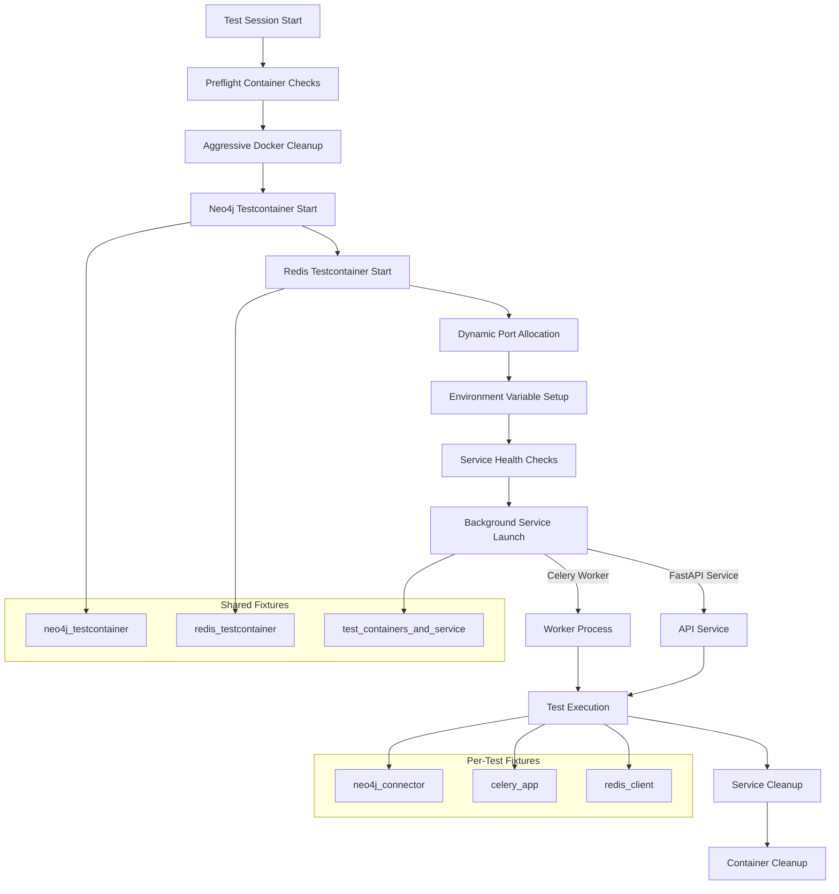
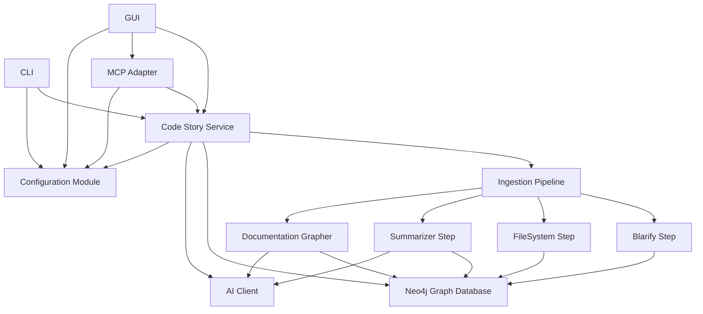

# Code Story - Specification Suite

This specification has been split into modular components. Please refer to the individual specification files for detailed information.

## Table of Contents

1. **[Overview & Architecture](./01-overview/overview.md)**
   - [Error Handling and Propagation](./01-overview/error-handling.md)
2. **[Scaffolding](./02-scaffolding/scaffolding.md)** - Project structure and foundational setup 
3. **[Configuration Module](./03-configuration/configuration.md)** - Settings and configuration management
4. **[Graph Database Service](./04-graph-database/graph-database.md)** - Neo4j backend and connectivity
5. **[AI Client](./05-ai-client/ai-client.md)** - OpenAI service integration
6. **[Ingestion Pipeline](./06-ingestion-pipeline/ingestion-pipeline.md)** - Orchestration framework
   - [Blarify Workflow Step](./07-blarify-step/blarify-step.md) - Code parsing
   - [FileSystem Workflow Step](./08-filesystem-step/filesystem-step.md) - Filesystem handling
   - [Summarizer Workflow Step](./09-summarizer-step/summarizer-step.md) - Content summarization
   - [Documentation Grapher Step](./10-docgrapher-step/docgrapher-step.md) - Documentation processing
7. **[Code Story Service](./11-code-story-service/code-story-service.md)** - Main API service
8. **[MCP Adapter](./12-mcp-adapter/mcp-adapter.md)** - Model Context Protocol integration
9. **[CLI](./13-cli/cli.md)** - Command-line interface
10. **[GUI](./14-gui/gui.md)** - Web-based user interface
11. **[Infrastructure](./15-infra/infra.md)** - Deployment and infrastructure
12. **[Documentation](./16-documentation/documentation.md)** - Project documentation

## Async Task Management & Control

The Code Story system supports advanced async task management for ingestion and workflow orchestration, including:

- Task cancellation and termination (user-initiated, API/CLI)
- Priority queueing and scheduling (high/low priority, delayed execution)
- Resource management and throttling (worker concurrency, resource tags)
- Task dependency tracking and ordering (chains, groups)
- Real-time task monitoring and progress reporting (API/WebSocket)
- Retry and failure recovery (configurable policies, API exposure)
- Performance monitoring and metrics (API/Prometheus)

See [Ingestion Pipeline](./06-ingestion-pipeline/ingestion-pipeline.md) and [Code Story Service](./11-code-story-service/code-story-service.md) for full details.

---

## Test Infrastructure Architecture

The Code Story system employs a unified test infrastructure architecture designed for reliability, parallelizability, and self-containment. This architecture replaces previous anti-patterns with a modern, testcontainer-based approach that ensures consistent testing across all environments.

### Rationale

**Previous Anti-patterns Replaced:**
- Hardcoded service ports causing conflicts between parallel tests
- External service dependencies requiring manual setup
- Tests failing due to environment-specific configurations
- Inconsistent fixture patterns across test modules
- Mock-heavy integration tests that didn't validate real functionality

**New Unified Approach:**
- Self-contained tests using testcontainers for all external dependencies
- Dynamic port allocation to enable parallel test execution
- Centralized fixture management in [`tests/integration/conftest.py`](../tests/integration/conftest.py)
- Real service integration without mocks for authentic validation
- Environment variable management ensuring test isolation

### Test Infrastructure Flow


```mermaid
graph TD
    A[Test Session Start] --> B[Preflight Container Checks]
    B --> C[Aggressive Docker Cleanup]
    C --> D[Neo4j Testcontainer Start]
    D --> E[Redis Testcontainer Start]
    E --> F[Dynamic Port Allocation]
    F --> G[Environment Variable Setup]
    G --> H[Service Health Checks]
    H --> I[Background Service Launch]
    I --> |Celery Worker| J[Worker Process]
    I --> |FastAPI Service| K[API Service]
    J --> L[Test Execution]
    K --> L
    L --> M[Service Cleanup]
    M --> N[Container Cleanup]
    
    subgraph "Shared Fixtures"
        O[neo4j_testcontainer]
        P[redis_testcontainer]
        Q[test_containers_and_service]
    end
    
    subgraph "Per-Test Fixtures"
        R[neo4j_connector]
        S[celery_app]
        T[redis_client]
    end
    
    D --> O
    E --> P
    I --> Q
    L --> R
    L --> S
    L --> T
```

### Code Example: Unified Test Pattern

```python
import pytest
from codestory.graphdb.neo4j_connector import Neo4jConnector

pytestmark = [pytest.mark.integration, pytest.mark.neo4j]

def test_repository_ingestion(
    neo4j_testcontainer: str,
    redis_testcontainer: str,
    test_containers_and_service: dict
) -> None:
    """Example showing unified test pattern usage."""
    # Neo4j connector automatically uses testcontainer URI
    connector = Neo4jConnector(
        uri=neo4j_testcontainer,
        username="neo4j",
        password="password",
        database="neo4j"
    )
    
    # Test operations use real services with dynamic ports
    result = connector.execute_query(
        "CREATE (r:Repository {name: $name}) RETURN r",
        {"name": "test-repo"},
        write=True
    )
    
    assert len(result) == 1
    assert result[0]["r"]["name"] == "test-repo"
```

For detailed implementation patterns, see:
- [Ingestion Pipeline Test Patterns](./06-ingestion-pipeline/ingestion-pipeline.md#test-patterns)
- [Infrastructure Test Strategy](./15-infra/infra.md#test-infrastructure)
- [Test Validation Report](./test-validation-report.md#unified-test-architecture)

---

## Component Dependencies


```mermaid
graph TD
    CLI[CLI] --> CS[Code Story Service]
    GUI[GUI] --> CS
    GUI --> MCP[MCP Adapter]
    MCP --> CS
    CS --> IP[Ingestion Pipeline]
    CS --> NEO4J[Neo4j Graph Database]
    CS --> AI[AI Client]
    IP --> BS[Blarify Step]
    IP --> FS[FileSystem Step]
    IP --> SS[Summarizer Step]
    IP --> DG[Documentation Grapher]
    BS & FS & SS & DG --> NEO4J
    SS --> AI
    DG --> AI
    CS --> CONFIG[Configuration Module]
    MCP --> CONFIG
    CLI --> CONFIG
    GUI --> CONFIG
```

Please navigate to the [Overview & Architecture](./01-overview/overview.md) to start reading the specifications in detail.